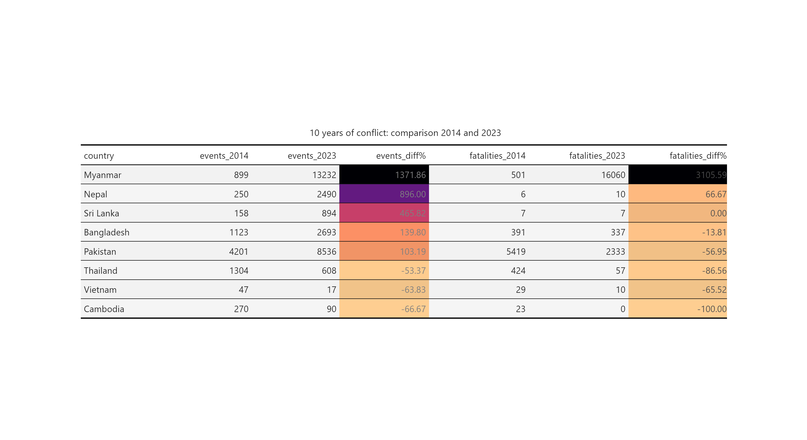
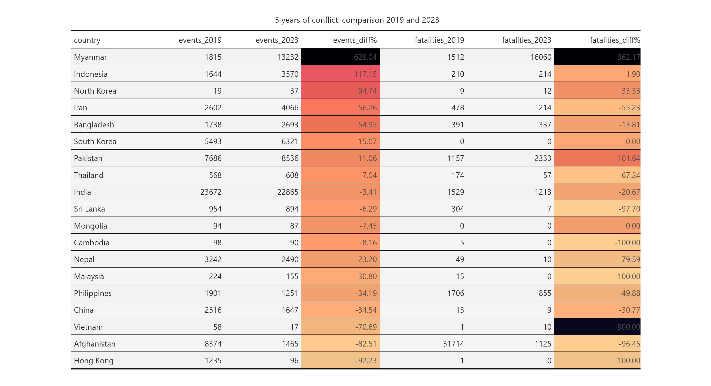

```{r setup, include=FALSE}

knitr::opts_chunk$set(echo = FALSE, warning = FALSE, message = FALSE,
                      fig.width = 9.5)

library(tidyverse)
library(here)
library(lubridate)
library(patchwork)
library(scales)
library(sf)
library(broom)
library(treemapify)
library(kableExtra) 
library(ggstream)

`%out%` <- Negate(`%in%`)
options(scipen = 100)
theme_set(theme_light())

show_col(viridis_pal(option = "cividis")(8))

```

```{r data, include=FALSE}
country_list <- c("Afghanistan", "Bangladesh", "Bhutan", "Cambodia", 
                  "China", "Fiji", "Hong Kong", "India", "Indonesia", 
                  "Iran", "North Korea", "South Korea", "Laos", 
                  "Malaysia", "Maldives", "Mongolia", "Myanmar", 
                  "Nepal", "Pakistan", "Papua New Guinea", "Philippines", 
                  "Solomon Islands", "Sri Lanka", "Thailand", "Timor-Leste", 
                  "Vanuatu", "Vietnam")

population <- read_csv(here("data", "wdi_all_countries_population.csv")) |> 
  janitor::clean_names()  %>%
  mutate(across(matches("_yr"), ~ as.numeric(.))) |> 
  pivot_longer(cols = x2000_yr2000:x2023_yr2023, 
               names_to = "year", 
               values_to = "population") |>
  mutate(year = str_sub(year, start = -4, end = -1), 
         year = as.double(year)) |> 
  rename(country = country_name) |> 
  mutate(country = 
           case_when(str_detect(country, "Korea, Rep.") ~ "South Korea",
                             str_detect(country, "Korea, Dem. People's Rep.") ~ "North Korea", 
                             str_detect(country, "Hong Kong SAR, China") ~ "Hong Kong", 
                             str_detect(country, "Iran, Islamic Rep.") ~ "Iran", 
                             str_detect(country, "Lao PDR") ~ "Laos", 
                             country == "Viet Nam" ~ "Vietnam", 
                             TRUE ~ country), 
         country_iso = countrycode::countrycode(country,
                                   origin = "country.name", 
                                   destination = "iso3c")) |> 
  filter(!is.na(country) & 
           country %out% c("Data from database: World Development Indicators", 
                           "Last Updated: 06/28/2024"))

# population_estimates <- crossing(country = population$country, year = 2000:2023) |> 
#   left_join(population |> 
#               select(year, country, population), 
#             by = c("year", "country")) |> 
#   group_by(country) %>% 
#   fill(population, .direction = "updown") 


population_estimates <- read_csv(here("data", "population_estimates.csv"))

world_shape <- st_read(here("data", 
                            "world-administrative-boundaries", 
                            "world-administrative-boundaries.shp"), 
                       quiet = TRUE)

myanmar_adm1 <- st_read(here("data", 
                             "mmr_polbnda2_adm1_mimu_250k", 
                             "mmr_polbnda2_adm1_mimu_250k.shp"), 
                        quiet = TRUE) |> 
  rename(state = ST, 
        admin1_pcode = ST_PCODE) |> st_as_sf()

country_iso3 <- world_shape |> 
  distinct(name, iso3)

acled_filtered <- readRDS(here("data", "acled_filtered.rds"))

most_events_list <- acled_filtered |> 
  filter(event_type != "Protest") |> 
  group_by(country) |> 
  summarise(events = n()) |> 
  arrange(desc(events)) |> 
  pull(country)

most_fatalities_list <- acled_filtered |> 
  group_by(country) |> 
  mutate(fatalities = as.numeric(fatalities)) |> 
  summarise(fatalities = sum(fatalities, na.rm = TRUE)) |> 
  arrange(desc(fatalities)) |> 
  pull(country)

actor_codes_acled <- tribble(
  ~actor_code, ~description, 
  1, "State Forces", 
  2, "Rebel Groups", 
  3, "Political Militias", 
  4, "Identity Militias", 
  5, "Rioters",
  6, "Protesters", 
  7, "Civilians", 
  8, "Other Forces"
)

interaction_codes_acled <- read_csv(here("data", "interaction_codes_acled.csv"))


afpak_buffer <- st_read(here("data", "afpak_buffer", "afpak_buffer.shp")) |> st_as_sf()

afir_buffer <- st_read(here("data", "afir_buffer", "afir_buffer.shp")) |> st_as_sf()


data(land, World)

```

## Introduction

Below is a table comparing the the number of political conflict events and fatalities in the countries that ACLED has been monitoring since 2014. Conflict has decreased across these countries since 2014, with the notable exception of Myanmar.

Note that the following event sub-types have been filtered out for the data in this report: `Agreement`, `Change to group/activity`, `Headquarters or base established`. 


<br>

```{r}
summary_stats <- acled_filtered |> 
  group_by(country, year) |> 
  summarise(events = n_distinct(event_id_cnty), 
            fatalities = sum(fatalities, na.rm = TRUE), 
            .groups = "drop")
```




<br>

As ACLED expanded the number of countries it monitored, a more comprehensive comparison is possible for the five-year horizon: 

<br>




<br>

Similar to the 10-year comparisons, most countries in the region have seen decreases in both the number of events and the number of conflict-related fatalities. Of note are Myanmar and Pakistan for their increased fatalities and Indonesia, Iran and Bangladesh for their increase in political incidents. 

The decreases in violence are apparent in most countries, as can be seen from the trendlines below; however, as we will explore in the next few sections, much more can be gained from country-based analyses. 

<br>

```{r fig.height= 6.5}
acled_filtered |> 
  filter(year > 2013 & year <= 2025) |> 
  filter(country %in% most_fatalities_list) |>  
  group_by(country, year) |> 
  summarise(fatalities = sum(fatalities, na.rm = TRUE), 
            .groups = "drop") |> 
  left_join(population_estimates, 
            by = c("country", "year")) |>
  mutate(date = as.Date(paste(year, 1, 1, sep="-")), 
         fatalities_100k = fatalities / population * 100000, 
         country = fct_relevel(country, most_fatalities_list)) |>
  ggplot(aes(x = date, y = fatalities)) + 
  geom_smooth(alpha = .1, colour = "salmon") + 
  geom_line(aes(group = country)) + 
  scale_x_date(date_labels = "%Y", 
               date_breaks = "2 years") + 
  facet_wrap(~ country, 
             scales = "free_y") +
  scale_y_continuous(labels = comma) +
  theme(axis.text.x = element_text(angle = 60, hjust = 1), 
        strip.background = element_rect(fill = "black")) + 
  labs(title = "Political incident fatalities by country in descending order, 2014-2023", 
       subtitle = "Black are the actual events, the trend line is in pink",
       y = "Annual fatalities", 
       x = "")
```

<br><br><br>

## Event type 

### Streamgraphs

```{r}
event_stream_data <- acled_filtered |> 
  filter(sub_event_type %out% c("Agreement", "Change to group/activity", "Headquarters or base established")) |> 
  mutate(quarter = floor_date(event_date, unit = "quarter")) |> 
  group_by(country, event_type, quarter) |> 
  summarise(events = n_distinct(event_id_cnty), 
            fatalities = sum(fatalities, na.rm = TRUE), 
            .groups = "drop") 

event_type_streamgraph <- function(df, column_var) {
  
  column_var <- enquo(column_var)
  
  df |>
    ggplot(aes(x = quarter, y = !!column_var, fill = event_type)) + 
    geom_stream(aes(fill = event_type)) + 
    scale_fill_manual(values = c(
      "Battles" = "#7A0403FF",
      "Violence against civilians" = "#F05B12FF",
      "Explosions/Remote violence" = "#E1DD37FF",
      "Protests" = "#25ECA7FF",
      "Strategic developments" = "#30123BFF",
      "Riots" = "#3E9BFEFF"
    )) +
    facet_wrap(~ country, scales = "free_y") + 
    labs(fill = "", 
         x = "") +
    theme(legend.position = "top",
          legend.key.width = unit(.3, "cm"), 
          legend.key.height = unit(.3, "cm"),
          legend.text = element_text(size = 5), 
          axis.text.y = element_text(size = 4), 
          axis.text.x = element_text(size = 4, angle = 30, hjust = 1, vjust = 1), 
          strip.text = element_text(size = 7), 
          strip.background = element_rect(fill = "black"), 
          plot.title = element_text(size = 13), 
          plot.subtitle = element_text(size = 11)) + 
    guides(fill = guide_legend(nrow = 1))
}
```


#### Fatalities over time 

From the chart below, sorted in order of number of **fatalities** from political incidents per quarter, it is clear that Afghanistan, Myanmar, Pakistan and Philippines have experienced severe political unrest, ranging from war, terrorism (with its hallmark explosions and remote violence) and political killings. Conflict in Afghanistan and Philippines has fallen significantly since its peak, but Myanmar is still in full conflagration and Pakistan is on the upswing: 

<br>

```{r fig.height = 6.5}

event_stream_data |> 
  mutate(country = fct_relevel(country, most_fatalities_list)) |>
  filter(fatalities > 0) |>
  event_type_streamgraph(fatalities) + 
  labs(title = "Number of fatalities by event type over time", 
       subtitle = "Data from 2014-01-01 to 2024-05-31, but not countries had full coverage during this period",
       y = "Fatalities per quarter")

```
<br>

It appears that Indonesia, Iran and Cambodia each have experienced much political violence leading up to elections, though in Cambodia, the deaths associated with protests in 2018 have served as a deterrent. 

#### Events over time

The streamgraphs below show the number of political incidents per quarter broken down by event type, sorted in order by the **number of political** incidents. 

It should be noted that in "stable" countries, the flavour of political conflict consists mainly of protests (which indicate widespread dissatisfaction but not that all nonviolent means have been exhausted). 

Widespread dissatisfaction has manifested in Thailand in 2014 and in 2021. However, the Thai state has responded by firmly clamping down on its citizenry in both instances. Core issues have yet to be addressed and it is likely that unrest will flare up again. However, the share of protests compared to violent political incidents seems to be worsening, indicating that more actors (the state included) believe that non-violent means have been exhausted. 

Bangladesh seems to have an outsized number of riots. Whilst protests are a natural feature of any democracy, riots are less so, given their disruptive and violent nature. Bangladesh seems to have a higher ratio of riots to protests than any other country except Papua New Guinea; this is not an esteemed group to be in, as it speaks to the inability of the state to maintain order and the ease of inciting the population (meaning that there are a multitude of injustices to inflame). 

Political incidents in Bangladesh (as we will explore in later section) had been falling until they increased around 2018, around the time of the Rohingya genocide and the influx of 700,000 refugees into Cox's Bazaar. This, predictably, has been destabilising for the country, bringing to light many longstanding issues and grudges. 

<br> 

```{r fig.height = 6.5}

event_stream_data |> 
  mutate(country = fct_relevel(country, most_events_list)) |>
  event_type_streamgraph(events) + 
  labs(title = "Number of political incidents by event type over time", 
       y = "Events per quarter")
```

<br>

Let's take a closer look at some countries of interest and narrow down from a ten-year horizon to a five-year one:

Myanmar and Afghanistan bear all the patterns of war. But what is surprising is the extent to which Philippine civil society has deteriorated due to damage from the drug war and the resulting political violence. When compared to other countries, their share of protests is abysmally low, lower even than Cambodia. Even as the drug war operations ceased and killings began to drop off sharply, the flavour of political unrest in the Philippines seems deeply changed, with its participatory democracy suffering massive setbacks. This is after all, not only the country of the EDSA revolution, but of the dictator Marcos as well. 

<br>

```{r}
event_stream_data |> 
  mutate(country = fct_relevel(country, most_events_list)) |>
  filter(country %in% c("Myanmar", "Afghanistan", 
                        "Philippines", "China", 
                        "Indonesia", "Vietnam"
                        ) & 
           quarter >= "2019-01-01") |>  
  event_type_streamgraph(events) + 
  labs(title = "Number of political incidents by event type over time", 
       subtitle = "Data from 2019-01-01 to 2024-05-31",
       y = "Events per quarter") + 
  theme(legend.position = "top")  
```
<br>

The Vietnamese state has seized the opportunity presented by COVID to advance state authority and clamp down on all types of political incidents (the clearest pattern of this in the region). China, for all the news of its vaunted lockdowns, only saw a more modest reduction in political incidents and is currently undergoing a mild increase in unrest related to labour and wage issues.

Indonesia is also experiencing an uptick in political incidents. The reasons behind this are to be explored. 

In post-genocide Myanmar, with the longstanding civil war with ethnic and communal militias in the background, the population exploded in protests against the Tatmadaw's coup. However, nonviolent means were soon exhausted and the country is now in full civil war. 

With the victory of the Taliban, Afghanistan has seen a 96% reduction on conflict fatalities and a 83% drop in conflict events since 2019 levels. However, civil society has by no means recovered, nor does Afghanistan bear any of the hallmarks of a participatory democracy. 

<br><br><br>

## Cross-border

### Afghanistan-Pakistan

The plots below show the past 5 years of conflict data in Afghanistan and Pakistan, with the border area between the two marked in a light grey.

The first three years show ultimately successful Taliban insurgency in full swing, with quite a significant amount of spillover into Pakistan, culminating in the US withdrawal in 2021. 2022 shows markedly less conflict, though we can see the beginnings of this "migration" of conflict (we don't know how literal this is yet) from Afghanistan to Pakistan, this is more evident in 2023. This is in also line with the longstanding Taliban policy of disregard for the Durand Line. 

<br>

```{r}
afpak_map <- function(tbl){
  
  tbl |> 
    filter(!is.na(longitude) & !is.na(latitude) & 
             country %in% c("Afghanistan", "Pakistan")) |> 
    filter(sub_event_type %out% c("Agreement", 
                                  "Change to group/activity", 
                                  "Headquarters or base established", 
                                  "Non-violent transfer of territory")) |> 
    mutate(quarter = floor_date(event_date, "quarter")) %>%
    select(event_id_cnty, event_type, longitude, latitude, event_type, quarter, fatalities) |>
    ggplot() +
    geom_sf(data = world_shape, size = .7, colour = "gold", fill = "black") + 
    geom_sf(data = afpak_buffer, colour = "black", fill = "white", alpha = .09) +
    coord_sf(xlim = c(60.41, 75.02), 
             ylim = c(25.04, 39.11)) +
    geom_point(aes(x = 73.0363, y = 33.6995), colour = "cornflowerblue", pch = 15) +
    geom_point(aes(x = 69.2075, y = 34.5553), colour = "cornflowerblue", pch = 15) +
    geom_point(aes(x = longitude, y = latitude, colour = event_type, size = fatalities), alpha = .05) +
    theme(plot.background = element_rect(fill = "black", colour = "black"),
          panel.background = element_rect(fill = "black", colour = "black"),
          rect = element_rect(fill = "NA"),
          legend.text = element_text(colour = "white"), 
          title = element_text(colour = "white"),
          legend.title = element_text(face = "bold"),
          plot.caption = element_text(hjust = 0.2)) + 
    guides(colour = guide_legend(override.aes = list(alpha = 1)), 
           size = guide_legend(override.aes = list(alpha = 1, 
                                                   colour = "grey"))) + 
    theme_void() + 
    labs(colour = "", size = "Fatalities")
}
```


```{r fig.height = 6.5, fig.width=9}


acled_filtered |> 
  filter(year == 2019) |> 
  afpak_map() + 
  scale_size_continuous(range = c(0.1, 3)) +
  labs(title = "2019") + # max100
  theme(legend.position = "none") + 

acled_filtered |> 
  filter(year == 2020) |> 
  afpak_map() + 
  scale_size_continuous(range = c(0.1, 2)) +
  labs(title = "2020") + #75
  theme(legend.position = "none") + 
  
acled_filtered |> 
  filter(year == 2021) |> 
  afpak_map() + 
  scale_size_continuous(range = c(0.1, 4)) +
  labs(title = "2021") + #150
  theme(legend.text = element_text(size = 4),
        legend.title = element_text(size = 5), 
        legend.key.width = unit(.3, "cm"), 
        legend.key.height = unit(.3, "cm"), 
        legend.margin=margin(t = 0, unit='cm')) +
  
acled_filtered |> 
  filter(year == 2022) |> 
  afpak_map() + 
  scale_size_continuous(range = c(0.1, 1.5)) +
  labs(title = "2022") + #60
  theme(legend.position = "none") + 
  
acled_filtered |> 
  filter(year == 2023) |> 
  afpak_map() + 
  scale_size_continuous(range = c(0.1, 2.2)) +
  labs(title = "2023") + #80
  theme(legend.position = "none") +
  plot_layout(guides = "collect") + 
  plot_annotation(
    title = "Political incidents in Afghanistan and Pakistan", 
    subtitle = "Border areas (>100km) marked in light grey; country capitals in blue")


```

<br>

Although ACLED only began data collection in Afghanistan in 2019, ACLED data on Pakistan was extracted all the way back to 2013. This is plotted below. 

Immediately apparent is how comparable the levels of conflict in and outside of Pakistan's border areas with Afghanistan are. This 100 km-thick strip of land only lags behind the rest of the country (including the capital) in the number of protests and strategic developments. 

<br>


```{r}

acled_afpak <- acled_filtered |> 
  filter(sub_event_type %out% c("Agreement", 
                                  "Change to group/activity", 
                                  "Headquarters or base established", 
                                  "Non-violent transfer of territory")) |>
  filter(!is.na(longitude) & !is.na(latitude) & 
             country %in% c("Afghanistan", "Pakistan")) |> 
  left_join(acled_filtered |>
              filter(!is.na(longitude) & !is.na(latitude) &
                       country %in% c("Afghanistan", "Pakistan")) |>
              st_as_sf(coords = c("longitude", "latitude"), crs = 4326) |>
              st_intersection(afpak_buffer) |>
              st_drop_geometry() |>
              mutate(afpak_border = "Afpak border") |>
              select(event_id_cnty, afpak_border), 
            by = "event_id_cnty") |> 
  mutate(afpak_border = ifelse(is.na(afpak_border), "Non-border", afpak_border))
  
```


```{r}
acled_afpak |>
  filter(country == "Pakistan" & year != 2024) |> 
  group_by(event_type, year = floor_date(event_date, "year"), afpak_border) |> 
  summarise(events = n_distinct(event_id_cnty), 
            .groups = "drop") |> 
  ggplot(aes(x = year, y = events)) + 
  geom_line(aes(colour = event_type)) +
  scale_y_log10(labels = comma) +
  scale_x_date(date_breaks = "2 years", date_labels = "%Y") +
  facet_wrap(~afpak_border) + 
  theme(strip.background = element_rect(fill = "black")) + 
  labs(colour = "", 
       x = "", 
       y = "Number of political incidents",
       title = "Political incidents in Pakistan, by year and border area", 
       subtitle = "Border area defined as 100km from Afghanistan")
```

<br>

And, as observed from the maps above, we see an increase in political violence after the Taliban victory. As mentioned, this is in line with Taliban policy, but it remains to be explored how centrally-directed these efforts are. 

Perhaps a more instructive view of violence in Pakistan's border areas comes from an examination of conflict fatalities over time. Explosions and remote violence, battles and violence against civilians were once much more common in Pakistan's border areas -- this was likely dependent on the cycles of stabilisation and destabilisation in Afghanistan. This situation should be monitored for further deterioration since conflict is on the upswing. 

<br>

```{r}
acled_afpak |>
  filter(country == "Pakistan" & year != 2024) |> 
  group_by(event_type, year = floor_date(event_date, "year"), afpak_border) |> 
  summarise(fatalities = sum(fatalities, na.rm = TRUE), 
            .groups = "drop") |> 
  ggplot(aes(x = year, y = fatalities)) + 
  geom_line(aes(colour = event_type)) +
  scale_y_continuous(labels = comma) + 
  scale_x_date(date_breaks = "2 years", date_labels = "%Y") +
  facet_wrap(~afpak_border) + 
  theme(strip.background = element_rect(fill = "black")) + 
  labs(colour = "", 
       x = "", 
       y = "Number of fatalities",
       title = "Political incidents in Pakistan, by year and border area", 
       subtitle = "Border area defined as 100km from Afghanistan")
```


<br><br><br>

### Myanmar-Bangladesh

Conflict in most parts of Bangladesh has been on the decline, with the notable exceptions of Dhaka and Cox's Bazar (where the Rohingya fled). 


```{r}
bangladesh_admin2 <- acled_filtered |> 
  filter(country == "Bangladesh") |> 
  group_by(admin2) |> 
  summarise(fatalities = sum(fatalities, na.rm = TRUE), 
            events = n_distinct(event_id_cnty), 
            .groups = "drop") |> 
  arrange(desc(fatalities)) |> 
  head(20) |> pull(admin2)
```


```{r}
bangladesh_summary <- acled_filtered |> 
  filter(country == "Bangladesh") |> 
  mutate(quarter = floor_date(event_date, "quarter")) |> 
  group_by(quarter, admin2) |> 
  summarise(fatalities = sum(fatalities, na.rm = TRUE), 
            events = n_distinct(event_id_cnty), 
            .groups = "drop") |>
  
  pivot_longer(cols = c(fatalities, events), 
               names_to = "type", 
               values_to = "value") |> 
  mutate(admin2 = fct_relevel(admin2, bangladesh_admin2), 
         type = fct_rev(type)) 

bangladesh_summary |> 
  filter(admin2 %in% c("Dhaka", "Chittagong", "Cox's Bazar", "Jessore")) |> 
  ggplot(aes(x = quarter, y = value)) + 
  geom_vline(aes(xintercept=as.numeric(quarter[c(145)])), linetype=4, colour="black", 
             alpha = .5, 
             size = .5) +
  geom_line(aes(colour = type)) + 
  facet_wrap(~admin2, scales = "free_y") + 
  scale_x_date(date_breaks = "2 years", label = date_format("%Y")) + 
  theme(axis.text.x = element_text(size = 5), 
        strip.background = element_rect(fill = "black")) + 
  labs(title = "Top 4 districts (admin2) in Bangladesh, political incidents and resulting fatalities", 
       subtitle = "Grey line marks Rohingya genocide", 
       y = "", x = "")

```
