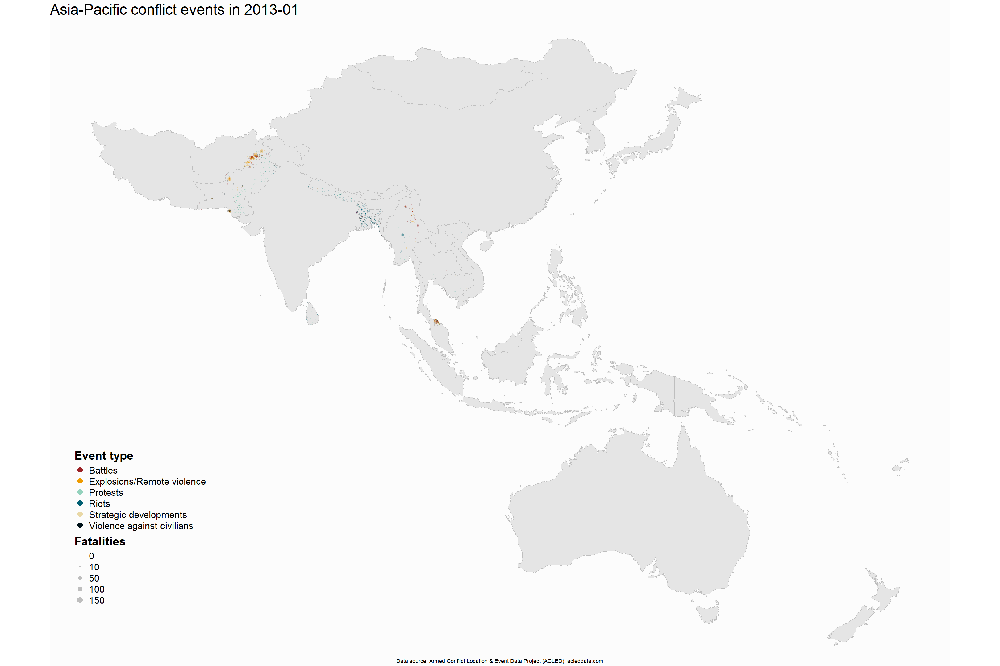
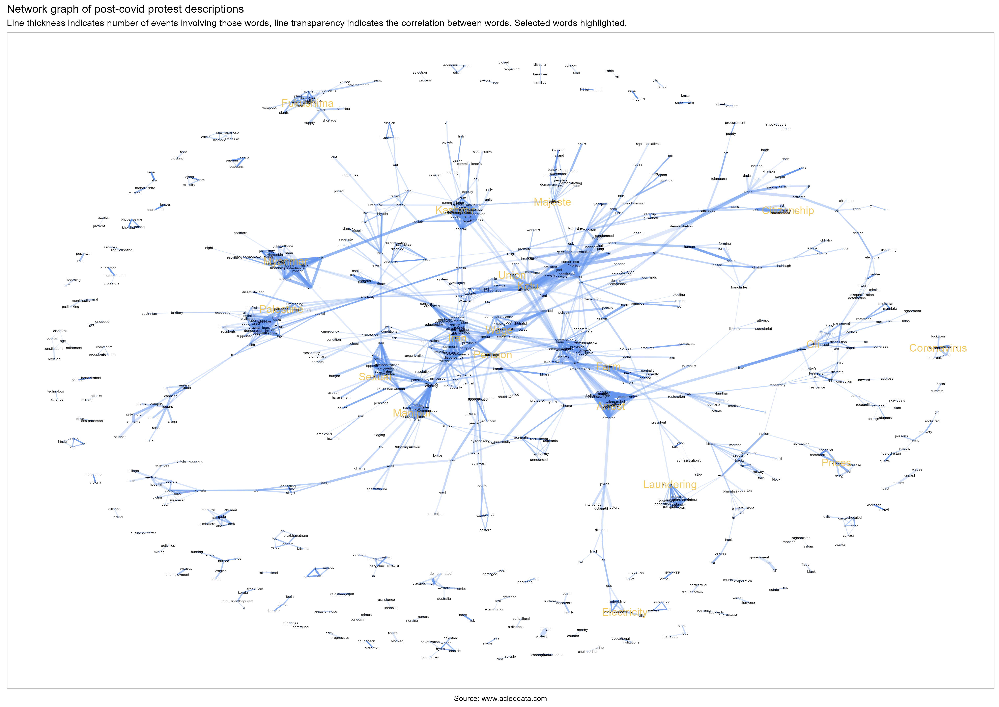

```{r setup, include=FALSE}

knitr::opts_chunk$set(echo = FALSE, warning = FALSE, message = FALSE, results = "asis",
                      fig.width = 9.5)

library(tidyverse)
library(here)
library(lubridate)
library(patchwork)
library(scales)
library(sf)
library(broom)
library(treemapify)
library(kableExtra) 
library(ggstream)
library(ggrepel)
library(ggcorrplot)
library(tidytext)
library(ggtext)
library(widyr)
library(ggraph)
library(janitor)

`%out%` <- Negate(`%in%`)
options(scipen = 100)
theme_set(theme_light())

range_wna <- function(x){(x-min(x, na.rm = TRUE))/(max(x, na.rm = TRUE)-min(x, na.rm = TRUE))}
```

```{r data, include=FALSE}
country_list <- c("Australia", "Afghanistan", "Bangladesh", "Bhutan", "Cambodia", 
                  "China", "Fiji", "Hong Kong", "Japan", "India", "Indonesia", 
                  "Iran",  "Laos", "Malaysia", "Maldives", "Mongolia", "Myanmar", 
                  "Nepal", "New Zealand",  "North Korea", "Pakistan", "Papua New Guinea",
                  "Philippines", "Singapore", "Solomon Islands", "South Korea", 
                  "Sri Lanka", "Thailand", "Timor-Leste", "Vanuatu", "Vietnam")

population <- read_csv(here("data", "wdi_all_countries_population.csv")) |> 
  janitor::clean_names()  %>%
  mutate(across(matches("_yr"), ~ as.numeric(.))) |> 
  pivot_longer(cols = x2000_yr2000:x2023_yr2023, 
               names_to = "year", 
               values_to = "population") |>
  mutate(year = str_sub(year, start = -4, end = -1), 
         year = as.double(year)) |> 
  rename(country = country_name) |> 
  mutate(country = 
           case_when(str_detect(country, "Korea, Rep.") ~ "South Korea",
                             str_detect(country, "Korea, Dem. People's Rep.") ~ "North Korea", 
                             str_detect(country, "Hong Kong SAR, China") ~ "Hong Kong", 
                             str_detect(country, "Iran, Islamic Rep.") ~ "Iran", 
                             str_detect(country, "Lao PDR") ~ "Laos", 
                             country == "Viet Nam" ~ "Vietnam", 
                             TRUE ~ country), 
         country_iso = countrycode::countrycode(country,
                                   origin = "country.name", 
                                   destination = "iso3c")) |> 
  filter(!is.na(country) & 
           country %out% c("Data from database: World Development Indicators", 
                           "Last Updated: 06/28/2024"))

population_estimates <- crossing(country = population$country, year = 2000:2024) |> 
 left_join(population |> 
             select(year, country, population), 
           by = c("year", "country")) |> 
 group_by(country) %>% 
 fill(population, .direction = "updown") 


world_shape <- st_read(here("data", 
                            "world-administrative-boundaries", 
                            "world-administrative-boundaries.shp"), 
                       quiet = TRUE)

myanmar_adm1 <- st_read(here("data", 
                             "mmr_polbnda2_adm1_mimu_250k", 
                             "mmr_polbnda2_adm1_mimu_250k.shp"), 
                        quiet = TRUE) |> 
  rename(state = ST, 
        admin1_pcode = ST_PCODE) |> st_as_sf()


country_iso3_ap <- world_shape |> 
  distinct(name, iso3) |> 
  mutate(country = 
           case_when(str_detect(name, "Democratic People's Republic of Korea") ~ "North Korea",
                     name == "Republic of Korea" ~ "South Korea",
                     str_detect(name, "Iran") ~ "Iran",
                     str_detect(name, "Lao People's Democratic Republic") ~ "Laos", 
                             name == "Viet Nam" ~ "Vietnam", 
                             TRUE ~ name)) |> 
  filter(country %in% country_list) |> 
  arrange(country) 

acled_filtered <- readRDS(here("data", "acled_filtered.rds"))

most_events_list <- acled_filtered |> 
  filter(event_type != "Protest") |> 
  group_by(country) |> 
  summarise(events = n()) |> 
  arrange(desc(events)) |> 
  pull(country)

most_fatalities_list <- acled_filtered |> 
  group_by(country) |> 
  mutate(fatalities = as.numeric(fatalities)) |> 
  summarise(fatalities = sum(fatalities, na.rm = TRUE)) |> 
  arrange(desc(fatalities)) |> 
  pull(country)

actor_codes_acled <- tribble(
  ~actor_code, ~description, 
  1, "State Forces", 
  2, "Rebel Groups", 
  3, "Political Militias", 
  4, "Identity Militias", 
  5, "Rioters",
  6, "Protesters", 
  7, "Civilians", 
  8, "Other Forces"
)

interaction_codes_acled <- read_csv(here("data", "interaction_codes_acled.csv"))

acled_actors <- rbind(
  acled_filtered |>
    select(actor = actor1, actor_code = inter1, event_id_cnty),
  acled_filtered |> 
    select(actor = actor2, actor_code = inter2, event_id_cnty)) |> 
  filter(!is.na(actor)) |> 
  left_join(acled_filtered |> 
              select(event_id_cnty, interaction, event_date, country, fatalities,
                     sub_event_type, event_type), 
            by = c("event_id_cnty"),
            relationship = "many-to-many") |> 
  mutate(event_date = as.Date(event_date, "%d %B %Y"), 
         year = year(event_date), 
         actor_code = as.double(actor_code)) |> 
  left_join(actor_codes_acled |>
              rename(actor_description = description), 
            by = "actor_code", 
            relationship = "many-to-many") 

afpak_buffer <- st_read(here("data", "afpak_buffer", "afpak_buffer.shp")) |> st_as_sf()

afir_buffer <- st_read(here("data", "afir_buffer", "afir_buffer.shp")) |> st_as_sf()

mmr_buffer <- st_read(here("data", "mmr_buffer", "mmr_buffer.shp"))

kash_buffer <- st_read(here("data", "kash_buffer", "kash_buffer.shp"))

ind_pak_buffer <- st_read(here("data", "ind_pak_buffer", "ind_pak_buffer.shp"))

mmr_shape <- world_shape |> filter(str_detect(name, "Myanmar")) 

rak_cxb <- st_read(here("data", "mmr_border", "rak_cxb.shp"))

indo_adm1_pop <- read_csv(here("data", "idn_admpop_adm1_2020_v2.csv")) |>
  janitor::clean_names() |>
  select(adm1_pcode, population = t_tl) |>
  left_join(
    readxl::read_excel(here(
      "data", "idn_adminboundaries_tabulardata.xlsx"
    ), sheet = 2) |>
      clean_names() |>
      select(adm1_pcode, adm1_en, area_sqkm),
    by = "adm1_pcode"
  )


wdi <- read_csv(here("data", "wdi_extract_Data.csv")) |> 
  clean_names() %>%
  mutate(across(matches("_yr"), ~ as.numeric(.))) |> 
  pivot_longer(cols = x1994_yr1994:x2023_yr2023, 
               names_to = "year", 
               values_to = "value") |>
  mutate(year = str_sub(year, start = -4, end = -1), 
         year = as.double(year)) |> 
  rename(country = country_name) |> 
  mutate(country = 
           case_when(str_detect(country, "Korea, Rep.") ~ "South Korea",
                             str_detect(country, "Korea, Dem. People's Rep.") ~ "North Korea", 
                             str_detect(country, "Hong Kong SAR, China") ~ "Hong Kong", 
                             str_detect(country, "Iran, Islamic Rep.") ~ "Iran", 
                             str_detect(country, "Lao PDR") ~ "Laos", 
                             country == "Viet Nam" ~ "Vietnam", 
                             TRUE ~ country), 
         country_iso = countrycode::countrycode(country,
                                   origin = "country.name", 
                                   destination = "iso3c")) |> 
  filter(!is.na(country) & 
           !str_detect(country, "Data from database|Last Updated")) |> 
  filter(country_iso %in% (country_iso3_ap |> pull(iso3)))


```


# Introduction and broad trends {#sec-introduction}

This report documents observed conflict trends in the Asia-Pacific region over the past ten years, exploring trends relating to events, fatalities, conflict types and conflict actors using ACLED data[^1].

[^1]: The primary dataset used is the Armed Conflict Location and Event Data (ACLED). The primary reason for privileging this source over UCDP’s Georeferenced Event Dataset is because ACLED has a wider diversity of sources and records a wider range of conflict events.

This report is in line with ACLED's [metholodology](https://acleddata.com/knowledge-base/codebook/)[^2] and its categorisation of conflict events, which encompasses protests, riots, battles, explosions and remote violence and strategic developments (such as arrests of key figures).

[^2]: The ACLED codebook contains all the documentation, including coding decisions and explanations of all recorded variables

@fig-regionalgif below displays cumulative conflict events over the past 10 years (2014-2023).

Major conflict-affected countries in the region are all quite clear: Afghanistan, Pakistan, Bangladesh, India, Thailand, Philippines and Myanmar, as are the "hotspots" within them (e.g. Kashmir) that account for some of these countries being on the list whilst not necessarily being considered to be in "in armed conflict" at the country level.

<br>

::: {#fig-regionalgif}

[](https://github.com/UNDP-CREW/conflict-trends-asia-pacific/raw/main/plots/asia_pacific_event_types_grey.gif)

:::

<br>

However, both the magnitude (number of events or fatalities, as displayed above) and the severity (events and fatalities per capita) provide important perspectives on conflict: India may have a very large number of conflict events, but as can be seen from @fig-percapita below, on a per-capita basis (in this case the denominator per 100,000 persons), it sits sin the middle of the pack.

The plot below is of the number of events per 100,000 persons per annum against the number of conflict fatalities per 100,000 persons per annum. The number of events is represented by the size of each point and the colour represents the total conflict fatalities experienced by each country over the past 10 years.

<br>

::: {#fig-percapita}

```{r}

acled_filtered |>
  filter(year < 2024 & year > 2013) |> 
  group_by(country, year) |> 
  summarise(events = n_distinct(event_id_cnty), 
            fatalities = sum(fatalities, na.rm = TRUE), 
            .groups = "drop") |> 
  left_join(
    population_estimates, 
    by = c("country", "year")
  ) |> 
  mutate(events_100k = events / population * 100000, 
         fatalities_100k = fatalities / population * 100000) |> 
  group_by(country) |> 
  summarise(events_100k = mean(events_100k, na.rm = TRUE), 
            fatalities_100k = mean(fatalities_100k, na.rm = TRUE), 
            events = sum(events), 
            fatalities = sum(fatalities)) |> 
  arrange(desc(events_100k)) |> 
  ggplot(aes(x = events_100k + 0.01, 
             y = fatalities_100k + 0.01)) + 
  #geom_segment(aes(x = .04, xend = .02, y = 2, yend = 2), arrow = arrow(), 
               #size = .1, lwd = 1.2, colour = "lightsteelblue", alpha = .1) + 
  #geom_segment(aes(x = .6, xend = .6, y = 11, yend = 35), arrow = arrow(), 
               #size = .1, lwd = 1.2, colour = "bisque3", alpha =.1) + 
  geom_smooth(method = "lm",formula = y ~ splines::bs(x, 2), se = FALSE, lwd = 1) + 
  geom_hline(yintercept = 0.01, lwd = .2, linetype = "dashed", alpha = .5) + 
  geom_vline(xintercept = 0.01, lwd = .2, linetype = "dashed", alpha = .5) + 
  geom_hline(yintercept = 1.01, lwd = .9, linetype = "dashed", alpha = .4, colour = "cornflowerblue") + 
  geom_vline(xintercept = 1.01, lwd = .9, linetype = "dashed", alpha = .4, colour = "cornflowerblue") + 
  geom_point(aes(colour = fatalities, 
                 size = events), alpha = .8) + 
  # geom_text(aes(label = country), vjust = "inward") +
  ggrepel::geom_text_repel(aes(label = country), size = 3, vjust = "inward", 
                           max.overlaps = 20) +
  scale_x_log10(breaks=c(0.01, 0.11, 1.01, 2.01, 5.01, 10.01), labels=\(x) x-0.01) + 
  scale_y_log10(breaks=c(0.01, 0.11, 0.31, 1.01, 3.01, 10.01, 50.01), labels=\(x) x-0.01) +
  scale_size_continuous(range = c(1, 9), breaks = c(100, 1000, 10000, 100000), 
                        labels = comma) + 
  scale_colour_viridis_c(option = "magma", direction = -1, end = .85, labels = comma) + 
  labs(x = "Mean Events per 100k per annum", 
       y = "Mean Fatalities per 100k per annum", 
       title = "Severity and lethality of political conflict in the Asia-Pacific, 2014-2023", 
       subtitle = "Mean annual events and fatalities per country per 100,000 persons", 
       caption = "Source: www.accleddata.com", 
       size = "No. Events", 
       colour = "Fatalities") + 
  theme(plot.caption = element_text(hjust = .5))


```

:::

<br>

Whilst the immensity and diversity of the Asia-Pacific demand exceptions to every rule, we can identify a central tendency (the solid blue line) that most countries in the region seem to sit on. On one end of the line are disproportionately quiet autocracies (or their approximations) and on the other are countries where violence has spun out of state control.

Myanmar and Afghanistan have separated themselves from this central curve as a consequence of open warfare. Philippines, Papua New Guinea and Pakistan are all at risk or were at risk of doing the same in the past 10 years. The blue dotted reference lines were chosen based on a visual inspection of the data.

At the bottom of the plot, on either side of the reference line at `x = 1`, we see on one side, autocracies and on the other, democracies. These democratic countries have exited the central tendency as well. In these countries, an increase in political participation and conflict is not associated with an increase in fatalities.

Furthermore, all have populations who actively participate in the political process -- even the least protest-inclined of this group, Japan, has higher rates of participation (i.e. number of events per 100k) than Indonesia or Malaysia, or even pre-2024 Bangladesh.

ACLED does not capture all conflict. The number of fatalities per 100,000 here is for comparison amongst countries within the ACLED dataset. Were we looking for the actual mortality rate, there are [preferred sources](https://www.who.int/data/gho/data/themes/mortality-and-global-health-estimates/ghe-leading-causes-of-death), which put the mortality rate in Afghanistan from ["collective violence and legal intervention"](https://data.who.int/countries/004) at 122 per 100,000 in 2021. The value for ACLED in Afghanistan in 2021 was 106 per 100,000. The homicide rate in Southeast Asia in four per 100,000, the [road traffic death rate](https://www.who.int/data/gho/data/indicators/indicator-details/GHO/estimated-road-traffic-death-rate-per-100-000-population) is 16.

Over the course of this document, as we explore trends and drivers of conflict in the region, it is important to recall that there is no optimal amount of political conflict. Too little indicates suppression and too much, widespread dissatisfaction and, in some cases, open revolt amongst the populace.

But until we identify why and how countries can exit the central tendency and join the peaceful countries in the bottom-right corner, the majority of countries in the region will oscillate between upheavals and crackdowns, between disarray and abuses of state power.

To paraphrase Martin Luther King, Jr., without justice, there is no peace, only order.

<br><br><br>

## Conflict events and fatalities (summary tables)

Looking back at a 10-year horizon (note that ACLED used to monitor a smaller set of countries) in @tbl-summary10, although the number of events is much higher than 10 years ago, the majority of countries have seen declines in the number of fatalities associated with political conflict. However, most of these countries have also seen increases in the number of events, indicating increased that whilst there is more conflict, it is less bloody than before (except in Myanmar).

<br>

```{r}
summary_stats <- acled_filtered |> 
  group_by(country, year) |> 
  summarise(events = n_distinct(event_id_cnty), 
            fatalities = sum(fatalities, na.rm = TRUE), 
            .groups = "drop")

event_diff_spec_2014 <- summary_stats |> 
  select(-fatalities) |> 
  filter(year %in% c(2014, 2023)) |> 
  pivot_wider(names_from = year, 
              values_from = events, 
              names_prefix = "events_") |> 
  filter(!is.na(events_2014)) |> 
  adorn_totals(where = "row") |>
  mutate(event_diff_pc = round((events_2023 - events_2014) / events_2014 * 100, digits = 2)) |> 
  filter(country != "Laos") |> 
  mutate(country = fct_relevel(country, 
                               c("Myanmar", "Nepal", "Sri Lanka", "Bangladesh", 
                                 "Pakistan", "Thailand", "Vietnam", "Cambodia", "Total"))) |> 
  arrange(country)

fatalities_diff_spec_2014 <- summary_stats |>
  select(-events) |>
  filter(year %in% c(2014, 2023)) |>
  pivot_wider(names_from = year,
              values_from = fatalities,
              names_prefix = "fatalities_") |>
  filter(!is.na(fatalities_2014)) |>
  adorn_totals(where = "row") |>
  mutate(fatalities_diff_pc = 
           round((fatalities_2023 - fatalities_2014) / fatalities_2014 * 100,
                                    digits = 2)) |>
  mutate(fatalties_diff_pc = ifelse(is.nan(fatalities_diff_pc), 0, fatalities_diff_pc)) |>
  filter(country != "Laos") |> 
  arrange(desc(fatalities_diff_pc))


```

<br>

```{=html}
<style>
.table>tbody>tr>td{
  padding: 1px;
}
</style>
```

```{r}
#| label: tbl-summary10

summary_stats |> 
  select(-fatalities) |> 
  filter(year %in% c(2014, 2023)) |> 
  pivot_wider(names_from = year, 
              values_from = events, 
              names_prefix = "events_") |> 
  filter(!is.na(events_2014)) |> 
  adorn_totals(where = "row") |> 
  mutate(event_diff_pc = round((events_2023 - events_2014) / events_2014 * 100, digits = 2)) |> 
  left_join(
    summary_stats |> 
  select(-events) |> 
  filter(year %in% c(2014, 2023)) |> 
  pivot_wider(names_from = year, 
              values_from = fatalities, 
              names_prefix = "fatalities_") |> 
  filter(!is.na(fatalities_2014)) |>
    adorn_totals(where = "row") |>
    mutate(fatalities_diff_pc = round((fatalities_2023 - fatalities_2014) / fatalities_2014 * 100, digits = 2)) |> 
    mutate(fatalties_diff_pc = ifelse(is.nan(fatalities_diff_pc), 0, fatalities_diff_pc)), 
  by = "country"
  ) |> 
  filter(country != "Laos") |> 
  mutate(country = fct_relevel(country, c("Myanmar", "Nepal", "Sri Lanka", "Bangladesh", 
                                 "Pakistan", "Thailand", "Vietnam", "Cambodia", "Total"))) |> 
  arrange(country) |> 
  select(country, events_2014, events_2023, `events_diff%` = event_diff_pc, 
         fatalities_2014, fatalities_2023, `fatalities_diff%` = fatalities_diff_pc) %>% 
  select_all(~ gsub("_", " ", .)) %>%
  select_all(~ str_to_title(.)) |> 
  kable(booktabs = TRUE, 
        caption = "10 years of conflict: comparison 2014 and 2023", 
        format.args = list(big.mark = ",")) |> 
  kable_classic_2("striped", full_width = TRUE) |>
  column_spec(4, color = "grey50", background = 
                spec_color(event_diff_spec_2014$event_diff_pc[1:9], direction = -1, end = .95, 
                           option = "plasma")) |> 
  column_spec(7, color = "grey40", background =
                spec_color(fatalities_diff_spec_2014$fatalities_diff_pc[1:9], 
                                                           direction = -1, end = .95, 
                           option = "plasma")) 
```

<br>

Across a five-year horizon, with more countries included in the comparison, the number of events and fatalities is down in most countries, though regional totals are boosted by Myanmar.

Afghanistan, Vietnam and Hong Kong saw the largest declines in political conflict. Myanmar, Indonesia, Iran and Bangladesh have each experienced a significant increase in unrest in the past five years. As mentioned before, though countries like South Korea and Japan also large increases in political conflict, these activities were not associated with any deaths.

<br>

```{r}
#| label: tbl-summary5

event_diff_spec_2019 <-
  summary_stats |> 
  select(-fatalities) |> 
  filter(year %in% c(2019, 2023)) |> 
  pivot_wider(names_from = year, 
              values_from = events, 
              names_prefix = "events_") |>
  filter(!is.na(events_2019)) |>
  adorn_totals(where = "row") |>
  mutate(event_diff_pc = round((events_2023 - events_2019) / events_2019 * 100, digits = 2)) |> 
  filter(country != "Laos") |> 
  arrange(desc(event_diff_pc)) |> 
  mutate(country = fct_relevel(country,
                               c("Myanmar", "Indonesia", "North Korea", "Iran", 
                                 "Bangladesh", "Japan", "South Korea", "Pakistan", 
                                 "Thailand", "India", "Sri Lanka", "Mongolia", 
                                 "Cambodia", "Nepal", "Malaysia", "Philippines", 
                                 "China", "Vietnam", "Afghanistan", "Hong Kong", 
                                 "Total")))


fatalities_diff_spec_2019 <- summary_stats |>
  select(-events) |>
  filter(year %in% c(2019, 2023)) |>
  pivot_wider(names_from = year,
              values_from = fatalities,
              names_prefix = "fatalities_") |>
  filter(!is.na(fatalities_2019)) |>
  adorn_totals(where = "row") |>
  mutate(fatalities_diff_pc = 
           round((fatalities_2023 - fatalities_2019) / fatalities_2019 * 100,
                                    digits = 2)) |>
  mutate(fatalities_diff_pc = ifelse(is.nan(fatalities_diff_pc), 0, fatalities_diff_pc)) |>
  filter(country != "Laos") |> 
  mutate(country = fct_relevel(country,
                               c("Myanmar", "Indonesia", "North Korea", "Iran", 
                                 "Bangladesh", "Japan", "South Korea", "Pakistan", 
                                 "Thailand", "India", "Sri Lanka", "Mongolia", 
                                 "Cambodia", "Nepal", "Malaysia", "Philippines", 
                                 "China", "Vietnam", "Afghanistan", "Hong Kong", 
                                 "Total"))) |> 
  arrange(country)


summary_stats |> 
  select(-fatalities) |> 
  filter(year %in% c(2019, 2023)) |> 
  pivot_wider(names_from = year, 
              values_from = events, 
              names_prefix = "events_") |> 
  filter(!is.na(events_2019)) |>
  adorn_totals(where = "row") |>
  mutate(event_diff_pc = round((events_2023 - events_2019) / events_2019 * 100, digits = 2)) |> 
  left_join(
    summary_stats |> 
  select(-events) |> 
  filter(year %in% c(2019, 2023)) |> 
  pivot_wider(names_from = year, 
              values_from = fatalities, 
              names_prefix = "fatalities_") |> 
  filter(!is.na(fatalities_2019)) |>
    adorn_totals(where = "row") |>
    mutate(fatalities_diff_pc = round((fatalities_2023 - fatalities_2019) / fatalities_2019 * 100, digits = 2)) |> 
    mutate(fatalities_diff_pc = ifelse(is.nan(fatalities_diff_pc), 0, fatalities_diff_pc)), 
  by = "country"
  ) |> 
  filter(country != "Laos") |> 
  mutate(country = fct_relevel(country,
                               c("Myanmar", "Indonesia", "North Korea", "Iran", 
                                 "Bangladesh", "Japan", "South Korea", "Pakistan", 
                                 "Thailand", "India", "Sri Lanka", "Mongolia", 
                                 "Cambodia", "Nepal", "Malaysia", "Philippines", 
                                 "China", "Vietnam", "Afghanistan", "Hong Kong", 
                                 "Total"))) |> 
  arrange(country) |> 
  select(country, events_2019, events_2023, `events_diff%` = event_diff_pc, 
         fatalities_2019, fatalities_2023, `fatalities_diff%` = fatalities_diff_pc) %>%
  select_all(~ gsub("_", " ", .)) %>%
  select_all(~ str_to_title(.)) |> 
  kable(caption = "Five years of conflict: comparison 2019 and 2023", 
        format.args = list(big.mark = ",")) |> 
  kable_classic_2("striped", full_width = TRUE) |> 
  column_spec(4, color = "grey40", background = 
                spec_color(event_diff_spec_2019$event_diff_pc[1:21], direction = -1, end = .9, 
                           option = "plasma")) |> 
  column_spec(7, color = "grey40", background =
                spec_color(fatalities_diff_spec_2019$fatalities_diff_pc[1:21], 
                                                           direction = -1, end = .9, 
                           option = "plasma"))
```

<br>

The increase in the number of conflict events -- especially if they were primarily due to protests -- is not an immediate cause for concern.

To provide a bit more perspective on these country totals, and given that declines or increases happen for a multitude of reao

Increases in the number of conflict events -- especially if they were primarily due to protests -- is not an immediate cause for concern. South Koreans have managed to enact several changes through their protests (like the removal of President Park Geun-hye), as have Malaysians and Nepalese. Similarly, a decrease in conflict events only indicates stabilisation or suppression, not that the underlying issues have been resolved.

To provide an additional layer of perspective on @tbl-summary10 and @tbl-summary5, both the number of events and the number of fatalities are plotted below in @fig-eventsfatalitiesline.

For most countries, conflict fatalities are down or flat. This is in line with what we have observed in the ten-year and five-year horizons.

Afghanistan, China, Vietnam, Cambodia, Laos, Philippines and the Solomon Islands have each seen a drastic fall in conflict events and fatalities over the past 10 years. Fatalities in Pakistan and Bangladesh were trending upwards, at the end of 2023 (2024 has not yet concluded and for this comparison, we have elected to use only full years of data).

However, looking at the dark blue lines, indicating the number of events, it becomes clearer that the remaining countries all experience periodic spikes and troughs in conflict, periods of destabilisation and tightening. Clear examples of this are Iran and Thailand, where the waves of protest movements or elections are immediately visible. As are the effects of the state re-exerting control.

If we were to extrapolate from the example of Iran: the population there seems to be severely dissatisfied with their leaders and are expressing it. There were two clear waves of protests and while numbers might currently be on the downtrend from last year, the next protest movement will likely be even more destabilising than the last.

<br>

::: {#fig-eventsfatalitiesline}

```{r fig.height=6.5}

acled_filtered |> 
  filter(year > 2013 & year <= 2025) |>
  filter(country %in% most_fatalities_list) |> 
  filter(country %out% c("Singapore", "Bhutan", "Fiji", "Maldives",
                         "New Zealand", "Vanuatu")) |> 
  group_by(country, year) |> 
  summarise(fatalities = sum(fatalities, na.rm = TRUE),
            events = n_distinct(event_id_cnty), 
            .groups = "drop") |> 
  pivot_longer(cols = c(fatalities, events), 
               names_to = "indicator", 
               values_to = "value") |> 
  group_by(country, indicator) |> 
  mutate(value_range = range_wna(value)) |> 
  ungroup() |> 
  mutate(date = as.Date(paste(year, 1, 1, sep="-"))) |> 
  mutate(country = fct_relevel(country, most_fatalities_list), 
         indicator = str_to_title(indicator)) |>
  ggplot(aes(x = date, y = value)) + 
  geom_smooth(aes(colour = indicator), 
              se = FALSE) + 
  facet_wrap(~ country, 
             scales = "free_y") +
  scale_y_continuous(labels = comma) +
  scale_colour_manual(values = c("Events" = "#264653", 
                                 "Fatalities" = "#e76f51")) +
  theme(axis.text.x = element_text(angle = 60, hjust = 1), 
        strip.background = element_rect(fill = "black"), 
        legend.position = "top", 
        legend.key.height = unit(.3, "cm")) + 
  labs(title = "Number of political incidents and resulting fatalities by, 2014-2023", 
       subtitle = "Events are in dark blue, fatalities in red. In descending order, by total number of fatalities.",
       y = "Annual fatalities", 
       x = "", 
       colour = "")
    
```

:::

<br>

A number of territories -- China, Nepal, Hong Kong, Japan, Mongolia and South Korea -- have very low or 0 fatalities from political incidents. We note that the line for fatalities in @fig-eventsfatalitiesline above in these countries is flat. We venture that whilst countries like China are "orderly", they not necessarily peaceful: its trendlines are most similar to those of Vietnam and Cambodia (where fatalities are low because events are suppressed) rather than Japan or South Korea (where the fatalities line stays flat no matter how many events there are). It is hypothesised that its conflict fatalities being flat might more be due to prolonged suppression.

<br><br><br>

## Event type streamgraphs

```{r event-stream-data}
event_stream_data <- acled_filtered |> 
  mutate(quarter = floor_date(event_date, unit = "quarter")) |> 
  group_by(country, event_type, quarter) |> 
  summarise(events = n_distinct(event_id_cnty), 
            fatalities = sum(fatalities, na.rm = TRUE), 
            .groups = "drop") 

event_type_streamgraph <- function(df, column_var) {
  
  column_var <- enquo(column_var)
  
  df |>
    ggplot(aes(x = quarter, y = !!column_var, fill = event_type)) + 
    geom_stream(aes(fill = event_type)) + 
    scale_fill_manual(values = c(
      "Battles" = "#9b2226",
      "Violence against civilians" = "#001219",
      "Explosions/Remote violence" = "#ee9b00",
      "Protests" = "#94d2bd",
      "Strategic developments" = "#e9d8a6",
      "Riots" = "#005f73"
    )) +
    facet_wrap(~ country, scales = "free_y") + 
    labs(fill = "", 
         x = "") +
    theme(legend.position = "top",
          legend.key.width = unit(.3, "cm"), 
          legend.key.height = unit(.3, "cm"),
          legend.text = element_text(size = 5), 
          axis.text.y = element_text(size = 4), 
          axis.text.x = element_text(size = 4, angle = 30, hjust = 1, vjust = 1), 
          strip.text = element_text(size = 7), 
          strip.background = element_rect(fill = "black"), 
          plot.title = element_text(size = 13), 
          plot.subtitle = element_text(size = 11)) + 
    guides(fill = guide_legend(nrow = 1))
}

```

To add further context to our exploration of regional conflict trends, let us now consider event types. [ACLED](https://acleddata.com/knowledge-base/codebook/)[^3] categorises conflict events into protests, riots, battles, explosions and remote violence and strategic developments (such as arrests or new legislation). These are further still into 25 sub-types.

[^3]: The ACLED codebook contains all the documentation, including coding decisions and explanations of all recorded variables

The charts below are streamgraphs, where values over time -- in @fig-eventsstream below, the number of quarterly conflict events -- are represented by their respective area. Though there are negative values shown, the Y-axis values are absolute i.e. if a certain point in time is `+400` and `-400`, there were a total of 800 events. Streamgraphs are employed here despite this because spikes in violence (from elections, for instance) are much more visible than a traditional area graph.

@fig-eventsstream shows the number of political incidents per quarter broken down by event type, sorted in order by the **number of political** incidents.

It should be noted that in "stable" countries, the flavour of political conflict consists mainly of protests (which indicate widespread dissatisfaction but also that not all nonviolent means have been exhausted).

The Thai people manifested their dissatisfaction has manifested in 2014 and in 2021. However, the Thai state responded by firmly clamping down on its citizenry in both instances, as can be seen from the swift decrease in events. This approach does not address the core issues behind the protests. Notably, the share of protests compared to violent political incidents seems to be worsening, possibly indicating that more actors (the state included) believe that nonviolent solutions have been exhausted.

Bangladesh seems to have an outsized number of riots. Whilst protests are a natural feature of any democracy, riots are less so, given their disruptive and violent nature. Bangladesh seems to have a higher ratio of riots to protests than any other country except Papua New Guinea. This speaks to the inability of the state to maintain order and the ease of inciting the population to violence (which speaks to the existence of many instances of injustice and hurt to inflame). Political incidents in Bangladesh (as we will explore in later section) had been falling until they increased around 2018, around the time of the first quota reform protests.

<br>

::: {#fig-eventsstream}

```{r fig.height = 8}

event_stream_data |> 
  mutate(country = fct_relevel(country, most_events_list)) |>
  filter(country %out% c("Bhutan")) |> 
  event_type_streamgraph(events) + 
  labs(title = "Number of political incidents by event type over time", 
       subtitle = "Data from 2014-01-01 to 2024-10-29, but not countries had full coverage during this period",
       y = "Events by quarter")
```

:::

<br>

Myanmar and Afghanistan bear all the patterns of war. But what is surprising is the extent to which Philippine civil society has deteriorated due to damage from the drug war and the resulting political violence. When compared to other countries, their share of protests is very low, lower even than Cambodia. Even as the drug war operations ceased and killings began to drop off sharply, the flavour of political unrest in the Philippines seems deeply changed, with its participatory democracy suffering massive setbacks. They are, after all, the country of both the EDSA revolution and the dictator Marcos.

Let's take a closer look at some countries of interest and narrow down from a ten-year horizon to a five-year one:

<br>

::: {#fig-eventsstream5}

```{r fig.height = 6}

#| label: fig-eventsstream5

event_stream_data |> 
  mutate(country = fct_relevel(country, most_events_list)) |>
  filter(country %in% c("Myanmar", "Afghanistan", 
                        "Philippines", "China", 
                        "Indonesia", "Vietnam"
                        ) & 
           quarter >= "2019-01-01") |>  
  event_type_streamgraph(events) + 
  labs(title = "Number of political incidents by event type over time", 
       subtitle = "Data from 2019-01-01 to 2024-10-29",
       y = "Events per quarter") + 
  theme(legend.position = "top") 
```
:::

<br>

From the dramatic decrease in political activity starting in 2020, it would appear that the Vietnamese state has seized the opportunity to presented by COVID to advance state authority and solidify its hold on the country. China saw a more modest reduction in political incidents, and is undergoing an increase in unrest related to labour and wage issues.

Indonesia is has also seen a large increase in political incidents driven by economic woes, increasing state authoritarianism and violations of human rights and environmental and land rights.

In post-genocide Myanmar, with the longstanding civil war with ethnic and communal militias in the background, the population exploded in protests against the Tatmadaw's coup. However, nonviolent means were soon exhausted and the country is now in full civil war.

With the victory of the Taliban, Afghanistan has seen a 96% reduction on conflict fatalities and a 83% drop in conflict events since 2019 levels. However, civil society has by no means recovered, nor does Afghanistan bear any of the hallmarks of a participatory democracy.

<br><br><br>

# Protests {#sec-protests}

The most common form of political conflict is to protest. Protests are a non-violent form of political conflict which manifest when all legal and administrative avenues have been exhausted. Widespread protests indicate a "hole" in governance, given that such protests would only be possible if a significant proportion of the population not only agreed with them but also felt that the issue had gone unaddressed long enough or is egregious to manifest their outrage in public.

<br>

## Common protest topics 

@fig-protestwordbars below shows the (log of) odds that a word will appear in post-COVID event descriptions for protests events in that country. For example, the word with the highest odds of appearing in protest events in India is **BJP**.

This document does not pretend to speak for the people, however, the charts below do provide a very useful overview of what people in each country are most concerned with. To continue with India, the top end of its chart is dominated by minority rights and rural economic issues, with the incumbent party firmly at the top, given that these protests stemmed from their policies. Instead of focusing of the individual odds of each word, it is better to take the list of words as a whole, in aggregate.

Place names have been largely filtered out, countries below left with many place names in their protest descriptions tend to have experienced widespread protests over singular topics. An example of this is Thailand, where protests seem to revolve around the singular issue of state power. Almost every other word is a place name where protests concerning state power took place. Myanmar's protest descriptors are similar as well, given that they too were preoccupied with their own coup. This is also the same for South Korea, though that may also be due to over-centralisation in Seoul.

<br>

```{r}
protest_country_words <- acled_filtered |> 
  filter(event_type == "Protests") |> 
  mutate(covid = ifelse(event_date >= "2020-03-11", "post-covid", "pre-covid")) |> 
  select(event_id_cnty, country, notes, covid) |> 
  unnest_tokens(word, notes) |>
  anti_join(stop_words, by = "word") |> 
  filter(str_detect(word, "[a-z]")) |> 
  filter(word %out% c("township", "district", "city", "village", 
                      "region", "town", "coded", "province", "county", 
                      "pradesh", "prefecture", "regency", 
                      "barangay", "upazila") & 
           word %out% c("january", "february", "march", "april", "may", 
         "june", "july", "august", "september", "october", 
         "november", "december")) |> 
  mutate(stem = SnowballC::wordStem(word, language = "porter"))

acled_protests <- acled_filtered |> 
  filter(event_type == "Protests") |> 
  mutate(covid = ifelse(event_date >= "2020-03-11", "post-covid", "pre-covid")) |> 
  select(event_id_cnty, notes, covid) |> 
  unnest_tokens(word, notes) |> 
  anti_join(stop_words, by = "word") |> 
  filter(str_detect(word, "[a-z]")) |> 
  filter(word %out% c("township", "district", "city", "village", 
                      "region", "town", "coded", "province", "county", 
                      "pradesh", "prefecture", "regency", 
                      "barangay", "upazila", "january", "february", 
                      "march", "april", "may",
                        "june", "july", "august", "september", "october",
                        "november", "december", 
                        "report", "protest")) |> 
  mutate(stem = SnowballC::wordStem(word, language = "porter")) 

```

::: {#fig-protestwordbars}

```{r fig.height=15}


protest_order <- acled_filtered |> 
  filter(event_type == "Protests") |> 
  group_by(year, country) |> 
  summarise(events = n_distinct(event_id_cnty), 
            .groups = "drop") |> 
  left_join(
    population_estimates, 
    by = c("year", "country")
  ) |>
  mutate(events_100k = events / population * 100000) |> 
  group_by(country) |> 
  summarise(events_100k_mean = mean(events_100k, na.rm = TRUE), 
            total_events = sum(events)) |> 
  arrange(desc(events_100k_mean)) |> 
  pull(country)

# Trying to strip out all the admin2 names, only partially successful
admin2_list <- acled_filtered |> 
  filter(!is.na(admin2)) |> 
  distinct(admin2) |> 
  mutate(admin2 = str_to_lower(admin2), 
         admin1 = str_replace_all(admin2, 
                                  "city|special|south |north |west |east|-north|\\-", 
                                  ""), 
         admin1 = str_trim(admin2)) |> 
  filter(!is.na(admin2)) |> 
  pull(admin2)

admin1_list <- acled_filtered |> 
  filter(!is.na(admin1)) |> 
  distinct(admin1) |> 
  mutate(admin1 = str_to_lower(admin1), 
         admin1 = str_replace_all(admin1, 
                                  "city|special|south |north |west |east|-north|\\-", 
                                  ""), 
         admin1 = str_trim(admin1)) |> 
  pull(admin1)

protest_country_words |> 
  filter(covid == "post-covid") |> 
  filter(word %out% c(admin1_list, admin2_list) & 
           word %out% c("protest", "staged", "demonstration", "held", "couple", 
                        "demonstrators", "urged", "banners", "slogan", "slogans", 
                        "banner", "coordinating", "opposed", "condemned", 
                        "demanded", "demonstrate", "rally", "demands", 
                        "municipality", "locality", "township", "metropolitan", 
                        "provincial", "prefectural", "bandar", "federation",
                         "pa", "shwe", "ri", 
                        "manila", "visayas", "davao", 
                        "mueang", "nakhon", "tambon", "kowloon", "tsim", "yau", 
                        "sham", "shui", "po", "uttar", "paltan", "sadar", 
                        "shahbagh", "parishad", "chiang", "phra", "jr", 
                        "bengaluru", "weiyang", "nancheng", "picketed", "hpakant", 
                        "thway", "karachi", "sur", "occidental", "wan", 
                        "pathum", "kwaeng", "nwe", "dagon", "chaung", 
                        "eup", "pickets", "gu", "myeon", "plymouth", 
                        "hong", "kong", "kuala", "lumpur", "office", "locals", 
                        "phnom", "penh") &
           stem %out% c("protest")) |>
  count(word, country, sort = TRUE) |>  
  bind_tf_idf(country, word, n) |> 
  tidylo::bind_log_odds(country, word, n) |> 
  filter(n > 4) |> 
  mutate(country = fct_relevel(country, protest_order)) |> 
  mutate(
    word_group = case_when(
      str_detect(word, "npa|cadre") ~ "Armed conflict",
      str_detect(word, "kpk") & country == "Pakistan" ~ "Geopolitics",
      str_detect(word, "myanmar|kachin|arakan|gaza|israel|missiles|palestinian|iran|u.s|bnp|bifur|nagaworld|aukus|damascus|kashmir|jammu|airstrike") ~ "Geopolitics",
      str_detect(
        word,
        "worker|arrear|wage|factori|union|kctu|picket|pension|affili|retire|commod|labor|price|cpi|employer|economic|financial|strike|owe|increase|inflation|company|salary|liveli|compensation|fktu|kctu|syndicate|shedding|load|kptu|equalization|employees|electricity|unemp|regularization|skm|bku|regen|citu|msp|farmer|farm|plantation|crops|kmu|ktu|zenroren|hkftu|truckers|courier|rmb|cfmmeu") & !str_detect(word, "flower")
      ~ "Economic",
      word == "rs" ~ "Economic", 
      str_detect(word, "tamil|hindu|nadu|indian|dalit|papua|korean|aboriginal|meitei|shiv|maori|adivasi") ~ "Ethnic",
      str_detect(word, "marcos|duterte|oli|cpn|ppp|jcp|bjp|rpp|ferdinand|bongbong|greens|pti|jspn|sdpj|aap|dmk|alp|tdp|uml|ncp|gabriela|awami|chhatra|yoon|pspd|abe|dp|dpk") ~ "Politicians", 
      str_detect(word, "bjp") & country != "Bangladesh" ~ "Politicians", 
      str_detect(word, "corona|lockdown|restrict|home|pandem|mandates") ~ "COVID",
      str_detect(word, "provin|local|tribal") ~ "Other",
      str_detect(word, "taliban|islam|modesty|worshiper") ~ "Religion",
      str_detect(word, "press|editor|media|telecommunication") ~ "Other",
      str_detect(word, "metoo|acquittal") ~ "Gender",
      str_detect(word, "omni|congress|articl|law|legco|sabha|diet|councilors|legislators|elab|kpk|minister")  ~ "State",
      word == "kpk" & country == "Indonesia" ~ "State", 
      str_detect(word, 
                 "military|coup|lese|maj|president|government|monarchy|police|arrest|release|kpk|disqualification|release|dissolution|council|accountability|irgc") 
      ~ "State", 
      str_detect(word, "student|university|youth|teacher|education|school|hktu|nsu|college|hmi|pmii|annfsu|gmni") ~ "Student", 
     TRUE ~ "Other")) |>
  filter(word %out% c("front", "conference", "demanding", 
                      "including", "support", "demand")) |> 
  # Less than 30 protests
  filter(country %out% c("Solomon Islands", "Singapore", "Vanuatu", "North Korea", 
                         "Timor-Leste", "Bhutan", "Laos")) |> 
  arrange(desc(log_odds_weighted)) |> 
  group_by(country) |> 
  slice(1:20) |> 
  ungroup() |>
  ggplot(aes(x = log_odds_weighted, 
             y = reorder_within(str_sub(word, 1, 25), 
                                log_odds_weighted, 
                                country))) + 
  geom_col(aes(fill = word_group)) + 
  scale_fill_manual(values = c(
    "Armed conflict" = "#540b0e",
    "Economic" = "#9b2226",
    "COVID" = "#ca6702",
    "Ethnic" = "#ffbd00",
    "Geopolitics" = "#e9d8a6",
    "Religion" = "#94d2bd",
    "Politicians" = "#0a9396",
    "State" = "#005f73",
    "Student" = "#001219",
    "Other" = "grey50" 
  )) +
  scale_y_reordered() + 
  facet_wrap(~ country, scales = "free", ncol = 5) + 
  theme(axis.text.y = element_text(size = 9), 
        axis.text.x = element_text(size = 5), 
        legend.text = element_text(size = 7),
        legend.position = "top", 
        strip.background = element_rect(fill = "black")) + 
  labs(x = "Log odds weighted", 
       y = "", 
       fill = "", 
       title = "Most common post-COVID protest descriptions by country, in order of protest events per capita") + 
  guides(fill = guide_legend(nrow = 1))


```

:::

<br>

The Philippines has less protests per capita than Afghanistan. Protesters there are not in an enviable position if they believe protesting there is riskier than it is in Afghanistan.

South Korea, Hong Kong, the Maldives and Nepal all experienced significant protest events. New Zealand is currently experiencing a political crisis, but people there might just be more politically active in general, given that in addition to Maori rights, they seem to be fairly responsive to geopolitical events.

The people of Iran, in spite of their government being party to numerous contentious geopolitical conflicts, seem to be most concerned about economic issues as well as basic human rights. And in Sri Lanka, tensions from the civil war continue to manifest in society.

<br><br><br>

## Use of force against protesters

This section is concerned with protests where individuals who are peacefully protesting are targeted with violence, including that which results in serious injuries or death. @fig-protestsuppressed charts the countries where protests are most likely to be met with violence.

More than one-fifth of all protests in the Maldives and Vietnam were met with violence and/or excessive force. [Criticisms](https://www.hrw.org/world-report/2024/country-chapters/maldives) of the Maldives for restrictions on freedom of expression and peaceful assembly are validated by the data. The next four countries below it (Vietnam, Cambodia, Afghanistan, Myanmar) either have massive state apparatuses dedicated to suppression of free expression or were or ar at war.

<br>

violence ratio pre- and post-covid

::: {#fig-protestsuppressed}

```{r fig.height=6.5}


suppression_sort <- acled_filtered |> 
   mutate(covid = ifelse(event_date >= "2020-03-11", "post-covid", "pre-covid")) |> 
  filter(event_type == "Protests") |> 
  mutate(protest_category = ifelse(sub_event_type == "Peaceful protest",
                                   "Peaceful", "Violent")) |> 
  group_by(country, protest_category, covid) |> 
  summarise(events = n_distinct(event_id_cnty), .groups = "drop")  |> 
  pivot_wider(names_from = protest_category, values_from = events) |>
  mutate(Total = Violent + Peaceful,
         violent_ratio = Violent / Total) |>
  arrange((violent_ratio)) |> 
  filter(Total > 30 & covid == "post-covid") |> 
  pull(country)

protests_100k <- acled_filtered |> 
  filter(event_type == "Protests") |> 
  mutate(covid = ifelse(event_date >= "2020-03-11", "Post-Covid", "Pre-Covid")) |> 
  group_by(country, year, covid) |> 
  summarise(events = n_distinct(event_id_cnty)) |> 
  left_join(
    population_estimates, 
    by = c("country", "year")
  ) |> 
  mutate(events_100k = events / population * 100000) |> 
  group_by(country, covid) |>
  summarise(events_100k_mean = mean(events_100k, na.rm = TRUE), 
            total_events = sum(events)) |> 
  arrange(desc(events_100k_mean))

acled_filtered |> 
  mutate(covid = ifelse(event_date >= "2020-03-11", "Post-Covid", "Pre-Covid")) |> 
  filter(event_type == "Protests") |> 
  mutate(protest_category = ifelse(sub_event_type == "Peaceful protest",
                                   "Peaceful", "Violent")) |> 
  group_by(country, protest_category, covid) |> 
  summarise(events = n_distinct(event_id_cnty), .groups = "drop")  |> 
  pivot_wider(names_from = protest_category, values_from = events) |>
  mutate(Total = Violent + Peaceful,
         violent_ratio = Violent / Total) |>
  arrange(desc(violent_ratio)) |> 
  filter(Total > 30) |> 
  left_join(
    protests_100k, 
    by = c("country", "covid")
  ) |> 
  # pivot_longer(cols = c(Peaceful, Violent), names_to = "Type", values_to = "value") |> 
  ggplot(aes(x = violent_ratio, y = fct_relevel(country, suppression_sort))) + 
  geom_col(aes(fill = events_100k_mean)) + 
  geom_text(aes(label = comma(Total), hjust = "inward")) +
  scale_x_continuous(labels = percent) + 
  scale_fill_viridis(direction = -1, begin = .1, labels = comma) +
  facet_wrap(~ fct_rev(covid)) +
  labs(x = "% of protests with violent intervention or excessive force", 
       y = "", 
       title = "Where have protests been suppressed?", 
       fill = "Protests\nper 100k\npersons",
       subtitle = "Countries in order of % of protests met with intervention or excessive force. \nLabels show total number of protests and colours show protests per 100k, from 2014-01-01 to 2024-10-29.") + 
  theme(strip.background = element_rect(fill = "black"), 
        axis.text.y = element_text(size = 11))

```

:::

<br>

The level of suppression is indicative of both the priorities of the state (how committed it is to free expression) as well as the ability of the state to enforce its authority. The New Zealand and Australian government's responses to protests was swift and forceful, especially during COVID. On the other hand, South Korea and post-COVID Japan both seem to be much more permissive towards protesters. However, this does not mean that the government of Pakistan is more permissive to protesters than that of Australia, more likely, it is that the authority of the state there is too weak to do the same.

Similarly, the number of protests met with violence in Bangladesh decreased from about 10% pre-COVID, to just over 5% post-COVID whilst the number of total protests has doubled: given that the quota reform movement and the resulting government response there began before COVID, the Bangladeshi state was likely unable to intervene in any more protests than it already was doing.

<br><br><br>

# Country spotlights 

## Myanmar {#sec-myanmar}

The current conflict is very linear and concerned with the control of the road network. The highway network was constructed to link military garrisons, important [natural resources](https://adamsmithinternational.com/projects/governance-of-myanmars-extractive-industries/) (gems, ores, oil and gas), border crossings and, now, narcotics factories important to funding the war effort. The Tatmadaw have never been in full of Myanmar's territory and their ability to project power is now deeply compromised and, consequently, so is their economy.

This has given rise to the very linear pattern of violence as both sides contest for control over the road network. For the rebels, they have stated that "all roads lead to Naypyitaw" are have been trying to enclose the military and limit its movements.

[Overland trade](https://thediplomat.com/2024/09/myanmars-border-trade-with-china-and-thailand-has-collapsed/) with China has fallen by 41% and by 87% with Thailand; the border crossing with India remains closed. Rebel groups are now preparing to siege Sittwe and Mandalay, the last major garrison before Naypyitaw.

@fig-myanmarroads plots the Myanmar civil war over its road network (dark blue). Conflict events are in red, with the sizes corresponding to the number of fatalities. Gold squares are Tatmadaw regional commands and blue squares are border crossings.

::: {#fig-myanmarroads}

[](https://github.com/UNDP-CREW/conflict-trends-asia-pacific/raw/main/plots/roads_conflict_new_combined.png){width=5%}

:::

In the northeast, Lashio has fallen, drastically lowering the amount of conflict in the area. And Muse has lost five out of its ten border gates with China. In the southeast Loikaw has fallen (not a major command post, but a city at major arterial intersection in the road network) and so has the crossing with Chiang Mai at Myawaddy.

In the northwest, India has closed the border crossing at Tamu (in line with the Tatmadaw's wishes, since they no longer control it); and we also see intensification of conflict in Rakhine in preparation for the battle of Sittwe. With the northern garrisons isolated and cut off, rebels hold much of Monywa town itself, isolating the garrison there as the main front encircles and prepares to invade Mandalay.

The military no longer has the ability to push beyond the positions they already hold. However, the remaining garrisons are entrenched and manned by hardened troops. With reference to the inset line graph of fatalities over time in @fig-myanmarroads, although overall fatalities seem to be decreasing, battles seem to be getting bloodier as the conflict gets more concentrated as spikes in fatalities in 2024 matched the highs set in 2022.

However, should the fall of the Tatmadaw seem imminent, all attempts must be made, through all channels, to prevent a free-for-all. With reference to MIMU ethnolinguistic map of Myanmar (@fig-myanmarcomposite) below, no [modern] government has exerted territorial control over the entirety of Myanmar.

::: {#fig-myanmarcomposite}

[](https://github.com/UNDP-CREW/conflict-trends-asia-pacific/blob/main/plots/Ethnologue_Map_Main_Spoken_Languages_of_MyanmarNeighbour_MIMU1300v03_7Jan2019_A1.pdf)

:::

Areas predominantly settled by ethnic minorities are strongholds of anti-Tatmadaw forces and have been for decades. Forces in these areas are converging on the yellow area in the middle of the country, populated primarily by the Bamar majority.

Myanmar has many [disparate armed groups](https://mmpeacemonitor.org/1426/armed-ethnic-groups/), and they have proliferted massively since the start of the civil war. Previous attempts at peace and reconciliation, even under the Aung San Suu Kyi administration, were half-hearted and not well-received. It is hoped that the National Unity Government has the mettle to win the loyalties of the oft-discriminated minorities in Myanmar, including the Rohingya. 


<br>

::: {#fig-actortreemap}

```{r fig.height=5.5}

pre_coup_actors <- acled_actors |> 
  filter(country == "Myanmar") |> 
  filter(event_date <= "2021-01-31") |> 
  summarise(n_distinct(actor)) |> 
  pull()

post_coup_actors <- acled_actors |> 
  filter(country == "Myanmar") |> 
  filter(event_date > "2021-01-31") |> 
  summarise(n_distinct(actor)) |> 
  pull() |> format(big.mark = ",")

acled_actors |> 
  filter(country == "Myanmar") |> 
  filter(event_date <= "2021-01-31") |> 
  group_by(actor) |>
  summarise(events = n_distinct(event_id_cnty), 
            fatalities = sum(fatalities), 
            .groups = "drop") |> 
  mutate(pc = paste0(round(fatalities / sum(fatalities) * 100, digits = 2), "%")) |>
  ggplot(aes(area = fatalities)) + 
  geom_treemap(fill = "#4361ee", size = .1) +
  geom_treemap_text(aes(label = pc), 
                    colour = "white") +
  labs(title = "% Fatalities by actor, pre-February 2021 coup", 
       subtitle = paste0(pre_coup_actors, " conflict actors between 1 Jan 2013 and 31 Jan 2022.")) + 
  
acled_actors |> 
  filter(country == "Myanmar") |> 
  filter(event_date > "2021-01-31") |> 
  group_by(actor) |>
  summarise(events = n_distinct(event_id_cnty), 
            fatalities = sum(fatalities), 
            .groups = "drop") |> 
  mutate(pc = paste0(round(fatalities / sum(fatalities) * 100, digits = 2), "%")) |>
  ggplot(aes(area = fatalities)) + 
  geom_treemap(fill = "#9a031e", size = .1) +
  geom_treemap_text(aes(label = pc), 
                    colour = "white") +
  labs(title = "% Fatalities by actor, post-February 2021 coup", 
       subtitle = paste0(post_coup_actors, " conflict actors between 1 Feb 2022 and "), 
       caption = "Significant proliferation and fragmentation of conflict actors post-February 2021 coup.")


```

:::


<br><br><br>

### "Deadliest" actors

@fig-deadliestactors plots conflict actors by their lethality: on the x-axis is the number of fatalities per event each actor is involved in and on the y-axis is the total number of fatalities from all events each actor was involved in. Actors involved in conflicts outside of their country of origin have their extraterritorial exploits recorded separately (i.e. the Taliban operating in Pakistan is recorded separately from the Taliban operating in Afghanistan).

Additionally, actors related to or originating from Myanmar are highlighted in red. Whilst the Myanmar civil war has not reached the massive total fatalities associated with Afghanistan, Myanmar actors are some of the bloodiest in the region, being involved in extremely deadly incidents. 

For instance, the Yaw Defense Force, a local militia based in Gangnaw, was associated with more deaths per event than the US military in Afghanistan, and almost as many deaths. The People's Defense Force - Kanbalu Unit has the notoriety of being associated with more deaths per event than any other actor in the region, more than even the Taliban's Red Unit (their special forces unit).  

The number of civilian deaths in Myanmar exceeds all other countries in the region, even Afghanistan. 

<br>

::: {#fig-deadliestactors}

```{r fig.height=6.5}

actors_conf_int <- acled_actors |>
  group_by(country) |> 
  add_count(actor) |> 
  ungroup() |>
  filter(n > 20) %>% 
  nest(-actor) %>% 
  mutate(model = map(data, ~ t.test(.$fatalities))) |> 
  unnest_legacy(map(model,tidy))

actors_conf_int %>% 
  left_join(acled_actors %>% 
              group_by(actor, actor_description, country) %>% 
              summarise(fatalities = sum(fatalities), .groups = "drop"), 
            by = "actor") %>%
  mutate(actor = fct_reorder(actor, estimate), 
         actor = str_replace_all(actor, "Forces of ", ""), 
         actor = str_replace_all(actor, "People's Defense Force", "PDF"),
          actor = str_replace_all(actor, "the Philippines", "Philippines"),
         actor = str_sub(actor, start = 1L, end = 40L), 
         country = fct_relevel(country, most_fatalities_list), 
         sort = (estimate / sum(estimate)) + (fatalities / sum(fatalities))) %>% 
  mutate(actor_red = ifelse(str_detect(actor, "Myanmar|Arakan|Kachin") | 
                          country == "Myanmar", 
                        paste0("<span style='color:#FF0000'>", actor, "</span>"),
                        actor), 
         myanmar_actor = ifelse(str_detect(actor, "Myanmar|Arakan|Kachin") | 
                          country == "Myanmar", 
                          "Myanmar", "non-Myanmar")) |> 
  arrange(desc(sort)) |> 
  ggplot(aes(x = estimate, y = fatalities)) + 
  geom_point(aes(colour = myanmar_actor)) + 
  geom_text_repel(aes(label = actor), size = 2) + 
  scale_colour_manual(values = c("Myanmar" = "#e63946", 
                                 "non-Myanmar" = "#a8dadc")) +  
  scale_y_log10(breaks = c(1, 10, 100, 1000, 10000, 100000), labels = comma) +
  scale_x_continuous(breaks = c(1, 3, 5, 7, 9)) +
  labs(y = "Total fatalities associated with actor", 
       x = "Fatalities per event", 
       title = "'Deadliest' actors in the Asia-Pacific", 
       subtitle = "Fatalities per event plotted against total fatalities associated with actor",
       colour = "") + 
  theme(legend.position = "top") + 
  guides(colour = guide_legend(override.aes = list(
    size = 3
  )))
```

:::


<br>


The widespread nature of protests, riots and violent incursions related to Myanmar. Even though armed conflict in Myanmar is largely contained within its borders, a war of this size is destabilising for the region as a whole.

In addition to the 1 million Rohingya in Bangladesh (that will be discussed shortly), there are also millions of refugees and economic migrants in other parts of the region. The [ILO](https://www.ilo.org/media/558626/download) noted that there were 2.2 million Myanmar migrants in Thailand and Malaysia alone in 2019. It is unclear how much more that number has grown since the start of the civil war but the [Bangkok    Post](https://www.bangkokpost.com/opinion/opinion/2866687/solving-the-myanmar-migrant-surge) called it a "surge" that shows "no signs of abating soon", further highlighting: "the irregular migrant situation could become a ticking time bomb for the country". 

<br><br><br>

## Bangladesh


The recent 2024 protests are unique in recent history -- this is apparent from the spike in fatalities in the plots below, which took place almost entirely during Sheikh Hasina's rule -- her second premiership began on 6 January 2009, before ACLED began data collection in Bangladesh.  

In the plots below, the first grey line marks the start of the 2018 quota reform protests, and consequently, movement. The second grey line marks the overturn of the 2018 decision (which was in favour of the protesters) by the Supreme Court. 

However, it should be noted that in contrast to before the 2018 protests, Bangladesh used to have a much higher ratio of riots to protests, though deaths from riots and violence against civilians seem to be a prevalent part of its political landscape. 


<br>


::: {#fig-bangladeshstream}

```{r}
acled_filtered |> 
  filter(country == "Bangladesh") |> 
  group_by(event_type, quarter = floor_date(event_date, unit = "quarter")) |> 
  summarise(Events = n_distinct(event_id_cnty), 
            Fatalities = sum(fatalities, na.rm = TRUE), 
            .groups = "drop") |> 
  pivot_longer(cols = c(Events, Fatalities), 
               names_to = "type", 
               values_to = "value") |>
  ggplot(aes(x = quarter, y = value)) + 
  geom_vline(aes(xintercept=as.numeric(as.Date(dmy("17/2/2018")))), linetype=4, colour="black", 
             alpha = .5, size = .5) +
  geom_vline(aes(xintercept=as.numeric(as.Date(dmy("1/4/2024")))), linetype=4, colour="black", 
             alpha = .5, size = .5) +
  geom_area(aes(fill = event_type), 
            size = .75) + 
  scale_fill_manual(values = c(
      "Battles" = "#9b2226",
      "Violence against civilians" = "#001219",
      "Explosions/Remote violence" = "#ee9b00",
      "Protests" = "#94d2bd",
      "Strategic developments" = "#e9d8a6",
      "Riots" = "#005f73"
    )) +
  facet_wrap(~ type, scales = "free_y", ncol = 1) + 
  scale_y_continuous(labels = comma) + 
  scale_x_date(date_breaks = "2 years", date_labels = "%Y") + 
  theme(strip.background = element_rect(fill = "black"),
        strip.text = element_text(size = 10), 
        legend.position = "top") + 
  labs(x = "", y = "",
       title = "Conflict events and fatalities in Bangladesh, 2010-2024", 
       fill = "") + 
  guides(fill = guide_legend(nrow = 1))
```

:::

<br>

The driving forces behind these protests and riots is also clear. @fig-bangladeshwords has, on the y-axis, words found in descriptions of protests and riots in Bangladesh and on the x-axis, the odds that a word is likely to appear in protest or riot descriptions. The plot has also been faceted to before and after the 2018 quota reform protests to examine if there has been a change in rhetoric and motivating factors behind public dissatisfaction. 

Post-2018, whilst covid topics are predominant, so are words related to the incumbent: `resignation` and `government` are also prominent, in addition to `quota` and `reform`. Quota reform protests did spark larger-scale protests and brought additional grievances against the ruling administration to light. 

<br>

```{r}
bangladesh_quota_words <- acled_filtered |> 
  filter(country == "Bangladesh") |>  
  filter(event_type %in% c("Protests", "Riots")) |> 
  mutate(quota = ifelse(event_date <= "2018-02-17", "Pre-2018 protests", "Post-2018 protests")) |> 
  select(event_id_cnty, notes, quota) |> 
  unnest_tokens(word, notes) |> 
  anti_join(stop_words, by = "word") |> 
  filter(str_detect(word, "[a-z]")) |> 
  filter(word %out% c("township", "district", "city", "village", 
                      "region", "town", "coded", "province", "county", 
                      "pradesh", "prefecture", "regency", 
                      "barangay", "upazila", "january", "february", 
                      "march", "april", "may",
                        "june", "july", "august", "september", "october",
                        "november", "december", 
                        "report")) |> 
  mutate(stem = SnowballC::wordStem(word, language = "porter"))   
```

::: {#fig-bangladeshwords}

```{r}
bangladesh_quota_words |> 
  count(word, quota, sort = TRUE) |> 
  bind_tf_idf(quota, word, n) |> 
  tidylo::bind_log_odds(quota, word, n) |> 
  mutate(
    word_group = case_when(
      str_detect(
        word,
        "worker|arrear|wage|factori|union|kctu|picket|pension|affili|retire|commod|labor|price|cpi|employer|economic|financial|strike|owe|increase|inflation|company|salary|liveli|compensation")
      ~ "economic",
      str_detect(word, "tamil|hindu|nadu|indian") ~ "ethnic",
      str_detect(word, "corona|lockdown|restrict|home|pandem|outbreak") ~ "covid",
      str_detect(word, "omni|congress|articl|law|legco|sabha")  ~ "legislation",
      str_detect(word, "provin|local|farmer|skm|bku|regen|farm|tribal") ~ "rural",
      str_detect(word, "resignation|awami|government|police|arrest") ~ "state",
      str_detect(word, "quota|reform|discrimination|reinstatement|abolition") ~ "quota",
      str_detect(word, "ransacked|editor|media") ~ "riots",
      str_detect(word, "jei|ics|shibir|bombs|crude|azam") ~ "terrorism",
      str_detect(word, "blockaders|hartal|ganatantra|bnp|elections") ~ "opposition", 
      str_detect(word, 
                 "military|coup|lese|maj|president|release|oli|kpk") 
      ~ "state", 
      str_detect(word, "student|university|youth|teacher|education|school") ~ "student", 
     TRUE ~ "other"),
    word_group = fct_relevel(word_group, 
                             c("state", "incumbent", "ethnic", "covid", 
                               "opposition", "terrorism", "riots", "quota", 
                               "other"))
  ) |>
  filter(word %out% c("front", "conference", "demanding", 
                      "including", "support", "demand", 
                      "staged", "protest", "emerging", "sadar", 
                      "demonstration", "movement", "people", 
                      "brought", "leaving", "amid", "anti", 
                      "rally")) |> 
  arrange(desc(log_odds_weighted)) |> 
  group_by(quota) |> 
  slice(1:20) |> 
  ungroup() |>
  mutate(quota = fct_rev(quota)) |> 
  ggplot(aes(x = log_odds_weighted, 
             y = reorder_within(str_sub(word, 1, 25), 
                                log_odds_weighted, 
                                quota))) + 
  geom_col(aes(fill = word_group)) + 
  scale_fill_manual(values = c(
    "terrorism" = "#addc30",
    "covid" = "#2c728e",
    "riots" = "#472d7b",
    "opposition" = "#28ae80",
    "incumbent" = "#5ec962",
    "state" = "#440154",
    "quota" = "#fde725",
    "other" = "grey50"
  )) +
  scale_y_reordered() + 
  facet_wrap(~ quota, scales = "free") + 
  labs(title = "Descriptors of protests and riots in Bangladesh, 2010-2024", 
       y = "", 
       x = "Log-odds weighted", 
       fill = "") + 
  theme(strip.background = element_rect(fill = "black"))
```


:::


<br><br><br>


### Rohingya and Cox's Bazar

::: {#fig-cxbbordermap}

```{r fig.height = 7.5}
acled_filtered |> 
  filter(event_date > "2017-08-25") |> 
  filter(latitude > 19.5 & latitude < 22 & 
           longitude < 93.5 & longitude > 91.7) |>
  filter(admin2 %out% c("Mrauk-U", "Kyauphyu", "Mindat", "Matupi", "Sittwe")) |> 
  ggplot() + 
  geom_sf(data = rak_cxb, aes(fill = adm0_en)) +
  scale_fill_manual(values = c("Myanmar" = "grey95", 
                               "Bangladesh" = "grey99", 
                               "India" = "grey85")) +
  geom_sf_text(aes(label = adm2_en), data = rak_cxb, size = 3) + 
  geom_point(aes(x = longitude, y = latitude, colour = event_type, size = fatalities),
             alpha = .5) +
  scale_size_continuous(range = c(1, 10)) +
  scale_colour_manual(values = c(
      "Battles" = "#9b2226",
      "Violence against civilians" = "#001219",
      "Explosions/Remote violence" = "#ee9b00",
      "Protests" = "#94d2bd",
      "Strategic developments" = "#e9d8a6",
      "Riots" = "#005f73"
    )) + 
  labs(title = "Conflict events at the Bangladesh-Myanmar border",
       subtitle = "Post-Rohingya genocide, 25 August 2017", 
       colour = "Event type", 
       fill = "Country", 
       size = "Fatalities", 
       caption = "The designations employed and the presentation of the material on this map do not imply the expression of any \nopinion whatsoever on the part of the Secretariat of the United Nations concerning the legal status of any\ncountry, territory, city or area or of its authorities, or concerning the delimitation of its frontiers or boundaries. \nThis map is provided without any warranty of any kind whatsoever, either express or implied.") + 
  theme_void() + 
  theme(plot.caption = element_text(hjust = .2, size = 7)) + 
  guides(colour = guide_legend(override.aes = list(alpha = 1,  size = 3
  )))
```

:::

<br>


The flight of 700,000 Rohingya refugees into Bangladesh has been tremendously destabilising for Bangladesh and the rest of the region. With Myanmar as it currently is, there is currently no party to even capable of offering restitution. 

Even with anti-govenrment protests embroiling the rest of the country, Cox's Bazar was still one of the most dangerous districts in the whole of Bangladesh, as can be seen from @fig-bangladeshadm2, which compares events and fatalities in the the top four districts with highest conflict fatalities.   

<br>

::: {#fig-bangladeshadm2}

```{r}

bangladesh_admin2 <- acled_filtered |> 
  filter(country == "Bangladesh") |> 
  group_by(admin2) |> 
  summarise(fatalities = sum(fatalities, na.rm = TRUE), 
            events = n_distinct(event_id_cnty), 
            .groups = "drop") |> 
  arrange(desc(fatalities)) |> 
  head(20) |> pull(admin2)

bangladesh_summary <- acled_filtered |> 
  filter(country == "Bangladesh") |>   
  mutate(quarter = floor_date(event_date, "quarter")) |> 
  group_by(quarter, admin2) |> 
  summarise(fatalities = sum(fatalities, na.rm = TRUE), 
            events = n_distinct(event_id_cnty), 
            .groups = "drop") |>
  pivot_longer(cols = c(fatalities, events), 
               names_to = "type", 
               values_to = "value") |> 
  mutate(admin2 = fct_relevel(admin2, bangladesh_admin2), 
         type = fct_rev(type)) 

bangladesh_summary |> 
  mutate(type = fct_rev(str_to_title(type))) |> 
  filter(admin2 %in% c("Dhaka", "Chittagong", "Cox's Bazar", "Jessore")) |> 
  filter(quarter != "2024-10-01") |> 
  ggplot(aes(x = quarter, y = value)) + 
  geom_vline(aes(xintercept=as.numeric(quarter[c(145)])), linetype=4, colour="red", 
             alpha = .5, size = .5) +
  geom_vline(aes(xintercept=as.numeric(quarter[c(165)])), linetype=4, colour="black", 
             alpha = .5, size = .5) +
  geom_line(aes(colour = type), linewidth = .75) + 
  facet_wrap(~admin2, scales = "free_y") + 
  scale_x_date(date_breaks = "2 years", label = date_format("%Y")) + 
  scale_colour_manual(values = c("Events" = "#264653", 
                                 "Fatalities" = "#e76f51")) +
  
  theme(axis.text.x = element_text(size = 5), 
        strip.background = element_rect(fill = "black"), 
        legend.position = "top") + 
  labs(title = "Top 4 districts (admin2) in Bangladesh in terms of conflict fatalities", 
       subtitle = "Red line marks Rohingya genocide; black line marks the 2018 quota reform protests", 
       y = "", x = "", 
       colour = "")

``` 

:::

<br>

The number of fatalities per event seems very high in Cox's Bazar -- territories where the number of fatalities is as high or higher than the number of events are typically at war. Other examples include Afghanistan and Myanmar (see @fig-eventsfatalitiesline) for more. 

For more detail, the streamgraphs (@fig-coxstream) below show the number of events broken down by event type within Cox's Bazar and in the rest of Bangladesh. Bangladesh as a whole has an outsized number of riots, when compared to other countries. The main event types in Cox's Bazar are battles and violence against civilians: it is clear that political violence in Cox's Bazar is on a different trajectory than the rest of Bangladesh. 

<br>

::: {#fig-coxstream}

```{r}
acled_filtered |> 
  filter(admin2 == "Cox's Bazar") |> 
  group_by(event_type, quarter = floor_date(event_date, unit = "quarter")) |> 
  summarise(events = n_distinct(event_id_cnty), 
            .groups = "drop") |> 
  mutate(type = "Cox's Bazar") |> 
  rbind(
    
    acled_filtered |>
      filter(country == "Bangladesh" & admin2 != "Cox's Bazar") |> 
      group_by(event_type, quarter = floor_date(event_date, unit = "quarter")) |>
      summarise(events = n_distinct(event_id_cnty), .groups = "drop") |> 
      mutate(type = "Other districts")
  ) |> 
  ggplot(aes(x = quarter, y = events)) + 
  geom_vline(aes(xintercept=as.numeric(as.Date(dmy("25/8/2017")))), linetype=4, colour="red", 
             alpha = .5, size = .7) +
  geom_vline(aes(xintercept=as.numeric(as.Date(dmy("17/2/2018")))), linetype=4, colour="black", 
             alpha = .5, size = .7) +
  geom_area(aes(fill = event_type), 
            size = .75) + 
  scale_fill_manual(values = c(
      "Battles" = "#9b2226",
      "Violence against civilians" = "#001219",
      "Explosions/Remote violence" = "#ee9b00",
      "Protests" = "#94d2bd",
      "Strategic developments" = "#e9d8a6",
      "Riots" = "#005f73"
    )) +
  facet_wrap(~ type, scales = "free_y", ncol = 1) + 
  scale_y_continuous(labels = comma) + 
  scale_x_date(date_breaks = "2 years", date_labels = "%Y") + 
  theme(strip.background = element_rect(fill = "black"), 
        legend.position = "top") + 
  labs(x = "", y = "",
       title = "Conflict events and fatalities in Bangladesh, 2010-2024", 
       subtitle = "The red line marks the start of the Rohingya genocide; the black line is the start of the quota reform protests", 
       fill = "") + 
  guides(fill = guide_legend(nrow = 1))

```

:::

<br>

This is made even more apparent when we examine the 10 most lethal actors in Cox's Bazar, post-Rohingya genocide: 

<br>

```{=html}
<style>
.table>tbody>tr>td{
  padding: 1px;
}
</style>
```


```{r}
#| label: tbl-cxbactors

cxb_actors <- acled_filtered |> 
  filter(event_date > "2017-08-25") |>
  filter(admin2 == "Cox's Bazar") |> 
  group_by(actor1, actor2) |> 
  summarise(events = n_distinct(event_id_cnty), 
            fatalities = sum(fatalities, na.rm = TRUE), 
            .groups = "drop") |>
  arrange(desc(fatalities)) 
  
  
cxb_actors |>
  slice(1:10) |> 
  select_all(~ str_to_title(.)) |> 
  kable(caption = "Most lethal conflict actors in Cox's Bazar, post-genocide", 
        format.args = list(big.mark = ",")) |> 
  kable_classic_2("striped", full_width = TRUE) |> 
  column_spec(3, color = "grey40", background = 
                spec_color(cxb_actors$events[1:10], direction = -1, end = .8, 
                           option = "plasma")) |> 
  column_spec(4, color = "grey40", background =
                spec_color(cxb_actors$events[1:10],direction = -1, end = .8, 
                           option = "plasma"))
```

<br>

The Arakan Rohingya Salvation Army (ARSA), recognised as a terrrorist group in Myanmar, is especially prominent in Cox's Baxar. However, of late, they have been [collaborating with the Tatmadaw](https://thediplomat.com/2024/08/captured-myanmar-soldier-army-joined-hands-with-arsa-against-arakan-army-advance/) as the Arakan Army makes gains in Rakhihne: "Major Hlaing Win Tun of the Myanmar military [...] prompted the military to join hands with ARSA, which eventually led to the forced conscription and training of hundreds of Rohingya youths from the region, including from refugee camps in Bangladesh."

The Arakan Army (AA) was one of the perpetrators of the Rohingya genocide. Their response is also troubling: the term "hostile Rohingya" is now used to cover any Rohingya who opposes them. [Human Rights' Watch](https://www.hrw.org/news/2024/08/12/myanmar-armies-target-ethnic-rohingya-rakhine) elaborates: 
"Myanmar junta forces and the opposition Arakan Army have committed extrajudicial killings and widespread arson against Rohingya, Rakhine, and other civilians in Myanmar’s western Rakhine State in recent months". 

In light of this, support for [ARSA grows](https://thediplomat.com/2024/10/rohingya-community-is-divided-over-arakan-armys-plan-for-inclusive-administration/): “ARSA has enlisted support in Buthidaung among some sections, which could explain the participation of people from far-off villages in the rally against AA”.  

This has extended to Cox's Bazar, where refugees are being recruited, where ARSA and various other militias are competing for territory and unidentified armed groups are going round targeting civilians. Furthermore, the Bangladeshi state is not able or willing to exert its control over Cox's Bazar -- from @tbl-cxbactors, we can see the relatively minor presence of police and non-involvement of the Bangladeshi military.

The Rohingya continue to be one of the most marginalised and vulnerable groups in the world. No party in this conflict seems to be able or interested in treating with the Rohingya in good faith. Refugee crisis actors have always been aware of the risk of radicalisation, though counter-programming (education and livelihoods) was very limited due to governmental restrictions and the difficulties of long-term planning. However, disaffection with their leaders, Bangladeshi state, international actors, the Tatmadaw and the Arakan Army has very understandably, only increased. Actions to stem radicalisation actually require some type of resolution to the genocide and refugee crisis. There was never even an official count of the dead or missing from the genocide. 

<br><br><br>

## Pakistan 

Even as it is embroiled in a political conflict, Pakistan also remains involved in several regional conflicts -- namely, with India and with Afganistan.  

<br>


```{r fig.height=7}


afpakind_capitals <- tribble(~x, ~y, ~name, 
                             77.2088, 28.6139, "New Delhi", 
                             73.0363, 33.6995, "Islamabad", 
                             69.2075, 34.5553, "Kabul") |> 
  st_as_sf(coords = c("x", "y"), crs = 4326)

acled_filtered |> 
  filter(year > 2015) |> 
  filter(!is.na(longitude) & !is.na(latitude) & 
           country %in% c("Pakistan", "India", "Afghanistan")) |> 
  select(event_id_cnty, event_type, longitude, latitude, event_type, fatalities) |>
  ggplot() + 
  geom_sf(data = world_shape, size = 1, colour = "darkblue", fill = "grey85", alpha = .5) +
  geom_sf_text(data = world_shape, aes(label = name)) + 
  geom_text(aes(, x = 76, y = 27), label = "India") + 
  geom_point(data = afpakind_capitals, aes(geometry = geometry), 
            size = 3, alpha = .8, pch = 15, alpha = .8, stat = "sf_coordinates",
            colour = "cornflowerblue") + 
   geom_sf_text(data = afpakind_capitals, aes(geometry = geometry, label = name), 
            size = 3, alpha = .8) + 
  geom_sf(data = kash_buffer, colour = "white", fill = "white", alpha = .65) + 
  geom_sf(data = afpak_buffer, colour = "white", fill = "white", alpha = .65) + 
  coord_sf(xlim = c(60, 82), ylim = c(23.1, 37)) +
  geom_point(aes(x = longitude, y = latitude, colour = event_type, size = fatalities), alpha = .05) +
  scale_colour_manual(values = c(
      "Battles" = "#9b2226",
      "Violence against civilians" = "#001219",
      "Explosions/Remote violence" = "#ee9b00",
      "Protests" = "#94d2bd",
      "Strategic developments" = "#e9d8a6",
      "Riots" = "#005f73"
    )) +
  scale_size_continuous(range = c(.1, 5)) + 
  theme(plot.background = element_rect(fill = NA, colour = NA),
          panel.background = element_rect(fill = NA, colour = NA),
          rect = element_rect(fill = NA, colour = NA),
          legend.title = element_text(face = "bold"),
          plot.caption = element_text(hjust = 0.2)) + 
    guides(colour = guide_legend(override.aes = list(alpha = 1)), 
           size = guide_legend(override.aes = list(alpha = 1, 
                                                   colour = "grey"))) + 
    theme_void() +
  labs(title = "Political conflict in Pakistan, including border areas with Afghanistan and India",
       subtitle = "Border areas (within 100km) and Kashmir marked in white. Country capitals are the blue squares.", 
       colour = "", size = "Fatalities")
  

```

<br>


```{r}
acled_filtered |> 
  filter(country == "Pakistan") |> 
  group_by(event_type, quarter = floor_date(event_date, unit = "quarter")) |> 
  summarise(Events = n_distinct(event_id_cnty), 
            Fatalities = sum(fatalities, na.rm = TRUE), 
            .groups = "drop") |> 
  pivot_longer(cols = c(Events, Fatalities), 
               names_to = "type", 
               values_to = "value") |>
  ggplot(aes(x = quarter, y = value)) + 
  geom_vline(aes(xintercept=as.numeric(as.Date(dmy("17/2/2018")))), linetype=4, colour="black", 
             alpha = .5, size = .5) +
  geom_vline(aes(xintercept=as.numeric(as.Date(dmy("29/2/2020")))), linetype=4, colour="black", 
             alpha = .5, size = .5) +
  geom_area(aes(fill = event_type), 
            size = .75) + 
  scale_fill_manual(values = c(
      "Battles" = "#9b2226",
      "Violence against civilians" = "#001219",
      "Explosions/Remote violence" = "#ee9b00",
      "Protests" = "#94d2bd",
      "Strategic developments" = "#e9d8a6",
      "Riots" = "#005f73"
    )) +
  facet_wrap(~ type, scales = "free_y", ncol = 1) + 
  scale_y_continuous(labels = comma) + 
  scale_x_date(date_breaks = "2 years", date_labels = "%Y") + 
  theme(strip.background = element_rect(fill = "black"),
        strip.text = element_text(size = 10), 
        legend.position = "top") + 
  labs(x = "", y = "",
       title = "Conflict events and fatalities in Bangladesh, 2010-2024", 
       fill = "") + 
  guides(fill = guide_legend(nrow = 1))
```


Apart from Jammu and Kashmir, the border region between India and Pakistan is sparsely populated. Though, with reference to the graphs below, the number of violent incidents in Kashmir has decreased since 2020, over the time period monitored by ACLED below, there were more battles in Kashmir than the rest of India. 

Pakistan's recent increase in conflict will be discussed in the next section. 

<br>

```{r}

afpakind_border <- acled_filtered |> 
  filter(!is.na(longitude) & !is.na(latitude) & 
             country %in% c("India", "Pakistan", "Afghanistan")) |> 
  left_join(
    rbind(acled_filtered |>
              filter(!is.na(longitude) & !is.na(latitude) &
                       country %in% c("Afghanistan", "Pakistan")) |>
              st_as_sf(coords = c("longitude", "latitude"), crs = 4326) |>
              st_intersection(ind_pak_buffer) |>
              st_drop_geometry() |>
              mutate(border = "Afpak border") |>
              select(event_id_cnty, border), 
    acled_filtered |>
      filter(!is.na(longitude) & !is.na(latitude) &
                       country %in% c("India", "Pakistan")) |>
              st_as_sf(coords = c("longitude", "latitude"), crs = 4326) |>
              st_intersection(ind_pak_buffer) |>
              st_drop_geometry() |>
              mutate(border = "Indpak border") |>
              select(event_id_cnty, border)), 
            by = "event_id_cnty") |> 
  mutate(border = case_when(is.na(border) & country == "Pakistan" ~ "other Pakistan", 
                            is.na(border) & country == "India" ~ "other India"))

```


```{r}
acled_filtered |> 
  filter(year < 2024 & year > 2015) |> 
  filter(country %in% c("India", "Pakistan")) |> 
  mutate(kashmir = case_when(
    admin1 %in% c("Azad Jammu and Kashmir", "Jammu and Kashmir", "FATA", "Khyber Pakhtunkhwa") ~ "Kashmir", 
    country == "Pakistan" & 
       admin1 %out% c("Azad Jammu and Kashmir", "Jammu and Kashmir", "FATA", "Khyber Pakhtunkhwa") ~ "other Pakistan", 
    country == "India" & 
       admin1 %out% c("Azad Jammu and Kashmir", "Jammu and Kashmir", "FATA", "Khyber Pakhtunkhwa") ~ "other India"
  )) |> 
  group_by(event_type, year, kashmir) |> 
  summarise(events = n_distinct(event_id_cnty), .groups = "drop") |> 
  ggplot(aes(x = year, y = events)) + 
  geom_line(aes(colour = event_type), lwd = 1) +
  scale_y_log10(labels = comma) +
  scale_x_continuous(breaks = c(2013, 2015, 2017, 2019, 2021, 2023)) + 
  scale_colour_manual(values = c(
      "Battles" = "#9b2226",
      "Violence against civilians" = "#001219",
      "Explosions/Remote violence" = "#ee9b00",
      "Protests" = "#94d2bd",
      "Strategic developments" = "#e9d8a6",
      "Riots" = "#005f73"
    )) +
  facet_wrap(~kashmir) + 
  theme(strip.background = element_rect(fill = "black")) + 
  labs(colour = "Event type", 
       x = "", 
       y = "Number of political incidents",
       title = "Political incidents in India and Pakistan, by year and border area (2016-2023)")

```


<br>

```{r}
acled_filtered |> 
  filter(country %in% c("India", "Pakistan")) |> 
  mutate(kashmir = case_when(
    admin1 %in% c("Azad Jammu and Kashmir", "Jammu and Kashmir") ~ "Kashmir", 
    country == "Pakistan" ~ "other Pakistan", 
    country == "India" ~ "other India"
  )) |> 
  filter(country == "India") |> 
  group_by(event_type, kashmir) |> 
   summarise(events = n_distinct(event_id_cnty),
             fatalities = sum(fatalities),
             .groups = "drop") |> 
  pivot_longer(cols = c(events, fatalities), 
               names_to = "variable", 
               values_to = "value") |> 
  ggplot(aes(x = value, y = fct_rev(event_type), fill = kashmir)) +
  geom_col(position = position_dodge(width = .9)) + 
  geom_text(aes(label = comma(value)), 
            position = position_dodge(width = .9), 
            hjust = "inward") + 
  scale_x_continuous(label = comma, trans = "sqrt") + 
  scale_fill_viridis_d(begin = .3) + 
  facet_wrap(~ variable, scales = "free_x") + 
  theme(strip.background = element_rect(fill = "black"), 
        legend.position = "top",
        plot.title = element_text(size = 11)) + 
  labs(x = "", y = "", fill = "", 
       title = "Conflict events and fatalities in Indian-adminstered Kashmir vs the rest of the country, 2016-01-01 to 2024-05-30")

```


<br>

Fatalities in Kashmir have also decreased since their 2018 highs. Kashmir experiences violence against civilians and riots at a lower rate than the rest of India and Pakistan. 

<br>

```{r}
acled_filtered |> 
  filter(year < 2024 & year > 2015) |> 
  filter(country %in% c("India", "Pakistan")) |> 
  mutate(kashmir = case_when(
    admin1 %in% c("Azad Jammu and Kashmir", "Jammu and Kashmir") ~ "Kashmir", 
    country == "Pakistan" ~ "other Pakistan", 
    country == "India" ~ "other India"
  )) |> 
  group_by(event_type, year, kashmir) |> 
  summarise(fatalities = sum(fatalities), .groups = "drop") |> 
  ggplot(aes(x = year, y = fatalities)) + 
  geom_line(aes(colour = event_type), lwd = 1) +
  scale_colour_manual(values = c(
      "Battles" = "#9b2226",
      "Violence against civilians" = "#001219",
      "Explosions/Remote violence" = "#ee9b00",
      "Protests" = "#94d2bd",
      "Strategic developments" = "#e9d8a6",
      "Riots" = "#005f73"
    )) + 
  scale_y_continuous(labels = comma) +
  scale_x_continuous(breaks = c(2013, 2015, 2017, 2019, 2021, 2023)) + 
  facet_wrap(~kashmir) + 
  theme(strip.background = element_rect(fill = "black")) + 
  labs(colour = "Event type", 
       x = "", 
       y = "Number of conflict fatalities per event type",
       title = "Political conflict fatalities by year")
```

<br><br><br>


## Afghanistan-Pakistan

Even as violence in Kashmir lessens (though upcoming elections in the Indian-administered zone may change that), Pakistan is still facing tremendous cross-border pressure. The plots below show the past 5 years of conflict data in Afghanistan and Pakistan, with the border area between the two marked in a light grey.

The first three years show ultimately successful Taliban insurgency in full swing, with quite a significant amount of spillover into Pakistan, culminating in the US withdrawal in 2021. 2022 shows markedly less conflict, though we can see the beginnings of this "migration" of conflict (we don't know how literal this is yet) from Afghanistan to Pakistan, this is more evident in 2023. This is in also line with the longstanding Taliban policy of disregard for the Durand Line. 

<br>


```{r}
afpak_map <- function(tbl){
  
  tbl |> 
    filter(!is.na(longitude) & !is.na(latitude) & 
             country %in% c("Afghanistan", "Pakistan")) |> 
    select(event_id_cnty, event_type, longitude, latitude, event_type, fatalities) |>
    ggplot() +
    geom_sf(data = world_shape, size = .7, colour = "gold", fill = "grey90", alpha = .5) + 
    geom_sf(data = afpak_buffer, colour = "white", fill = "white", alpha = .5) +
    coord_sf(xlim = c(60.41, 75.02), 
             ylim = c(25.04, 39.11)) +
    geom_point(aes(x = 73.0363, y = 33.6995), colour = "cornflowerblue", pch = 15) +
    geom_point(aes(x = 69.2075, y = 34.5553), colour = "cornflowerblue", pch = 15) +
    geom_point(aes(x = longitude, y = latitude, colour = event_type, size = fatalities), alpha = .05) +
    scale_colour_manual(values = c(
      "Battles" = "#9b2226",
      "Violence against civilians" = "#001219",
      "Explosions/Remote violence" = "#ee9b00",
      "Protests" = "#94d2bd",
      "Strategic developments" = "#e9d8a6",
      "Riots" = "#005f73"
    )) +
    theme(plot.background = element_rect(fill = NA, colour = NA),
          panel.background = element_rect(fill = NA, colour = NA),
          rect = element_rect(fill = NA, colour = NA),
          legend.title = element_text(face = "bold"),
          plot.caption = element_text(hjust = 0.2)) + 
    guides(colour = guide_legend(override.aes = list(alpha = 1)), 
           size = guide_legend(override.aes = list(alpha = 1, 
                                                   colour = "grey"))) + 
    theme_void() + 
    labs(colour = "", size = "Fatalities")
}


```


::: {#fig-afpak}

```{r fig.height = 6.5, fig.width=9}


acled_filtered |> 
  filter(year == 2019) |> 
  afpak_map() + 
  scale_size_continuous(range = c(0.1, 3)) +
  labs(title = "2019") + # max100
  theme(legend.position = "none") + 

acled_filtered |> 
  filter(year == 2020) |> 
  afpak_map() + 
  scale_size_continuous(range = c(0.1, 2)) +
  labs(title = "2020") + #75
  theme(legend.position = "none") + 
  
acled_filtered |> 
  filter(year == 2021) |> 
  afpak_map() + 
  scale_size_continuous(range = c(0.1, 4)) +
  labs(title = "2021") + #150
  theme(legend.text = element_text(size = 4),
        legend.title = element_text(size = 5), 
        legend.key.width = unit(.3, "cm"), 
        legend.key.height = unit(.3, "cm"), 
        legend.margin=margin(t = 0, unit='cm')) +
  
acled_filtered |> 
  filter(year == 2022) |> 
  afpak_map() + 
  scale_size_continuous(range = c(0.1, 1.5)) +
  labs(title = "2022") + #60
  theme(legend.position = "none") + 
  
acled_filtered |> 
  filter(year == 2023) |> 
  afpak_map() + 
  scale_size_continuous(range = c(0.1, 2.2)) +
  labs(title = "2023") + #80
  theme(legend.position = "none") +
  plot_layout(guides = "collect") + 
  plot_annotation(
    title = "Political incidents in Afghanistan and Pakistan", 
    subtitle = "Border areas (within 100km) marked in white; country capitals in blue")


```

<br>

Although ACLED only began data collection in Afghanistan in 2019, ACLED data on Pakistan was extracted all the way back to 2013. This is plotted below. 

Immediately apparent is how comparable the levels of conflict in and outside of Pakistan's border areas with Afghanistan are. This 100 km-thick strip of land only lags behind the rest of the country (including the capital) in the number of protests and strategic developments. 

<br>


```{r}
acled_afpak <- acled_filtered |> 
  filter(!is.na(longitude) & !is.na(latitude) & 
             country %in% c("Afghanistan", "Pakistan")) |> 
  left_join(acled_filtered |>
              filter(!is.na(longitude) & !is.na(latitude) &
                       country %in% c("Afghanistan", "Pakistan")) |>
              st_as_sf(coords = c("longitude", "latitude"), crs = 4326) |>
              st_intersection(afpak_buffer) |>
              st_drop_geometry() |>
              mutate(afpak_border = "Afpak border") |>
              select(event_id_cnty, afpak_border), 
            by = "event_id_cnty") |> 
  mutate(afpak_border = ifelse(is.na(afpak_border), "Non-border", afpak_border))

acled_afpak |>
  filter(country == "Pakistan" & year != 2024) |> 
  group_by(event_type, year = floor_date(event_date, "year"), afpak_border) |> 
  summarise(events = n_distinct(event_id_cnty), 
            .groups = "drop") |> 
  ggplot(aes(x = year, y = events)) + 
  geom_line(aes(colour = event_type), lwd = .8) +
  scale_y_log10(labels = comma) +
  scale_x_date(date_breaks = "2 years", date_labels = "%Y") +
  scale_colour_manual(values = c(
      "Battles" = "#9b2226",
      "Violence against civilians" = "#001219",
      "Explosions/Remote violence" = "#ee9b00",
      "Protests" = "#94d2bd",
      "Strategic developments" = "#e9d8a6",
      "Riots" = "#005f73"
    )) +
  facet_wrap(~afpak_border) + 
  theme(strip.background = element_rect(fill = "black")) + 
  labs(colour = "Event type", 
       x = "", 
       y = "Number of political incidents",
       title = "Political incidents in Pakistan, by year and border area", 
       subtitle = "Border area defined as 100km from Afghanistan")
```

<br>

And, as observed from the maps above, we see an increase in political violence after the Taliban victory. As mentioned, this is in line with Taliban policy, but it remains to be explored how centrally-directed these efforts are. 

Perhaps a more instructive view of violence in Pakistan's border areas comes from an examination of conflict fatalities over time. Explosions and remote violence, battles and violence against civilians were once much more common in Pakistan's border areas -- this was likely dependent on the cycles of stabilisation and destabilisation in Afghanistan. This situation should be monitored for further deterioration since conflict is on the upswing.  

<br>

```{r}
acled_afpak |>
  filter(country == "Pakistan" & year != 2024) |> 
  group_by(event_type, year = floor_date(event_date, "year"), afpak_border) |> 
  summarise(fatalities = sum(fatalities, na.rm = TRUE), 
            .groups = "drop") |> 
  ggplot(aes(x = year, y = fatalities)) + 
  geom_line(aes(colour = event_type)) +
  scale_y_continuous(labels = comma) + 
  scale_x_date(date_breaks = "2 years", date_labels = "%Y") +
  scale_colour_manual(values = c(
      "Battles" = "#9b2226",
      "Violence against civilians" = "#001219",
      "Explosions/Remote violence" = "#ee9b00",
      "Protests" = "#94d2bd",
      "Strategic developments" = "#e9d8a6",
      "Riots" = "#005f73"
    )) +
  facet_wrap(~afpak_border) + 
  theme(strip.background = element_rect(fill = "black")) + 
  labs(colour = "", 
       x = "", 
       y = "Number of fatalities",
       title = "Fatalities from political incidents in Pakistan, by year and border area", 
       subtitle = "Border area defined as 100km from Afghanistan")
```


### Appendices

### Fatalities streamgraph

From @fig-fatalitiesstream, sorted in order of number of **fatalities** from political incidents per quarter, it is clear that Afghanistan, Myanmar, Pakistan and Philippines have experienced severe political unrest, ranging from war, terrorism and political killings. Conflict in Afghanistan and Philippines has fallen significantly since its peak, but Myanmar is still in full conflagration and Pakistan is on the upswing:

<br>

::: {#fig-fatalitiesstream}

```{r fig.height = 6.5}

event_stream_data |> 
  mutate(country = fct_relevel(country, most_fatalities_list)) |>
  filter(country %out% c("Australia", "Japan", "Mongolia", 
                         "New Zealand", "Vanuatu", "Timor-Leste", 
                         "Maldives")) |> 
  filter(fatalities > 0) |>
  event_type_streamgraph(fatalities) + 
  labs(title = "Number of fatalities by event type over time", 
       subtitle = "Data from 2014-01-01 to 2024-10-29, but not countries had full coverage during this period",
       y = "Fatalities per quarter")

```

:::

<br>

### Protest network graph

It appears that Indonesia, Iran, Nepal and Cambodia each have experienced much cyclical political violence related to elections and mass protest movements. Though in Cambodia, the deaths associated with protests in 2018 might have served as a strong deterrent.

In this section, we explore the concerns of protesters in the Asia-Pacific. Below is a network graph of event descriptions of protests in the Asia-Pacific in the past 10 years. The links (edges) between each of the words indicate the strength of the relationship (transparency) and the number of times this word pair has occurred (thickness). Only the most common word pairs with correlations above 0.2 are included (for legibility).

The main topics identified from the graph include (cross-border issues are in bold):

-   *Contentious territories:* **Myanmar**, **Palestine**, Korea, Manipur, **Kashmir**, **Fukushima**

-   *Legislation and state overreach:* Citizenship amendment, Lese majeste, Oli (Nepal), Arrest, **Money laundering**

-   *Economic concerns and service delivery:* Unions, **Prices**, Arrears, Pensions, Hikes, Load shedding, Farms, Outages

-   **Coronavirus**

These can be thought of as the prime destabilising factors for the region: in some cases, they have devolved into open conflict. Peace actors should seek the just resolution of issues and ensure that nonviolent options always remain open to people.

Regional tensions, state overreach and bread and butter issues are the issues that people in the Asia-Pacific protested the most about. Though inflation seems to have been arrested, the poverty rate in these countries should be monitored very carefully.

<br>

```{r eval=FALSE}

set.seed(234)

protest_network_graph <- acled_protests |>
  filter(covid == "post-covid") |> 
  distinct(event_id_cnty, word) |> 
  add_count(word) |> 
  filter(n >= 425) |> 
  pairwise_cor(word, event_id_cnty, sort = TRUE) |> 
  filter(correlation >= .207) |> 
  left_join(
    acled_protests |> 
      distinct(event_id_cnty, word) |> 
      add_count(word) |> 
      filter(n >= 425) |> 
      pairwise_count(word, event_id_cnty, sort = TRUE), 
    by = c("item1", "item2")
  ) |> 
  igraph::graph_from_data_frame() %>% 
  ggraph(layout = "fr") + 
  geom_edge_link(aes(alpha = correlation, edge_width = n), colour = "cornflowerblue", check_overlap = TRUE) +
  scale_edge_width_continuous(range = c(.1, 2.5), trans = "log10") +
  scale_alpha_continuous(range = c(0.01, 0.08)) +
  geom_node_point(colour = "cornflowerblue", alpha = 0.2, size = .5) +
  geom_node_text(aes(label = ifelse(name %in% 
                                        c("myanmar", "laundering", "coronavirus",
                                          "citizenship", "union", "electricity", "farm", 
                                          "prices", "wage", "palestine", "kashmir", 
                                          "pension", "fukushima", "majeste",
                                          "arrest", "oli", "manipur", "kctu", 
                                          "sexual", "iran"),
                                      str_to_title(name),
                                      "")), 
                 size = 4.5, 
                 alpha = .7, 
                 colour = "goldenrod2") + 
  geom_node_text(aes(label = name), size = 1.5) + 
  theme(legend.position = "none", 
        plot.caption = element_text(hjust = .5)) + 
  labs(title = "Network graph of post-covid protest descriptions", 
       subtitle = "Line thickness indicates number of events involving those words, line transparency indicates the correlation between words. Selected words highlighted.", 
       caption = "Source: www.acleddata.com")
  

ggsave(here("plots", "protest_network_graph.png"), 
       width = 42.0, height = 29.7, units = "cm", dpi = 300)

```

::: {#fig-protestnetworkasia}

[](https://github.com/risk-anticipation-hub/conflict-trends-asia-pacific/raw/main/plots/protest_network_graph.png)

:::