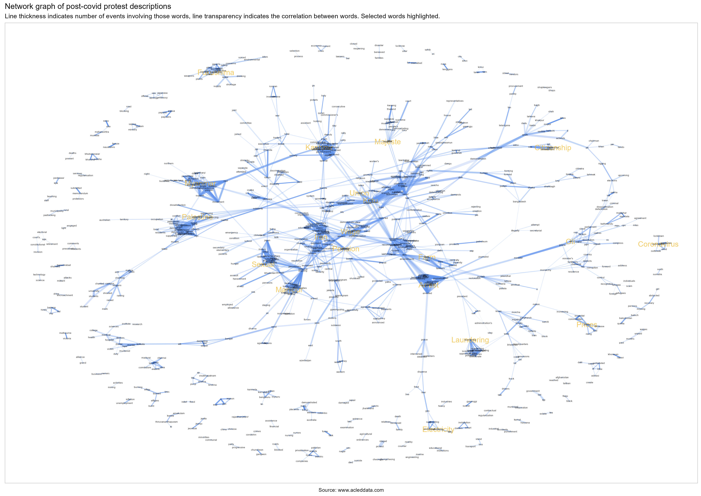

```{r setup, include=FALSE}

knitr::opts_chunk$set(echo = FALSE, warning = FALSE, message = FALSE,
                      fig.width = 9.5)

library(tidyverse)
library(here)
library(lubridate)
library(patchwork)
library(scales)
library(sf)
library(broom)
library(treemapify)
library(kableExtra) 
library(ggstream)
library(ggrepel)
library(ggcorrplot)
library(tidytext)
library(ggtext)
library(widyr)
library(ggraph)
library(janitor)

`%out%` <- Negate(`%in%`)
options(scipen = 100)
theme_set(theme_light())


```

```{r data, include=FALSE}
country_list <- c("Australia", "Afghanistan", "Bangladesh", "Bhutan", "Cambodia", 
                  "China", "Fiji", "Hong Kong", "Japan", "India", "Indonesia", 
                  "Iran",  "Laos", "Malaysia", "Maldives", "Mongolia", "Myanmar", 
                  "Nepal", "New Zealand",  "North Korea", "Pakistan", "Papua New Guinea",
                  "Philippines", "Singapore", "Solomon Islands", "South Korea", 
                  "Sri Lanka", "Thailand", "Timor-Leste", "Vanuatu", "Vietnam")

population <- read_csv(here("data", "wdi_all_countries_population.csv")) |> 
  janitor::clean_names()  %>%
  mutate(across(matches("_yr"), ~ as.numeric(.))) |> 
  pivot_longer(cols = x2000_yr2000:x2023_yr2023, 
               names_to = "year", 
               values_to = "population") |>
  mutate(year = str_sub(year, start = -4, end = -1), 
         year = as.double(year)) |> 
  rename(country = country_name) |> 
  mutate(country = 
           case_when(str_detect(country, "Korea, Rep.") ~ "South Korea",
                             str_detect(country, "Korea, Dem. People's Rep.") ~ "North Korea", 
                             str_detect(country, "Hong Kong SAR, China") ~ "Hong Kong", 
                             str_detect(country, "Iran, Islamic Rep.") ~ "Iran", 
                             str_detect(country, "Lao PDR") ~ "Laos", 
                             country == "Viet Nam" ~ "Vietnam", 
                             TRUE ~ country), 
         country_iso = countrycode::countrycode(country,
                                   origin = "country.name", 
                                   destination = "iso3c")) |> 
  filter(!is.na(country) & 
           country %out% c("Data from database: World Development Indicators", 
                           "Last Updated: 06/28/2024"))

population_estimates <- crossing(country = population$country, year = 2000:2024) |> 
 left_join(population |> 
             select(year, country, population), 
           by = c("year", "country")) |> 
 group_by(country) %>% 
 fill(population, .direction = "updown") 


world_shape <- st_read(here("data", 
                            "world-administrative-boundaries", 
                            "world-administrative-boundaries.shp"), 
                       quiet = TRUE)

myanmar_adm1 <- st_read(here("data", 
                             "mmr_polbnda2_adm1_mimu_250k", 
                             "mmr_polbnda2_adm1_mimu_250k.shp"), 
                        quiet = TRUE) |> 
  rename(state = ST, 
        admin1_pcode = ST_PCODE) |> st_as_sf()

country_iso3 <- world_shape |> 
  distinct(name, iso3)

acled_filtered <- readRDS(here("data", "acled_filtered.rds"))

most_events_list <- acled_filtered |> 
  filter(event_type != "Protest") |> 
  group_by(country) |> 
  summarise(events = n()) |> 
  arrange(desc(events)) |> 
  pull(country)

most_fatalities_list <- acled_filtered |> 
  group_by(country) |> 
  mutate(fatalities = as.numeric(fatalities)) |> 
  summarise(fatalities = sum(fatalities, na.rm = TRUE)) |> 
  arrange(desc(fatalities)) |> 
  pull(country)

actor_codes_acled <- tribble(
  ~actor_code, ~description, 
  1, "State Forces", 
  2, "Rebel Groups", 
  3, "Political Militias", 
  4, "Identity Militias", 
  5, "Rioters",
  6, "Protesters", 
  7, "Civilians", 
  8, "Other Forces"
)

interaction_codes_acled <- read_csv(here("data", "interaction_codes_acled.csv"))

acled_actors <- rbind(
  acled_filtered |>
    select(actor = actor1, actor_code = inter1, event_id_cnty),
  acled_filtered |> 
    select(actor = actor2, actor_code = inter2, event_id_cnty)) |> 
  filter(!is.na(actor)) |> 
  left_join(acled_filtered |> 
              select(event_id_cnty, interaction, event_date, country, fatalities,
                     sub_event_type, event_type), 
            by = c("event_id_cnty"),
            relationship = "many-to-many") |> 
  mutate(event_date = as.Date(event_date, "%d %B %Y"), 
         year = year(event_date), 
         actor_code = as.double(actor_code)) |> 
  left_join(actor_codes_acled |>
              rename(actor_description = description), 
            by = "actor_code", 
            relationship = "many-to-many") 

afpak_buffer <- st_read(here("data", "afpak_buffer", "afpak_buffer.shp")) |> st_as_sf()

afir_buffer <- st_read(here("data", "afir_buffer", "afir_buffer.shp")) |> st_as_sf()

mmr_buffer <- st_read(here("data", "mmr_buffer", "mmr_buffer.shp"))

kash_buffer <- st_read(here("data", "kash_buffer", "kash_buffer.shp"))


mmr_shape <- world_shape |> filter(str_detect(name, "Myanmar")) 


indo_adm1_pop <- read_csv(here("data", "idn_admpop_adm1_2020_v2.csv")) |>
  janitor::clean_names() |>
  select(adm1_pcode, population = t_tl) |>
  left_join(
    readxl::read_excel(here(
      "data", "idn_adminboundaries_tabulardata.xlsx"
    ), sheet = 2) |>
      clean_names() |>
      select(adm1_pcode, adm1_en, area_sqkm),
    by = "adm1_pcode"
  )

```

## Introduction

This report documents observed conflict trends in the Asia-Pacific region over the past ten years. The primary dataset used is the Armed Conflict Location and Event Data (ACLED). The reasons for privileging this source over UCDP's Georefereced Event Dataset are (detailed [here](https://risk-anticipation-hub.github.io/conflict-trends-asia-pacific/acled_ucdp.html)) were because ACLED has wider diversity of sources and records a wider range of conflict events. 

The gif below displays cumulative conflict events collected by ACLED, over the past 10 years. This is a visualisation of all the data we are working with (or at least all observations or rows). 

Major conflict hotspots in the region are all quite clear: Afghanistan, Pakistan, Kashmir, Bangladesh, Chhattisgarh in India, Southern Thailand, Mindanao and the rest of the Philippines, and Myanmar. 

<br>

[](https://github.com/risk-anticipation-hub/conflict-trends-asia-pacific/raw/main/plots/asia_pacific_event_types_grey.gif)

<br>


However, making sense of this data will require a deeper examination of the various contexts in this region. This document cannot be exhaustive, given the vastness of the Asia-Pacific and its mix of contexts. Instead, it is an exploratory analysis, limited to these topics:  

* A review of conflict by event type: 5-year and 10-year summary charts and graphs. 

* An analysis of events and fatalities per capita

* An overview of conflict in Myanmar and its spillover in the region: one of the major foci of conflict. Includes overview of most lethal conflict actors.   

* An overview of cross-border violence between Afghanistan and Pakistan and Pakistan and India.

* Conflict actors 

* Text mining of protest descriptions

Data collection has not been uniform. ACLED, like any other agency, and will expand their services if their resources and capacity allow for it -- we can see several countries pop in as conflict monitoring there comes "online". We accounted for this by both limiting timeframes (only plotting cross-border violence in Afghanistan and Pakistan for years where data collection was ongoing in both countries) and by making use of annual or quarterly means as well as per capita calculations to make for fair comparisons. 

ACLED has [regional overviews](https://acleddata.com/2024/09/06/asia-pacific-overview-august-2024/) but they tend to be more punctual, bird's eye and monthly products intended for different purposes. ACLED also adds value through its in-depth reports, such as this one on [Hindu nationalism](https://acleddata.com/2024/04/28/india-votes-2024-a-resurgent-hindu-nationalism-sets-the-stage-for-the-upcoming-elections-driving-communal-violence/) which highlight how country-level analysis tends to be very specific. In-depth reports from in-country analysts are far more accurate sources of information and can convey the "feel" of the situation on the ground, imparting their expert judgement. 

Nevertheless, this report does have some original research to offer, with relatively few overlaps with ACLED's current output. However, as opposed to an aid for decision making, this document serves more as a reasonable overview on conflict in the region. 

However, any analysis is limited by the knowledge of the subject matter expert and the time available. This means that there is much to be gained from both going larger (comparing regions, forms of government or economic blocs) and smaller (country-level or subnational) with this type of analysis. 

Any analysis is limited by the knowledge of the subject matter expert and the time available. This means that there is much to be gained from both going larger (comparing regions, forms of government or economic blocs) and smaller (country-level or subnational) with this analysis. There are definitely many more avenues of exploration, given the vastness of the Asia-Pacific and the diversity of the contexts within it. 


<br><br><br>

### Summary tables and trends

Below is a table comparing the the number of political conflict events and fatalities in the countries that ACLED has been monitoring since 2014. Fatalities have decreased across most countries since 2014, with the exceptions of Myanmar and Nepal. Myanmar is in a civil war and Nepal experienced severe political instability.  

<br>

```{r}
summary_stats <- acled_filtered |> 
  group_by(country, year) |> 
  summarise(events = n_distinct(event_id_cnty), 
            fatalities = sum(fatalities, na.rm = TRUE), 
            .groups = "drop")
```


```{r}
event_diff_spec_2014 <- summary_stats |> 
  select(-fatalities) |> 
  filter(year %in% c(2014, 2023)) |> 
  pivot_wider(names_from = year, 
              values_from = events, 
              names_prefix = "events_") |> 
  filter(!is.na(events_2014)) |> 
  mutate(event_diff_pc = round((events_2023 - events_2014) / events_2014 * 100, digits = 2)) |> 
  filter(country != "Laos") |> 
  mutate(country = fct_relevel(country, 
                               c("Myanmar", "Nepal", "Sri Lanka", "Bangladesh", 
                                 "Pakistan", "Thailand", "Vietnam", "Cambodia"))) |> 
  arrange(country)

fatalities_diff_spec_2014 <- summary_stats |>
  select(-events) |>
  filter(year %in% c(2014, 2023)) |>
  pivot_wider(names_from = year,
              values_from = fatalities,
              names_prefix = "fatalities_") |>
  filter(!is.na(fatalities_2014)) |>
  mutate(fatalities_diff_pc = 
           round((fatalities_2023 - fatalities_2014) / fatalities_2014 * 100,
                                    digits = 2)) |>
  mutate(fatalties_diff_pc = ifelse(is.nan(fatalities_diff_pc), 0, fatalities_diff_pc)) |>
  filter(country != "Laos") |> 
  arrange(desc(fatalities_diff_pc))


```

<br>

As ACLED expanded the number of countries it monitored, a more comprehensive comparison is possible for the five-year horizon: 

Myanmar, Indonesia, Iran and Bangladesh have all experienced a significant increase in unrest in the past five years. Though unrest in these countries is less bloody than before (with the exception of Myanmar). The lethality of conflict in Pakistan has increased significantly. 

<br>

```{r}

event_diff_spec_2019 <- summary_stats |> 
  select(-fatalities) |> 
  filter(year %in% c(2019, 2023)) |> 
  pivot_wider(names_from = year, 
              values_from = events, 
              names_prefix = "events_") |> 
  filter(!is.na(events_2019)) |> 
  mutate(event_diff_pc = round((events_2023 - events_2019) / events_2019 * 100, digits = 2)) |> 
  filter(country != "Laos") |> 
  arrange(desc(event_diff_pc)) 


fatalities_diff_spec_2019 <- summary_stats |>
  select(-events) |>
  filter(year %in% c(2019, 2023)) |>
  pivot_wider(names_from = year,
              values_from = fatalities,
              names_prefix = "fatalities_") |>
  filter(!is.na(fatalities_2019)) |>
  mutate(fatalities_diff_pc = 
           round((fatalities_2023 - fatalities_2019) / fatalities_2019 * 100,
                                    digits = 2)) |>
  mutate(fatalities_diff_pc = ifelse(is.nan(fatalities_diff_pc), 0, fatalities_diff_pc),  
         country = fct_relevel(country, event_diff_spec_2019 |> pull(country))) |>
  filter(country != "Laos") |> 
  arrange(country)


```


<br>

The increase in the number of events -- especially if it was due primarily to protests -- is not an immediate cause for concern. South Koreans have managed to enact several changes through their protests (like the removal of President Park Geun-hye), as have Malaysians and Nepalese. Though these changes have also had varying levels of success. 

Likewise, a reduction in events only indicates stabilisation -- whether that has come about through addressing core issues or state crackdowns has to be determined on a country-by-country level. 

On the whole, however, conflict events have decreased in more than half of Asia-Pacific countries and conflict fatalities are down for almost all countries, as can also be seen from the trendlines below:  

<br>

```{r fig.height= 6.5}
acled_filtered |> 
  filter(year > 2013 & year <= 2025) |> 
  filter(country %in% most_fatalities_list) |> 
  filter(country %out% c("Singapore", "Bhutan", "Fiji", "Maldives", 
                         "South Korea", "New Zealand", "Vanuatu")) |> 
  group_by(country, year) |> 
  summarise(fatalities = sum(fatalities, na.rm = TRUE), 
            .groups = "drop") |> 
  left_join(population_estimates, 
            by = c("country", "year")) |>
  mutate(date = as.Date(paste(year, 1, 1, sep="-")), 
         fatalities_100k = fatalities / population * 100000, 
         country = fct_relevel(country, most_fatalities_list)) |>
  
  ggplot(aes(x = date, y = fatalities)) + 
  geom_smooth(alpha = .1, colour = "salmon") + 
  geom_line(aes(group = country)) + 
  scale_x_date(date_labels = "%Y", 
               date_breaks = "2 years") + 
  facet_wrap(~ country, 
             scales = "free_y") +
  scale_y_continuous(labels = comma) +
  theme(axis.text.x = element_text(angle = 60, hjust = 1), 
        strip.background = element_rect(fill = "black")) + 
  labs(title = "Political incident fatalities by country in descending order, 2014-2023", 
       subtitle = "Black are the actual events, the trend line is in pink",
       y = "Annual fatalities", 
       x = "")
```


<br><br><br>

### Per Capita


Both the magnitude (number of events) and the severity (number of events per 100,000 persons) provide important perspectives on conflict: India may have a very large number of conflict events, but as can be seen from the graph below, on a per-capita basis, it sits fairly in the middle of the pack.

The plot below is of the number of events per 100,000 persons against the number of conflict fatalities per 100,000 persons. The number of events is represented by the size of each point, and the colour represents total conflict fatalities. 

<br>

```{r fig.height=6.5}
acled_filtered |>
  filter(year < 2024 & year > 2013) |> 
  group_by(country, year) |> 
  summarise(events = n_distinct(event_id_cnty), 
            fatalities = sum(fatalities, na.rm = TRUE), 
            .groups = "drop") |> 
  left_join(
    population_estimates, 
    by = c("country", "year")
  ) |> 
  mutate(events_100k = events / population * 100000, 
         fatalities_100k = fatalities / population * 100000) |> 
  group_by(country) |> 
  summarise(events_100k = mean(events_100k, na.rm = TRUE), 
            fatalities_100k = mean(fatalities_100k, na.rm = TRUE), 
            events = sum(events), 
            fatalities = sum(fatalities)) |> 
  arrange(desc(events_100k)) |> 
  ggplot(aes(x = events_100k + 0.01, 
             y = fatalities_100k + 0.01)) + 
  #geom_segment(aes(x = .04, xend = .02, y = 2, yend = 2), arrow = arrow(), 
               #size = .1, lwd = 1.2, colour = "lightsteelblue", alpha = .1) + 
  #geom_segment(aes(x = .6, xend = .6, y = 11, yend = 35), arrow = arrow(), 
               #size = .1, lwd = 1.2, colour = "bisque3", alpha =.1) + 
  geom_smooth(method = "lm",formula = y ~ splines::bs(x, 2), se = FALSE, lwd = 1) + 
  geom_hline(yintercept = 0.01, lwd = .2, linetype = "dashed", alpha = .5) + 
  geom_vline(xintercept = 0.01, lwd = .2, linetype = "dashed", alpha = .5) + 
  geom_hline(yintercept = 1.01, lwd = .9, linetype = "dashed", alpha = .4, colour = "cornflowerblue") + 
  geom_vline(xintercept = 1.01, lwd = .9, linetype = "dashed", alpha = .4, colour = "cornflowerblue") + 
  geom_point(aes(colour = fatalities, 
                 size = events), alpha = .8) + 
  # geom_text(aes(label = country), vjust = "inward") +
  ggrepel::geom_text_repel(aes(label = country), size = 3, vjust = "inward", 
                           max.overlaps = 20) +
  scale_x_log10(breaks=c(0.01, 0.11, 1.01, 2.01, 5.01), labels=\(x) x-0.01) + 
  scale_y_log10(breaks=c(0.01, 0.11, 1.01, 10.01), labels=\(x) x-0.01) +
  scale_size_continuous(range = c(1, 9), breaks = c(100, 1000, 10000, 100000), 
                        labels = comma) + 
  scale_colour_viridis_c(option = "magma", direction = -1, end = .85, labels = comma) + 
  labs(x = "Events per 100k", 
       y = "Fatalities per 100k", 
       title = "Severity and lethality of political conflict in the Asia-Pacific, 2014-2023", 
       subtitle = "Mean annual events and fatalities per country per 100,000 persons", 
       caption = "Source: www.accleddata.com", 
       size = "No. Events", 
       colour = "Fatalities") + 
  theme(plot.caption = element_text(hjust = .5))


```

<br> 

Most interesting is the central tendency (the solid blue line) that most countries in the Asia-Pacific seem to sit on. I would venture that this line describes something like state control, as we have disproportionately quiet autocracies (or their approximations) on one end of the line and other other extreme are countries where violence has spread out of state control. 

Myanmar, Afghanistan have exited the central tendency and have experienced open warfare. The Philippines, Papua New Guinea and Pakistan are all at risk or were at risk of doing the same during the past 10 years. The blue dotted reference lines were chosen just on a visual inspection of the data, but having at least one annual conflict fatality per 100,000 persons does seem to be a reasonable threshold for now. 

As a counterpart to these autocracies (as they exist on a spectrum of North Korea to Vietnam) are the "functioning" democracies of the region (except Hong Kong), who have also exited this central tendency but lie around the `y = 0` but past the blue dotted vertical reference line at `x = 1`. For these countries, political participation and conflict is not associated with the increase in fatalities per 100k seen in the other countries in the region. 

All have populations who actively participate in the political process -- even the least protest-inclined of this group, Fiji and Japan, have higher rates of participation (i.e. number of events per 100k) than Indonesia or Malaysia, or even pre-2024 Bangladesh. In this regard, Fiji is an overachiever, outperforming Singapore in its transition to a "functioning" or "mature" democracy. 

I don't think there is an optimum amount of political conflict. But we can hypothesise from the high rates of political conflict in South Korea, The Maldives and Hong Kong that at the extreme ends of the x-axis are countries indicate that countries are experiencing widespread dissatisfaction, verging on revolt. And that this is not desirable. This would be interesting to test this out on other regions and see if there is more we can get from this.   

As a final note, ACLED does not capture all conflict. The number of fatalities per 100,000 that we have calculated here is more for comparisons between countries within the ACLED dataset. Were we looking for the actual mortality rate or leading causes of death, there are [preferred sources](https://www.who.int/data/gho/data/themes/mortality-and-global-health-estimates/ghe-leading-causes-of-death). Though it does put Myanmar and Afghanistan into perspective: the [homicide rate](https://www.who.int/data/gho/data/indicators/indicator-details/GHO/estimates-of-rates-of-homicides-per-100-000-population) in Southeast Asia is four per 100,000, and the [road traffic death rate](https://www.who.int/data/gho/data/indicators/indicator-details/GHO/estimated-road-traffic-death-rate-per-100-000-population) is 16.

<br><br><br>


## Event types 

### Streamgraphs


```{r}
event_stream_data <- acled_filtered |> 
  mutate(quarter = floor_date(event_date, unit = "quarter")) |> 
  group_by(country, event_type, quarter) |> 
  summarise(events = n_distinct(event_id_cnty), 
            fatalities = sum(fatalities, na.rm = TRUE), 
            .groups = "drop") 

event_type_streamgraph <- function(df, column_var) {
  
  column_var <- enquo(column_var)
  
  df |>
    ggplot(aes(x = quarter, y = !!column_var, fill = event_type)) + 
    geom_stream(aes(fill = event_type)) + 
    scale_fill_manual(values = c(
      "Battles" = "#9b2226",
      "Violence against civilians" = "#001219",
      "Explosions/Remote violence" = "#ee9b00",
      "Protests" = "#94d2bd",
      "Strategic developments" = "#e9d8a6",
      "Riots" = "#005f73"
    )) +
    facet_wrap(~ country, scales = "free_y") + 
    labs(fill = "", 
         x = "") +
    theme(legend.position = "top",
          legend.key.width = unit(.3, "cm"), 
          legend.key.height = unit(.3, "cm"),
          legend.text = element_text(size = 5), 
          axis.text.y = element_text(size = 4), 
          axis.text.x = element_text(size = 4, angle = 30, hjust = 1, vjust = 1), 
          strip.text = element_text(size = 7), 
          strip.background = element_rect(fill = "black"), 
          plot.title = element_text(size = 13), 
          plot.subtitle = element_text(size = 11)) + 
    guides(fill = guide_legend(nrow = 1))
}

```


#### Fatalities over time 

The charts below are streamgraphs, where values over time -- in the case below, quarterly conflict fatalities between 2014 and 2024 -- are represented by the area. Though there are negative values shown, the Y-axis values are absolute; however, using a streamgraph, as opposed to an area graph, makes spikes in violence (from elections, for instance) much more visible. 

From the chart below, sorted in order of number of **fatalities** from political incidents per quarter, it is clear that Afghanistan, Myanmar, Pakistan and Philippines have experienced severe political unrest, ranging from war, terrorism (with its hallmark explosions and remote violence) and political killings. Conflict in Afghanistan and Philippines has fallen significantly since its peak, but Myanmar is still in full conflagration and Pakistan is on the upswing: 

<br>

```{r fig.height = 6.5}

event_stream_data |> 
  mutate(country = fct_relevel(country, most_fatalities_list)) |>
  filter(country %out% c("Australia", "Japan", "Mongolia", 
                         "New Zealand", "Vanuatu", "Timor-Leste", 
                         "Maldives")) |> 
  filter(fatalities > 0) |>
  event_type_streamgraph(fatalities) + 
  labs(title = "Number of fatalities by event type over time", 
       subtitle = "Data from 2014-01-01 to 2024-10-29, but not countries had full coverage during this period",
       y = "Fatalities per quarter")

```

<br>

It appears that Indonesia, Iran and Cambodia each have experienced much political violence leading up to elections, though in Cambodia, the deaths associated with protests in 2018 have served as a deterrent. 

<br><br>

#### Events over time

The streamgraphs below show the number of political incidents per quarter broken down by event type, sorted in order by the **number of political** incidents. 

It should be noted that in "stable" countries, the flavour of political conflict consists mainly of protests (which indicate widespread dissatisfaction but not that all nonviolent means have been exhausted). 

The Thai people manifested their dissatisfaction has manifested in 2014 and in 2021. However, the Thai state has responded by firmly clamping down on its citizenry in both instances, as can be seen from the swift decrease in events. This approach does not address the core issues behind the protests. Notably, the share of protests compared to violent political incidents seems to be worsening, indicating that more actors (the state included) believe that nonviolent solutions have been exhausted. 

Bangladesh seems to have an outsized number of riots. Whilst protests are a natural feature of any democracy, riots are less so, given their disruptive and violent nature. Bangladesh seems to have a higher ratio of riots to protests than any other country except Papua New Guinea. This speaks to the inability of the state to maintain order and the ease of inciting the population to violence (which also means that there are injustices to inflame). 

Political incidents in Bangladesh (as we will explore in later section) had been falling until they increased around 2018, around the time of the first quota reform protests.  

<br> 


```{r fig.height = 6.5}

event_stream_data |> 
  mutate(country = fct_relevel(country, most_events_list)) |>
  filter(country %out% c("Bhutan")) |> 
  event_type_streamgraph(events) + 
  labs(title = "Number of political incidents by event type over time", 
       subtitle = "Data from 2014-01-01 to 2024-10-29, but not countries had full coverage during this period",
       y = "Events by quarter")
```

<br>

Let's take a closer look at some countries of interest and narrow down from a ten-year horizon to a five-year one:

Myanmar and Afghanistan bear all the patterns of war. But what is surprising is the extent to which Philippine civil society has deteriorated due to damage from the drug war and the resulting political violence. When compared to other countries, their share of protests is very low, lower even than Cambodia. Even as the drug war operations ceased and killings began to drop off sharply, the flavour of political unrest in the Philippines seems deeply changed, with its participatory democracy suffering massive setbacks. This is after all, not only the country of the EDSA revolution, but of the dictator Marcos as well. 

<br>

```{r fig.height = 6}
event_stream_data |> 
  mutate(country = fct_relevel(country, most_events_list)) |>
  filter(country %in% c("Myanmar", "Afghanistan", 
                        "Philippines", "China", 
                        "Indonesia", "Vietnam"
                        ) & 
           quarter >= "2019-01-01") |>  
  event_type_streamgraph(events) + 
  labs(title = "Number of political incidents by event type over time", 
       subtitle = "Data from 2019-01-01 to 2024-10-29",
       y = "Events per quarter") + 
  theme(legend.position = "top") 
```

<br>

From the dramatic decrease in political activity starting in 2020, it would appear that the Vietnamese state has seized the opportunity to presented by COVID to advance state authority and solidify its hold on the country. China saw a more modest reduction in political incidents, and is undergoing an increase in unrest related to labour and wage issues. 

Indonesia is has also seen a large increase in political incidents driven by economic woes, increasing state authoritarianism and violations of human rights and environmental and land rights. 

In post-genocide Myanmar, with the longstanding civil war with ethnic and communal militias in the background, the population exploded in protests against the Tatmadaw's coup. However, nonviolent means were soon exhausted and the country is now in full civil war. 

With the victory of the Taliban, Afghanistan has seen a 96% reduction on conflict fatalities and a 83% drop in conflict events since 2019 levels. However, civil society has by no means recovered, nor does Afghanistan bear any of the hallmarks of a participatory democracy. 

<br><br><br>

## Protests 

The most common form of political conflict is to protest. Protests are a non-violent form of political conflict which manifest when all legal and administrative avenues have been exhausted. Widespread protests indicate that "hole" in governance, given that such protests would only be possible if a significant proportion of the population not only agreed with them but also felt that the issue had gone unaddressed long enough or is egregious to manifest their outrage in public. 

In this section, we explore the concerns of protesters in the Asia-Pacific. Below is a network graph of event descriptions of protests in the Asia-Pacific in the past 10 years. The links (edges) between each of the words indicate the strength of the relationship (transparency) and the number of times this word pair has occurred (thickness). Only the most common word pairs with correlations above 0.2 are included (for legibility). 


The main topics identified from the graph include (cross-border issues are in bold): 

* *Contentious territories:* **Myanmar**, **Palestine**, Korea, Manipur, **Kashmir**, **Fukushima**

* *Legislation and state overreach:* Citizenship amendment, Lese majeste, Oli (Nepal), Arrest, **Money laundering**

* *Economic concerns:* Unions, **Prices**, Arrears, Pensions, Hikes

* *Service delivery and infrastructure:* Load shedding, Farms, Outages

* **Coronavirus**

These can be thought of as the prime destabilising factors for the region: in some cases, they have devolved into open conflict. Peace actors should seek the just resolution of issues and ensure that nonviolent options always remain open to people. 

<br>

```{r}
protest_country_words <- acled_filtered |> 
  filter(event_type == "Protests") |> 
  mutate(covid = ifelse(event_date >= "2020-03-11", "post-covid", "pre-covid")) |> 
  select(event_id_cnty, country, notes, covid) |> 
  unnest_tokens(word, notes) |>
  anti_join(stop_words, by = "word") |> 
  filter(str_detect(word, "[a-z]")) |> 
  filter(word %out% c("township", "district", "city", "village", 
                      "region", "town", "coded", "province", "county", 
                      "pradesh", "prefecture", "regency", 
                      "barangay", "upazila") & 
           word %out% c("january", "february", "march", "april", "may", 
         "june", "july", "august", "september", "october", 
         "november", "december")) |> 
  mutate(stem = SnowballC::wordStem(word, language = "porter"))

```


```{r}
acled_protests <- acled_filtered |> 
  filter(event_type == "Protests") |> 
  mutate(covid = ifelse(event_date >= "2020-03-11", "post-covid", "pre-covid")) |> 
  select(event_id_cnty, notes, covid) |> 
  unnest_tokens(word, notes) |> 
  anti_join(stop_words, by = "word") |> 
  filter(str_detect(word, "[a-z]")) |> 
  filter(word %out% c("township", "district", "city", "village", 
                      "region", "town", "coded", "province", "county", 
                      "pradesh", "prefecture", "regency", 
                      "barangay", "upazila", "january", "february", 
                      "march", "april", "may",
                        "june", "july", "august", "september", "october",
                        "november", "december", 
                        "report")) |> 
  mutate(stem = SnowballC::wordStem(word, language = "porter")) 
```


```{r eval=FALSE}

set.seed(234)

protest_network_graph <- acled_protests |>
  # filter(covid == "post-covid") |> 
  distinct(event_id_cnty, word) |> 
  add_count(word) |> 
  filter(n >= 425) |> 
  pairwise_cor(word, event_id_cnty, sort = TRUE) |> 
  filter(correlation >= .207) |> 
  left_join(
    acled_protests |> 
      distinct(event_id_cnty, word) |> 
      add_count(word) |> 
      filter(n >= 425) |> 
      pairwise_count(word, event_id_cnty, sort = TRUE), 
    by = c("item1", "item2")
  ) |> 
  igraph::graph_from_data_frame() %>% 
  ggraph(layout = "fr") + 
  geom_edge_link(aes(alpha = correlation, edge_width = n), colour = "cornflowerblue", check_overlap = TRUE) +
  scale_edge_width_continuous(range = c(.1, 2.5), trans = "log10") +
  scale_alpha_continuous(range = c(0.01, 0.08)) +
  geom_node_point(colour = "cornflowerblue", alpha = 0.2, size = .5) +
  geom_node_text(aes(label = ifelse(name %in% 
                                        c("myanmar", "laundering", "coronavirus",
                                          "citizenship", "union", "electricity", "farm", 
                                          "prices", "wage", "palestine", "kashmir", 
                                          "pension", "fukushima", "majeste",
                                          "arrest", "oli", "manipur", "kctu"),
                                      str_to_title(name),
                                      "")), 
                 size = 4.5, 
                 alpha = .7, 
                 colour = "goldenrod2") + 
  geom_node_text(aes(label = name), size = 1.5) + 
  theme(legend.position = "none", 
        plot.caption = element_text(hjust = .5)) + 
  labs(title = "Network graph of post-covid protest descriptions", 
       subtitle = "Line thickness indicates number of events involving those words, line transparency indicates the correlation between words. Selected words highlighted.", 
       caption = "Source: www.acleddata.com")
  

ggsave(here("plots", "protest_network_graph.png"), 
       width = 42.0, height = 29.7, units = "cm", dpi = 300)

```


[](https://github.com/risk-anticipation-hub/conflict-trends-asia-pacific/raw/main/plots/protest_network_graph.png)


<br><br><br>

### Indonesia

Whilst the regional network graph provided a very broad overview and gave insight into common trends. A country-level one is far more interpretable. 


<br>

```{r eval=FALSE}

set.seed(234)

protest_network_graph_indonesia <- acled_protests |>
  filter(str_detect(event_id_cnty, "IDN")) |> 
  # filter(covid == "post-covid") |> 
  distinct(event_id_cnty, word) |> 
  add_count(word) |> 
  filter(n >= 100) |> 
  pairwise_cor(word, event_id_cnty, sort = TRUE) |> 
  filter(correlation >= .15) |> 
  left_join(
    acled_protests |> 
      distinct(event_id_cnty, word) |> 
      add_count(word) |> 
      filter(n >= 100) |> 
      pairwise_count(word, event_id_cnty, sort = TRUE), 
    by = c("item1", "item2")
  ) |> 
  igraph::graph_from_data_frame() %>% 
  ggraph(layout = "fr") + 
  geom_edge_link(aes(alpha = correlation, edge_width = n), colour = "lightskyblue2", check_overlap = TRUE) +
  scale_edge_width_continuous(range = c(.1, 2.5), trans = "log10") +
  scale_alpha_continuous(range = c(0.01, 0.08)) +
  geom_node_point(colour = "lightskyblue2", alpha = 0.2, size = .5) +
  geom_node_text(aes(label = ifelse(name %in% 
                                        c("myanmar", "laundering", "coronavirus",
                                          "citizenship", "union", "load", "farm", 
                                          "prices", "arrears", "palestine", "kashmir", 
                                          "pension", "fukushima", "majeste",
                                          "arrested", "oli", "manipur", "korea", 
                                          "football", "rights", 
                                          "incumbent", "drivers", "dispute", 
                                          "papua", "kpk"),
                                      str_to_title(name),
                                      "")), 
                 size = 4.3, 
                 alpha = .7, 
                 colour = "goldenrod2") + 
  geom_node_text(aes(label = name), size = 1.5) + 
  theme(legend.position = "none", 
        plot.caption = element_text(hjust = .5)) + 
  labs(title = "Network graph of protest descriptions in Indonesia 2014-2024", 
       subtitle = "Line thickness indicates number of events involving those words, line transparency indicates the correlation between words. Selected words highlighted.", 
       caption = "Source: www.acleddata.com")
  

ggsave(here("plots", "protest_network_graph_indonesia.png"), 
       width = 11, height = 7, units = "in", dpi = 300)

```


[](https://github.com/risk-anticipation-hub/conflict-trends-asia-pacific/raw/main/plots/protest_network_graph_indonesia.png)

<br><br><br>

### Common protest topics

The following charts, broken down by country show the (log of) odds that a word will appear in the event description for protest events in a given country. 

As an example, the word most likely to appear in protest events in India is **BJP**. 

Most topics are local or are place names (indicating significant protests in a specific area), but several common topics have been manually identified and are coloured in the chart below. 

<br>

```{r fig.height=8}
admin2_list <- acled_filtered |> 
  filter(!is.na(admin2)) |> 
  distinct(admin2) |> 
  mutate(admin2 = str_to_lower(admin2), 
         admin1 = str_replace_all(admin2, 
                                  "city|special|south |north |west |east|-north|\\-", 
                                  ""), 
         admin1 = str_trim(admin2)) |> 
  filter(!is.na(admin2)) |> 
  pull(admin2)

admin1_list <- acled_filtered |> 
  filter(!is.na(admin1)) |> 
  distinct(admin1) |> 
  mutate(admin1 = str_to_lower(admin1), 
         admin1 = str_replace_all(admin1, 
                                  "city|special|south |north |west |east|-north|\\-", 
                                  ""), 
         admin1 = str_trim(admin1)) |> 
  pull(admin1)

protest_order <- protest_country_words |> 
  group_by(country) |> 
  summarise(count = n_distinct(event_id_cnty)) |> 
  arrange(desc(count)) |> 
  pull(country)


protest_country_words |> 
  filter(covid == "post-covid") |> 
  filter(word %out% c(admin1_list, admin2_list) & 
           word %out% c("protest", "staged", "demonstration", "held", "couple", 
                        "demonstrators", "urged", "banners", "slogan", "slogans", 
                        "banner", "coordinating", "opposed", "condemned", 
                        "demanded", "demonstrate", "rally", "demands", 
                        "municipality", "locality", "township", "metropolitan", 
                        "provincial", "prefectural", "bandar", "federation") & 
           stem %out% c("protest")) |>
  count(word, country, sort = TRUE) |>  
  bind_tf_idf(country, word, n) |> 
  tidylo::bind_log_odds(country, word, n) |> 
  filter(n > 4) |> 
  mutate(country = fct_relevel(country, protest_order)) |> 
  mutate(
    word_group = case_when(
      str_detect(
        word,
        "worker|arrear|wage|factori|union|kctu|picket|pension|affili|retire|commod|labor|price|cpi|employer|economic|financial|strike|owe|increase|inflation|company|salary|liveli|compensation")
      ~ "economic",
      str_detect(word, "tamil|hindu|nadu|indian") ~ "ethnic",
      str_detect(word, "bjp") & country != "Bangladesh" ~ "ethnic", 
      str_detect(word, "corona|lockdown|restrict|home|pandem") ~ "covid",
      str_detect(word, "omni|congress|articl|law|legco|sabha")  ~ "legislation",
      str_detect(word, "provin|local|farmer|skm|bku|regen|farm|tribal") ~ "rural",
      str_detect(word, "myanmar|kachin|arakan") ~ "myanmar",
      str_detect(word, "kashmir|jammu") ~ "kashmir",
      str_detect(word, "press|editor|media") ~ "press",
      str_detect(word, 
                 "military|coup|lese|maj|president|government|monarchy|police|arrest|release|oli|kpk") 
      ~ "state", 
      str_detect(word, "student|university|youth|teacher|education|school") ~ "student", 
     TRUE ~ "other"),
    word_group = fct_relevel(word_group, 
                             c("economic", "disobedience", "ethnic",   
                               "legislation", "rural", "covid", "kashmir", 
                               "press", "student", "state", "other"))
  ) |>
  filter(word %out% c("front", "conference", "demanding", 
                      "including", "support", "demand")) |> 
  arrange(desc(log_odds_weighted)) |> 
  group_by(country) |> 
  slice(1:15) |> 
  ungroup() |>
  ggplot(aes(x = log_odds_weighted, 
             y = reorder_within(str_sub(word, 1, 25), 
                                log_odds_weighted, 
                                country))) + 
  geom_col(aes(fill = word_group)) + 
  scale_fill_manual(values = c(
    "economic" = "#addc30",
    "ethnic" = "#2c728e",
    "covid" = "#21918c",
    "legislation" = "#472d7b",
    "rural" = "#28ae80",
    "kashmir" = "#3b528b",
    "press" = "#5ec962",
    "state" = "#440154",
    "student" = "#fde725",
    "other" = "grey50"
  )) +
  scale_y_reordered() + 
  facet_wrap(~ country, scales = "free") + 
  theme(axis.text.y = element_text(size = 5), 
        axis.text.x = element_text(size = 5), 
        legend.text = element_text(size = 7), 
        legend.position = "top") + 
  labs(x = "Log odds weighted", 
       y = "", 
       fill = "Topic", 
       title = "Most common protest descriptions by country") + 
  guides(fill = guide_legend(nrow = 1))

  

```


<br>

Despite all the violence in Pakistan, `load shedding` still appears in the words most likely to be associated with protests in Pakistan, perhaps indicating that their infrastructure is in a truly dire state, even when compared to countries of similar income levels. 

Are wage protests in China a sign of a slowing economy or is it that the only acceptable subjects to protest about in China are economic issues? 

<br><br><br>


## Myanmar


```{r}

sf_use_s2(FALSE)

acled_filtered |> 
  filter(!is.na(longitude) & !is.na(latitude) & 
             country %in% 
           c("Myanmar", "China", "Bangladesh", "Laos", "Thailand")) |>
  left_join(
    acled_filtered |> 
      filter(!is.na(longitude) & !is.na(latitude) & 
             country %in% 
           c("Myanmar", "China", "Bangladesh", "Laos", "Thailand")) |>
      st_as_sf(coords = c("longitude", "latitude"), crs = 4326) |>
              st_intersection(mmr_buffer) |>
              st_make_valid() |> 
              st_drop_geometry() |>
              mutate(mmr_border = "Myanmar border") |>
              select(event_id_cnty, mmr_border), 
            by = "event_id_cnty") |> 
  mutate(mmr_border = ifelse(is.na(mmr_border), "Non-border", mmr_border)) |> 
  mutate(pre_post_coup = case_when(
    event_date < "2016-10-09" ~ "Pre-Genocide",
                  event_date >= "2016-10-09" & event_date < "2021-02-01" ~ 
      "Post-Genocide, pre-Coup", 
                  event_date >= "2021-02-01" ~ "Post-Coup"), 
    pre_post_coup = fct_relevel(pre_post_coup, 
                                c("Pre-Genocide", 
                                  "Post-Genocide, pre-Coup", 
                                  "Post-Coup"))) |>
  filter(event_type != "Peaceful protest") |> 
  filter(country == "Myanmar" | mmr_border == "Myanmar border") |> 
  ggplot() + 
  geom_sf(data = mmr_shape, colour = "blue", alpha = .7, fill = NA) + 
  geom_sf(data = mmr_buffer, alpha = .1, fill = "grey", colour = NA) + 
  geom_point(aes(x = longitude, y = latitude, colour = event_type), 
             size = .5, 
             alpha = .2) + 
  facet_wrap(~ pre_post_coup) + 
  guides(colour = guide_legend(override.aes = list(alpha = 1, size = 2))) + 
  labs(colour = "Event type") + 
  theme(strip.background = element_rect(fill = "black"))


```


<br>

With reference to the maps above, it would appear that unlike in Afghanistan and Pakistan that will be discussed later, cross-border conflict seems to have been largely contained within Myanmar. The visible exceptions in the border regions in the map below seem to back this up, upon investigation. 

First, Cox's Bazaar already had an elevated level of political violence even before the first militaty crackdown; admittedly, there had been Rohingya refugees in Cox's Bazaar prior to the commencement of ACLED's data collection -- and Chiang Rai: and a cursory inspection of the data indicates the majority of the recent political violence to have been driven by domestic issues, such as the cyclical election violence and calls for reforms to the monarchy. 

However, the spillover from the civil war in Myanmar has been pervasive in the region. And we will discuss this in its own section below, after a brief review of the current situation in Myanmar. 


<br>

[](https://github.com/risk-anticipation-hub/conflict-trends-asia-pacific/raw/main/plots/roads_conflict_black_red_combined.png)


<br>

The plots above are of the Myanmar civil war, with events (red) plotted over the road network (blue). Gold squares are Tatamadaw regional commands and the blue squares are border crossings. 

Within Myanmar itself, with reference to the maps below, the fighting seems to have come to a very critical juncture. At first glance, the fighting seems to have lessened in 2024, but with reference to the line graph of monthly fatalities, we know that the fighting has instead been concentrated. 

The rebels and the National Unity Government have sought to isolate military garrisons from each other; and the Tatmadaw needs to maintain its supply lines to its major command centres (as they protect border crossings, various mineral mines and other resources, such as methamphetamine factories) as well as try to project power into rebel-held territory. 

This has given rise to the very linear pattern of violence as both sides contest for control over the road network. For the rebels, they have stated that "all roads lead to Naypyitaw" (the gold diamond in the middle of the country) are have been trying to enclose the military and limit its movements. 

In the northeast, Lashio has fallen, drastically lowering the amount of conflict in the area. And Muse has lost five out of its ten border gates with China. In the southeast Loikaw has fallen (not a major command post, but a city at major arterial intersection in the road network) and so has the crossing with Chiang Mai at Myawaddy. 

In the northwest, India has closed the border crossing at Tamu (in line with the Tatmadaw's wishes since they no longer control it); and we also see intensification of conflict in Rakhine in preparation for the battle of Sittwe. With the northern garrisons isolated and cut off, rebels hold much of Monywa town itself, isolating the garrison there as the main front encircles and prepares to invade Mandalay. 

The military no longer has the ability to push beyond the positions they already hold. If the rebels can defeat the Mandalay garrison, the Tatmadaw will have lost.

However, with reference to MIMU's excellent ethnolinguistic map of Myanmar, if the rebels do defeat the Tatmadaw, governing Myanmar's various ethnic groups will prove to be challenging. 


<br>

[](https://www.themimu.info/sites/themimu.info/files/documents/Ethnologue_Map_Main_Spoken_Languages_of_MyanmarNeighbour_MIMU1300v03_7Jan2019_A1.pdf){width=500}

<br><br><br>

### Spillover and most lethal actors 

#### "Deadliest" actors 

The plot below details the most lethal actors by country: these are the actors involved in events associated with the highest number of fatalities. The x-axis is the estimate for the number of fatalities from each event each actors is involved in. 

Additionally, actors related to or originating from Myanmar are highlighted in red in the plot below. The widespread nature of protests, riots and violent incursions related to Myanmar. Even though armed conflict in Myanmar is largely contained within its borders, a war of this size is destabilising for the region as a whole. 

The [ILO](https://www.ilo.org/media/558626/download) noted that there were 2.2 million Myanmar migrants in Thailand and Malaysia alone in 2019. It is unclear how much more that number has grown since the start of the civil war. 

<br>

```{r fig.height=10}

actors_conf_int <- acled_actors |>
  group_by(country) |> 
  add_count(actor) |> 
  ungroup() |>
  filter(n > 20) %>% 
  nest(-actor) %>% 
  mutate(model = map(data, ~ t.test(.$fatalities))) |> 
  unnest_legacy(map(model,tidy))

actors_conf_int %>% 
  left_join(acled_actors %>% 
              group_by(actor, actor_description, country) %>% 
              summarise(fatalities = sum(fatalities), .groups = "drop"), 
            by = "actor") %>%
  mutate(actor = fct_reorder(actor, estimate), 
         actor = str_replace_all(actor, "Forces of ", ""), 
         actor = str_replace_all(actor, "People's Defense Force", "PDF"),
         actor = str_replace_all(actor, "the Philippines", "Philippines"),
         actor = str_sub(actor, start = 1L, end = 40L), 
         country = fct_relevel(country, most_fatalities_list), 
         sort = (estimate / sum(estimate)) + (fatalities / sum(fatalities))) %>% 
  mutate(actor = ifelse(str_detect(actor, "Myanmar|Arakan|Kachin") | 
                          country == "Myanmar", 
                        paste0("<span style='color:#FF0000'>", actor, "</span>"),
                        actor)) |> 
  arrange(desc(sort)) |> 
  group_by(country) |> 
  slice(1:10) |> 
  ungroup() |> 
  filter(country %out% c("Bhutan", "Fiji", "Timor-Leste",
                         "Singapore", "New Zealand", "Mongolia")) |> 
  mutate(actor_description = fct_relevel(actor_description,
                                         c(
                                           "Civilians", "State Forces", 
                                           "Protesters", "Identity Militias", 
                                           "Rebel Groups", "Rioters", 
                                           "Political Militias", "Other Forces")))  |> 
  ggplot(aes(x = estimate, y = reorder_within(actor, estimate, country), colour = actor_description)) + 
  geom_point(aes(size = fatalities)) + 
  geom_errorbarh(aes(xmin = conf.low, xmax = conf.high), height = 0.15) + 
  scale_x_continuous(trans = "log10") +
  scale_size_continuous(range = c(1, 5)) + 
  scale_colour_manual(
    values = c(
      "Civilians" = "#FCFFA4FF",
      "State Forces" = "#000004FF",
      "Protesters" = "#FAC127FF",
      "Identity Militias" = "#9F2A63FF",
      "Rebel Groups" = "#F57D15FF",
      "Rioters" = "#65156EFF",
      "Political Militias" = "#D44842FF",
      "Other Forces" = "#280B54FF")) +
  # scale_colour_brewer(palette = "Dark2") + 
  scale_y_reordered() + 
  facet_wrap(~country, scales = "free", ncol = 4) +
  labs(x = "Estimate: Fatalities per conflict event (log scale)",
      y = "", 
      title = "Top 10 'deadliest' actors per country in order of fatalities per event, 2014-2023", 
      subtitle = "Only actors involved more than 20 conflict events. Size indicates number of fatalities associated with actor. Red actors are from Myanmar.", 
      caption = "Data source: Armed Conflict Location & Event Data Project (ACLED); acleddata.com",
      colour = "", size = "") + 
  guides(size = "none") + 
  theme(plot.caption = element_text(hjust = 0.5), 
        legend.text = element_text(size = 6), 
        legend.position = "top",
        axis.text = element_text(size = 4), 
        axis.text.y = element_markdown()) +
  guides(colour = guide_legend(nrow = 1))
```

<br>


The Philippine police is more lethal than anti-drug vigilantes and the New People's Army. Similarly, in China, civilians seem to be involved in more fatalities per event than even the police, or rioters, indicating problems with violence against civilians (as fatalities from an incident where one party were civilians and the other combatants). 

South Korea here should be counterpoint to the Philippines, Vietnam and China, especially in terms of the lethality of state actors. In spite of how much Koreans protest, neither their protesters nor their state actors are amongst those who have suffered the most casualties.   

<br><br><br>


## India-Pakistan


```{r fig.height=7}
acled_filtered |> 
  filter(year > 2015) |> 
  filter(!is.na(longitude) & !is.na(latitude) & 
           country %in% c("Pakistan", "India")) |> 
  select(event_id_cnty, event_type, longitude, latitude, event_type, fatalities) |>
  ggplot() + 
  geom_sf(data = world_shape, size = .7, colour = "gold", fill = "grey90", alpha = .5) +
  geom_sf(data = kash_buffer, colour = "white", fill = "white", alpha = .65) + 
  #coord_sf(xlim = c(60.756785, 81.810392), ylim = c(18.846805, 37.550718)) +
  coord_sf(xlim = c(55, 96.5), ylim = c(7.264010, 37)) +
  geom_point(aes(x = longitude, y = latitude, colour = event_type, size = fatalities), alpha = .05) +
  scale_fill_manual(values = c(
      "Battles" = "#9b2226",
      "Violence against civilians" = "#001219",
      "Explosions/Remote violence" = "#ee9b00",
      "Protests" = "#94d2bd",
      "Strategic developments" = "#e9d8a6",
      "Riots" = "#005f73"
    )) +
  scale_size_continuous(range = c(.1, 5)) + 
  theme(plot.background = element_rect(fill = NA, colour = NA),
          panel.background = element_rect(fill = NA, colour = NA),
          rect = element_rect(fill = NA, colour = NA),
          legend.title = element_text(face = "bold"),
          plot.caption = element_text(hjust = 0.2)) + 
    guides(colour = guide_legend(override.aes = list(alpha = 1)), 
           size = guide_legend(override.aes = list(alpha = 1, 
                                                   colour = "grey"))) + 
    theme_void() +
  labs(title = "Political conflict in India and Pakistan",
       subtitle = "Border areas (within 100km) and Kashmir marked in white", 
       colour = "", size = "Fatalities")
  
  
```

<br>

Apart from Jammu and Kashmir, the border region between India and Pakistan is sparsely populated. Though, with reference to the graphs below, the number of violent incidents in Kashmir has decreased since 2020, over the time period monitored by ACLED below, there were more battles in Kashmir than the rest of India. 

Pakistan's recent increase in conflict will be discussed in the next section. 

<br>


```{r}
acled_filtered |> 
  filter(year < 2024 & year > 2015) |> 
  filter(country %in% c("India", "Pakistan")) |> 
  mutate(kashmir = case_when(
    admin1 %in% c("Azad Jammu and Kashmir", "Jammu and Kashmir") ~ "Kashmir", 
    country == "Pakistan" ~ "other Pakistan", 
    country == "India" ~ "other India"
  )) |> 
  group_by(event_type, year, kashmir) |> 
  summarise(events = n_distinct(event_id_cnty), .groups = "drop") |> 
  ggplot(aes(x = year, y = events)) + 
  geom_line(aes(colour = event_type), lwd = 1) +
  scale_y_log10(labels = comma) +
  scale_x_continuous(breaks = c(2013, 2015, 2017, 2019, 2021, 2023)) + 
  scale_colour_manual(values = c(
      "Battles" = "#9b2226",
      "Violence against civilians" = "#001219",
      "Explosions/Remote violence" = "#ee9b00",
      "Protests" = "#94d2bd",
      "Strategic developments" = "#e9d8a6",
      "Riots" = "#005f73"
    )) +
  facet_wrap(~kashmir) + 
  theme(strip.background = element_rect(fill = "black")) + 
  labs(colour = "Event type", 
       x = "", 
       y = "Number of political incidents",
       title = "Political incidents in India and Pakistan, by year and border area (2016-2023)")

```


<br>

```{r}
acled_filtered |> 
  filter(country %in% c("India", "Pakistan")) |> 
  mutate(kashmir = case_when(
    admin1 %in% c("Azad Jammu and Kashmir", "Jammu and Kashmir") ~ "Kashmir", 
    country == "Pakistan" ~ "other Pakistan", 
    country == "India" ~ "other India"
  )) |> 
  filter(country == "India") |> 
  group_by(event_type, kashmir) |> 
   summarise(events = n_distinct(event_id_cnty),
             fatalities = sum(fatalities),
             .groups = "drop") |> 
  pivot_longer(cols = c(events, fatalities), 
               names_to = "variable", 
               values_to = "value") |> 
  ggplot(aes(x = value, y = fct_rev(event_type), fill = kashmir)) +
  geom_col(position = position_dodge(width = .9)) + 
  geom_text(aes(label = comma(value)), 
            position = position_dodge(width = .9), 
            hjust = "inward") + 
  scale_x_continuous(label = comma, trans = "sqrt") + 
  scale_fill_viridis_d(begin = .3) + 
  facet_wrap(~ variable, scales = "free_x") + 
  theme(strip.background = element_rect(fill = "black"), 
        legend.position = "top",
        plot.title = element_text(size = 11)) + 
  labs(x = "", y = "", fill = "", 
       title = "Conflict events and fatalities in Indian-adminstered Kashmir vs the rest of the country, 2016-01-01 to 2024-05-30")

```


<br>

Fatalities in Kashmir have also decreased since their 2018 highs. Kashmir experiences violence against civilians and riots at a lower rate than the rest of India and Pakistan. 

<br>

```{r}
acled_filtered |> 
  filter(year < 2024 & year > 2015) |> 
  filter(country %in% c("India", "Pakistan")) |> 
  mutate(kashmir = case_when(
    admin1 %in% c("Azad Jammu and Kashmir", "Jammu and Kashmir") ~ "Kashmir", 
    country == "Pakistan" ~ "other Pakistan", 
    country == "India" ~ "other India"
  )) |> 
  group_by(event_type, year, kashmir) |> 
  summarise(fatalities = sum(fatalities), .groups = "drop") |> 
  ggplot(aes(x = year, y = fatalities)) + 
  geom_line(aes(colour = event_type), lwd = 1) +
  scale_colour_manual(values = c(
      "Battles" = "#9b2226",
      "Violence against civilians" = "#001219",
      "Explosions/Remote violence" = "#ee9b00",
      "Protests" = "#94d2bd",
      "Strategic developments" = "#e9d8a6",
      "Riots" = "#005f73"
    )) + 
  scale_y_continuous(labels = comma) +
  scale_x_continuous(breaks = c(2013, 2015, 2017, 2019, 2021, 2023)) + 
  facet_wrap(~kashmir) + 
  theme(strip.background = element_rect(fill = "black")) + 
  labs(colour = "Event type", 
       x = "", 
       y = "Number of conflict fatalities per event type",
       title = "Political conflict fatalities by year")
```

<br><br><br>


## Afghanistan-Pakistan

Even as violence in Kashmir lessens (though upcoming elections in the Indian-administered zone may change that), Pakistan is still facing tremendous cross-border pressure. The plots below show the past 5 years of conflict data in Afghanistan and Pakistan, with the border area between the two marked in a light grey.

The first three years show ultimately successful Taliban insurgency in full swing, with quite a significant amount of spillover into Pakistan, culminating in the US withdrawal in 2021. 2022 shows markedly less conflict, though we can see the beginnings of this "migration" of conflict (we don't know how literal this is yet) from Afghanistan to Pakistan, this is more evident in 2023. This is in also line with the longstanding Taliban policy of disregard for the Durand Line. 

<br>


```{r}
afpak_map <- function(tbl){
  
  tbl |> 
    filter(!is.na(longitude) & !is.na(latitude) & 
             country %in% c("Afghanistan", "Pakistan")) |> 
    select(event_id_cnty, event_type, longitude, latitude, event_type, fatalities) |>
    ggplot() +
    geom_sf(data = world_shape, size = .7, colour = "gold", fill = "grey90", alpha = .5) + 
    geom_sf(data = afpak_buffer, colour = "white", fill = "white", alpha = .5) +
    coord_sf(xlim = c(60.41, 75.02), 
             ylim = c(25.04, 39.11)) +
    geom_point(aes(x = 73.0363, y = 33.6995), colour = "cornflowerblue", pch = 15) +
    geom_point(aes(x = 69.2075, y = 34.5553), colour = "cornflowerblue", pch = 15) +
    geom_point(aes(x = longitude, y = latitude, colour = event_type, size = fatalities), alpha = .05) +
    scale_colour_manual(values = c(
      "Battles" = "#9b2226",
      "Violence against civilians" = "#001219",
      "Explosions/Remote violence" = "#ee9b00",
      "Protests" = "#94d2bd",
      "Strategic developments" = "#e9d8a6",
      "Riots" = "#005f73"
    )) +
    theme(plot.background = element_rect(fill = NA, colour = NA),
          panel.background = element_rect(fill = NA, colour = NA),
          rect = element_rect(fill = NA, colour = NA),
          legend.title = element_text(face = "bold"),
          plot.caption = element_text(hjust = 0.2)) + 
    guides(colour = guide_legend(override.aes = list(alpha = 1)), 
           size = guide_legend(override.aes = list(alpha = 1, 
                                                   colour = "grey"))) + 
    theme_void() + 
    labs(colour = "", size = "Fatalities")
}


```


```{r fig.height = 6.5, fig.width=9}


acled_filtered |> 
  filter(year == 2019) |> 
  afpak_map() + 
  scale_size_continuous(range = c(0.1, 3)) +
  labs(title = "2019") + # max100
  theme(legend.position = "none") + 

acled_filtered |> 
  filter(year == 2020) |> 
  afpak_map() + 
  scale_size_continuous(range = c(0.1, 2)) +
  labs(title = "2020") + #75
  theme(legend.position = "none") + 
  
acled_filtered |> 
  filter(year == 2021) |> 
  afpak_map() + 
  scale_size_continuous(range = c(0.1, 4)) +
  labs(title = "2021") + #150
  theme(legend.text = element_text(size = 4),
        legend.title = element_text(size = 5), 
        legend.key.width = unit(.3, "cm"), 
        legend.key.height = unit(.3, "cm"), 
        legend.margin=margin(t = 0, unit='cm')) +
  
acled_filtered |> 
  filter(year == 2022) |> 
  afpak_map() + 
  scale_size_continuous(range = c(0.1, 1.5)) +
  labs(title = "2022") + #60
  theme(legend.position = "none") + 
  
acled_filtered |> 
  filter(year == 2023) |> 
  afpak_map() + 
  scale_size_continuous(range = c(0.1, 2.2)) +
  labs(title = "2023") + #80
  theme(legend.position = "none") +
  plot_layout(guides = "collect") + 
  plot_annotation(
    title = "Political incidents in Afghanistan and Pakistan", 
    subtitle = "Border areas (within 100km) marked in white; country capitals in blue")


```

<br>

Although ACLED only began data collection in Afghanistan in 2019, ACLED data on Pakistan was extracted all the way back to 2013. This is plotted below. 

Immediately apparent is how comparable the levels of conflict in and outside of Pakistan's border areas with Afghanistan are. This 100 km-thick strip of land only lags behind the rest of the country (including the capital) in the number of protests and strategic developments. 

<br>


```{r}
acled_afpak <- acled_filtered |> 
  filter(!is.na(longitude) & !is.na(latitude) & 
             country %in% c("Afghanistan", "Pakistan")) |> 
  left_join(acled_filtered |>
              filter(!is.na(longitude) & !is.na(latitude) &
                       country %in% c("Afghanistan", "Pakistan")) |>
              st_as_sf(coords = c("longitude", "latitude"), crs = 4326) |>
              st_intersection(afpak_buffer) |>
              st_drop_geometry() |>
              mutate(afpak_border = "Afpak border") |>
              select(event_id_cnty, afpak_border), 
            by = "event_id_cnty") |> 
  mutate(afpak_border = ifelse(is.na(afpak_border), "Non-border", afpak_border))

acled_afpak |>
  filter(country == "Pakistan" & year != 2024) |> 
  group_by(event_type, year = floor_date(event_date, "year"), afpak_border) |> 
  summarise(events = n_distinct(event_id_cnty), 
            .groups = "drop") |> 
  ggplot(aes(x = year, y = events)) + 
  geom_line(aes(colour = event_type), lwd = .8) +
  scale_y_log10(labels = comma) +
  scale_x_date(date_breaks = "2 years", date_labels = "%Y") +
  scale_colour_manual(values = c(
      "Battles" = "#9b2226",
      "Violence against civilians" = "#001219",
      "Explosions/Remote violence" = "#ee9b00",
      "Protests" = "#94d2bd",
      "Strategic developments" = "#e9d8a6",
      "Riots" = "#005f73"
    )) +
  facet_wrap(~afpak_border) + 
  theme(strip.background = element_rect(fill = "black")) + 
  labs(colour = "Event type", 
       x = "", 
       y = "Number of political incidents",
       title = "Political incidents in Pakistan, by year and border area", 
       subtitle = "Border area defined as 100km from Afghanistan")
```

<br>

And, as observed from the maps above, we see an increase in political violence after the Taliban victory. As mentioned, this is in line with Taliban policy, but it remains to be explored how centrally-directed these efforts are. 

Perhaps a more instructive view of violence in Pakistan's border areas comes from an examination of conflict fatalities over time. Explosions and remote violence, battles and violence against civilians were once much more common in Pakistan's border areas -- this was likely dependent on the cycles of stabilisation and destabilisation in Afghanistan. This situation should be monitored for further deterioration since conflict is on the upswing.  

<br>

```{r}
acled_afpak |>
  filter(country == "Pakistan" & year != 2024) |> 
  group_by(event_type, year = floor_date(event_date, "year"), afpak_border) |> 
  summarise(fatalities = sum(fatalities, na.rm = TRUE), 
            .groups = "drop") |> 
  ggplot(aes(x = year, y = fatalities)) + 
  geom_line(aes(colour = event_type)) +
  scale_y_continuous(labels = comma) + 
  scale_x_date(date_breaks = "2 years", date_labels = "%Y") +
  scale_colour_manual(values = c(
      "Battles" = "#9b2226",
      "Violence against civilians" = "#001219",
      "Explosions/Remote violence" = "#ee9b00",
      "Protests" = "#94d2bd",
      "Strategic developments" = "#e9d8a6",
      "Riots" = "#005f73"
    )) +
  facet_wrap(~afpak_border) + 
  theme(strip.background = element_rect(fill = "black")) + 
  labs(colour = "", 
       x = "", 
       y = "Number of fatalities",
       title = "Fatalities from political incidents in Pakistan, by year and border area", 
       subtitle = "Border area defined as 100km from Afghanistan")
```


<br><br><br>

## Bangladesh


The recent 2024 protests are unique in recent history -- this is apparent from the spike in fatalities in the plots below, which took place almost entirely during Sheikh Hasina's rule -- her second premiership began on 6 January 2009, before ACLED began data collection in Bangladesh.  

In the plots below, the first grey line marks the start of the 2018 quota reform protests, and consequently, movement. The second grey line marks the overturn of the 2018 decision (which was in favour of the protesters) by the Supreme Court. 

However, it should be noted that in contrast to before the 2018 protests, Bangladesh used to have a much higher ratio of riots to protests, though deaths from riots and violence against civilians seem to be a prevalent part of its political landscape. 

<br>

```{r}
acled_filtered |> 
  filter(country == "Bangladesh") |> 
  group_by(event_type, quarter = floor_date(event_date, unit = "quarter")) |> 
  summarise(Events = n_distinct(event_id_cnty), 
            Fatalities = sum(fatalities, na.rm = TRUE), 
            .groups = "drop") |> 
  pivot_longer(cols = c(Events, Fatalities), 
               names_to = "type", 
               values_to = "value") |>
  ggplot(aes(x = quarter, y = value)) + 
  geom_vline(aes(xintercept=as.numeric(as.Date(dmy("17/2/2018")))), linetype=4, colour="black", 
             alpha = .5, size = .5) +
  geom_vline(aes(xintercept=as.numeric(as.Date(dmy("1/4/2024")))), linetype=4, colour="black", 
             alpha = .5, size = .5) +
  geom_area(aes(fill = event_type), 
            size = .75) + 
  scale_fill_manual(values = c(
      "Battles" = "#9b2226",
      "Violence against civilians" = "#001219",
      "Explosions/Remote violence" = "#ee9b00",
      "Protests" = "#94d2bd",
      "Strategic developments" = "#e9d8a6",
      "Riots" = "#005f73"
    )) +
  facet_wrap(~ type, scales = "free_y", ncol = 1) + 
  scale_y_continuous(labels = comma) + 
  scale_x_date(date_breaks = "2 years", date_labels = "%Y") + 
  theme(strip.background = element_rect(fill = "black"), 
        legend.position = "top") + 
  labs(x = "", y = "",
       title = "Conflict events and fatalities in Bangladesh, 2010-2024", 
       fill = "") + 
  guides(fill = guide_legend(nrow = 1))
```

<br>

The driving forces behind these protests and riots is also clear. The plot below has, on the y-axis, words found in descriptions of protests and riots in Bangladesh and on the x-axis, the odds that a word is likely to appear in protest or riot descriptions. The plot has also been faceted to before and after the 2018 quota reform protests to examine if there has been a change in rhetoric and motivating factors behind public dissatisfaction. 

Post-2018, whilst covid topics are predominant, so are words related to the incumbent: `resignation` and `government` are also prominent, in addition to `quota` and `reform`. Quota reform protests did spark larger-scale protests and brought additional grievances against the ruling administration to light. 

<br>

```{r}
bangladesh_quota_words <- acled_filtered |> 
  filter(country == "Bangladesh") |>  
  filter(event_type %in% c("Protests", "Riots")) |> 
  mutate(quota = ifelse(event_date <= "2018-02-17", "Pre-2018 protests", "Post-2018 protests")) |> 
  select(event_id_cnty, notes, quota) |> 
  unnest_tokens(word, notes) |> 
  anti_join(stop_words, by = "word") |> 
  filter(str_detect(word, "[a-z]")) |> 
  filter(word %out% c("township", "district", "city", "village", 
                      "region", "town", "coded", "province", "county", 
                      "pradesh", "prefecture", "regency", 
                      "barangay", "upazila", "january", "february", 
                      "march", "april", "may",
                        "june", "july", "august", "september", "october",
                        "november", "december", 
                        "report")) |> 
  mutate(stem = SnowballC::wordStem(word, language = "porter"))   
```

```{r}
bangladesh_quota_words |> 
  count(word, quota, sort = TRUE) |> 
  bind_tf_idf(quota, word, n) |> 
  tidylo::bind_log_odds(quota, word, n) |> 
  mutate(
    word_group = case_when(
      str_detect(
        word,
        "worker|arrear|wage|factori|union|kctu|picket|pension|affili|retire|commod|labor|price|cpi|employer|economic|financial|strike|owe|increase|inflation|company|salary|liveli|compensation")
      ~ "economic",
      str_detect(word, "tamil|hindu|nadu|indian") ~ "ethnic",
      str_detect(word, "corona|lockdown|restrict|home|pandem|outbreak") ~ "covid",
      str_detect(word, "omni|congress|articl|law|legco|sabha")  ~ "legislation",
      str_detect(word, "provin|local|farmer|skm|bku|regen|farm|tribal") ~ "rural",
      str_detect(word, "resignation|awami|government|police|arrest") ~ "state",
      str_detect(word, "quota|reform|discrimination|reinstatement|abolition") ~ "quota",
      str_detect(word, "ransacked|editor|media") ~ "riots",
      str_detect(word, "jei|ics|shibir|bombs|crude|azam") ~ "terrorism",
      str_detect(word, "blockaders|hartal|ganatantra|bnp|elections") ~ "opposition", 
      str_detect(word, 
                 "military|coup|lese|maj|president|release|oli|kpk") 
      ~ "state", 
      str_detect(word, "student|university|youth|teacher|education|school") ~ "student", 
     TRUE ~ "other"),
    word_group = fct_relevel(word_group, 
                             c("state", "incumbent", "ethnic", "covid", 
                               "opposition", "terrorism", "riots", "quota", 
                               "other"))
  ) |>
  filter(word %out% c("front", "conference", "demanding", 
                      "including", "support", "demand", 
                      "staged", "protest", "emerging", "sadar", 
                      "demonstration", "movement", "people", 
                      "brought", "leaving", "amid", "anti", 
                      "rally")) |> 
  arrange(desc(log_odds_weighted)) |> 
  group_by(quota) |> 
  slice(1:20) |> 
  ungroup() |>
  mutate(quota = fct_rev(quota)) |> 
  ggplot(aes(x = log_odds_weighted, 
             y = reorder_within(str_sub(word, 1, 25), 
                                log_odds_weighted, 
                                quota))) + 
  geom_col(aes(fill = word_group)) + 
  scale_fill_manual(values = c(
    "terrorism" = "#addc30",
    "covid" = "#2c728e",
    "riots" = "#472d7b",
    "opposition" = "#28ae80",
    "incumbent" = "#5ec962",
    "state" = "#440154",
    "quota" = "#fde725",
    "other" = "grey50"
  )) +
  scale_y_reordered() + 
  facet_wrap(~ quota, scales = "free") + 
  labs(title = "Descriptors of protests and riots in Bangladesh, 2010-2024", 
       y = "", 
       x = "Log-odds weighted", 
       fill = "") + 
  theme(strip.background = element_rect(fill = "black"))
```


```{r}
bangladesh_quota_words |> 
  filter(word == "aegis") |> 
  sample_n(5) |> 
  pull(event_id_cnty)
```

```{r}
acled_filtered |> 
  filter(event_id_cnty == "BGD25855") |> 
  pull(notes)
```


<br><br><br>


### Sub-national variations 

```{r}
bangladesh_admin2 <- acled_filtered |> 
  filter(country == "Bangladesh") |> 
  group_by(admin2) |> 
  summarise(fatalities = sum(fatalities, na.rm = TRUE), 
            events = n_distinct(event_id_cnty), 
            .groups = "drop") |> 
  arrange(desc(fatalities)) |> 
  head(20) |> pull(admin2)
```


```{r}
bangladesh_summary <- acled_filtered |> 
  filter(country == "Bangladesh") |>   
  mutate(quarter = floor_date(event_date, "quarter")) |> 
  group_by(quarter, admin2) |> 
  summarise(fatalities = sum(fatalities, na.rm = TRUE), 
            events = n_distinct(event_id_cnty), 
            .groups = "drop") |>
  pivot_longer(cols = c(fatalities, events), 
               names_to = "type", 
               values_to = "value") |> 
  mutate(admin2 = fct_relevel(admin2, bangladesh_admin2), 
         type = fct_rev(type)) 

bangladesh_summary |> 
  filter(admin2 %in% c("Dhaka", "Chittagong", "Cox's Bazar", "Jessore")) |> 
  ggplot(aes(x = quarter, y = value)) + 
  geom_vline(aes(xintercept=as.numeric(quarter[c(145)])), linetype=4, colour="black", 
             alpha = .5, 
             size = .5) +
  geom_line(aes(colour = type)) + 
  facet_wrap(~admin2, scales = "free_y") + 
  scale_x_date(date_breaks = "2 years", label = date_format("%Y")) + 
  
  theme(axis.text.x = element_text(size = 5), 
        strip.background = element_rect(fill = "black")) + 
  labs(title = "Top 4 districts (admin2) in Bangladesh, political incidents and resulting fatalities", 
       subtitle = "Grey line marks Rohingya genocide", 
       y = "", x = "")

```

<br>

Whilst widespread protests and riots and Dhaka are well-known, Cox's Bazaar has also become one of the most dangerous places in Bangladesh. Fatalities per event there and Jessore seem to be higher than in other areas. The genocide and consequent flight of 700,000 Rohingya refugees have no doubt been destabilising for the entire region. 

More testing is needed on how related unrest in Cox's Bazaar is to the rest of the country. 

Further destablilisation from Cox's Bazaar

```{r}
genocide_t_test <- bangladesh_summary |> 
  mutate(rohingya = ifelse(quarter < "2017-08-25", 
                           "pre_genocide", 
                           "post_genocide")) |> 
  filter(type == "fatalities") |> 
  select(-type) |> 
  group_by(admin2, rohingya) |> 
  summarise(mean_value = mean(value, na.rm = TRUE), 
            .groups = "drop") |> 
  pivot_wider(values_from = mean_value, 
              names_from = rohingya)  %>%
  t.test(.$post_genocide, .$pre_genocide, data = .) |> 
  broom::tidy()
```


<br><br><br>


## Annexes

### Supplementary charts

#### Protests vs non-protests


```{r fig.height=7}
acled_filtered |> 
  filter(year > 2013 & year <= 2025 & country != "Singapore") |> 
  mutate(country = fct_relevel(country, most_events_list), 
         protests = ifelse(str_detect(sub_event_type, "Protest|protest"), 
                           "protests", "non-protests"))|> 
  mutate(quarter = floor_date(event_date, unit = "quarter")) |> 
  group_by(country, quarter, protests) |> 
  summarise(events = n(), 
            fatalities = sum(fatalities), 
            .groups = "drop") |> 
  ggplot(aes(x = quarter, y = events, colour = protests)) + 
  geom_vline(xintercept = as.numeric(as.Date("2020-03-11")), lwd = .5, 
             colour = "grey30", 
             linetype = "dashed") + 
  geom_smooth(aes(group = protests), se = FALSE) + 
  scale_x_date(date_labels = "%Y", 
               date_breaks = "2 years") + 
  facet_wrap(~ country, 
             scales = "free_y") +
  scale_y_continuous(labels = comma) +
  theme(axis.text.x = element_text(angle = 60, hjust = 1), 
        strip.background = element_rect(fill = "black")) + 
  labs(title = "Protests vs all other types of political conflict", 
       subtitle = "Dotted line is the WHO declaration of the COVID pandemic",
       y = "Number of events", 
       x = "", 
       colour = "") +  
  theme(legend.position = "top", 
        legend.margin=margin(c(1,5,5,5))) + 
  guides(colour = guide_legend(nrow = 1), 
         linetype = guide_legend(nrow = 1))


```

<br><br>

#### Actor types pre- and post-covid

```{r}

acled_actors |>
    mutate(covid = ifelse(event_date >= "2020-03-11", "Post-covid", "Pre-covid"), 
           covid = fct_relevel(covid, "Pre-covid", "Post-covid")) |>
    group_by(actor_description, covid) |> 
    summarise(events = n_distinct(event_id_cnty), 
              fatalities = sum(fatalities, na.rm = TRUE), 
              .groups = "drop") |> 
    mutate(actor_description = fct_relevel(actor_description, 
                                           c("State Forces",
                                             "Civilians", 
                                             "Protesters",
                                             "Rebel Groups", 
                                             "Rioters", 
                                             "Political Militias", 
                                             "Identity Militias", 
                                             "Other Forces"
                                             ))) |> 
  ggplot(aes(y = fct_rev(actor_description), x = events)) + 
  geom_col(aes(fill = actor_description)) + 
  facet_wrap(~ covid, labeller = label_wrap_gen(multi_line=FALSE), ncol = 1) + 
  scale_fill_manual(values = c(
      "Civilians" = "#fde725ff",
      "State Forces" = "#7A0403FF",
      "Protesters" = "#4AC16DFF",
      "Identity Militias" = "#4777EFFF",
      "Rebel Groups" = "#FE9B2DFF",
      "Rioters" = "#1BD0D5FF",
      "Political Militias" = "#D3436EFF",
      "Other Forces" = "grey30")) +
  scale_x_continuous(labels = comma) + 
  guides(colour = guide_legend(override.aes = list(alpha = 1, 
                                                   size = 1.8)), 
         size = guide_legend(override.aes = list(alpha = 1, 
                                                 colour = "grey"))) + 
 labs(x = "No. of Events", 
      y = "",
      title = "Conflict Events", 
      caption = "Source: www.acleddata.com") + 
 theme(plot.caption = element_text(hjust = .5), 
       strip.background = element_rect(fill = "black"), 
       strip.text = element_text(face = "bold"), 
       legend.position = "none", 
       axis.text.x = element_text(size = 7)) + 
  
acled_actors |>
    mutate(covid = ifelse(event_date >= "2020-03-11", "Post-covid", "Pre-covid"), 
           covid = fct_relevel(covid, "Pre-covid", "Post-covid")) |>
    group_by(actor_description, covid) |> 
    summarise(events = n_distinct(event_id_cnty), 
              fatalities = sum(fatalities, na.rm = TRUE), 
              .groups = "drop") |> 
    mutate(actor_description = fct_relevel(actor_description, 
                                           c("State Forces",
                                             "Civilians", 
                                             "Protesters",
                                             "Rebel Groups", 
                                             "Rioters", 
                                             "Political Militias", 
                                             "Identity Militias", 
                                             "Other Forces"
                                             ))) |> 
  ggplot(aes(y = fct_rev(actor_description), x = fatalities)) + 
  geom_col(aes(fill = actor_description)) + 
  facet_wrap(~ covid, labeller = label_wrap_gen(multi_line=FALSE), ncol = 1) + 
  scale_fill_manual(values = c(
      "Civilians" = "#fde725ff",
      "State Forces" = "#7A0403FF",
      "Protesters" = "#4AC16DFF",
      "Identity Militias" = "#4777EFFF",
      "Rebel Groups" = "#FE9B2DFF",
      "Rioters" = "#1BD0D5FF",
      "Political Militias" = "#D3436EFF",
      "Other Forces" = "grey30")) +
  scale_x_continuous(labels = comma) + 
  guides(colour = guide_legend(override.aes = list(alpha = 1, 
                                                   size = 1.8)), 
         size = guide_legend(override.aes = list(alpha = 1, 
                                                 colour = "grey"))) + 
 labs(x = "No. of Fatalities", 
      y = "",
      title = "Conflict Fatalities", 
      caption = "Source: www.acleddata.com") + 
 theme(plot.caption = element_text(hjust = .5), 
       strip.background = element_rect(fill = "black"), 
       strip.text = element_text(face = "bold"), 
       legend.position = "none", 
       axis.text.x = element_text(size = 7)) + 
  
plot_layout(widths = c(1.84, 1.3))
```


